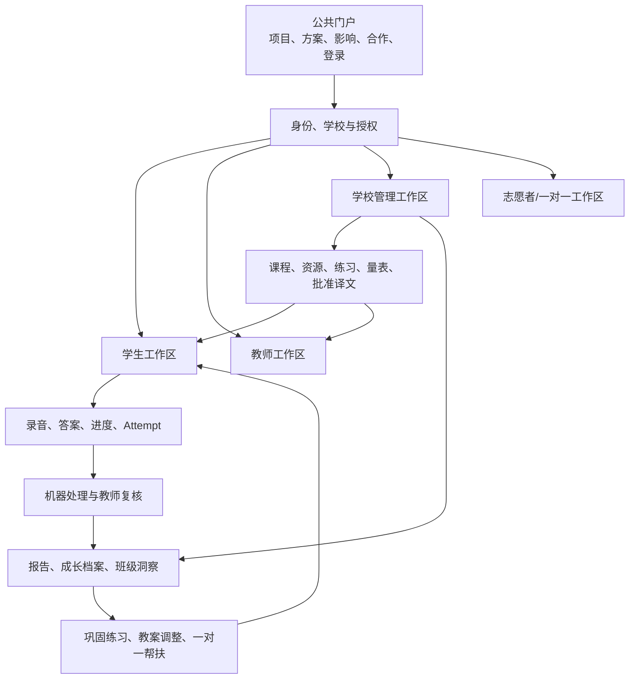
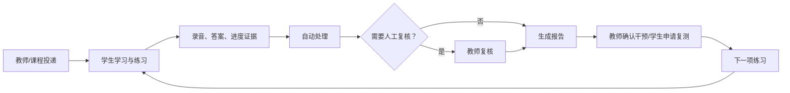

# 语赞心声 Web 产品需求文档

> 投资与产品版 · Strategic PRD v1.0

| 文档项 | 内容 |
|---|---|
| 文档状态 | 内部评审稿，可用于投资沟通、试点讨论与研发规划；不等同于正式募资材料 |
| 编制日期 | 2026-07-25 |
| 目标读者 | 项目负责人、潜在投资人、公益资助方、合作学校、教研团队、产品与研发团队 |
| 产品范围 | 语赞心声 Web 平台及其学生端、教师端、学校管理端、合作服务端 |
| 事实快照 | 多路线控制基线 `d681abb717041b22682792e22979108ea296f91e`，并补充核查截至 2026-07-25 的任务分支 |
| 规划周期 | 当前至未来 18 个月，按阶段门禁推进，不把时间预测当成完成承诺 |
| 产品负责人 | 未指定；按 `DEC-01` 在 Stage 0 第 1 日前指名，否则保持 `NO-GO` |
| 文档负责人 | PRODUCT-WEB-PRD-001 |

## 文档使用说明

本文件同时服务三类决策：

1. 对投资人和资助方说明：项目解决什么结构性问题，为什么值得持续投入，如何形成可验证的社会价值与可持续经营能力。
2. 对学校和教研伙伴说明：平台怎样进入真实教学过程，教师和学生分别得到什么，试点如何衡量成败。
3. 对产品和研发团队说明：目标产品、优先级、状态机、验收门禁和后续任务如何落地。

本文件不是当前代码功能清单，也不是财务预测书。目标产品可以高于当前实现，但所有“已开发”描述必须带证据等级。商业计划书中的覆盖人数、教学成效、合作数量、资金与媒体数据均视为“项目方材料，待尽调”，在完成原始数据、定义和授权核验前，不作为本 PRD 的已验证结论。

### 三类读者的最短阅读路径

| 读者 | 建议顺序 | 读完应能作出的决定 |
|---|---|---|
| 投资人/资助方 | 执行摘要 → 项目背景与机会 → 当前开发基线 → 商业与社会价值 → 指标体系 → 风险与应对 → 待决策与尽调清单 | 是否进入数据室尽调、需要补哪些证据、何种里程碑后分阶段投入 |
| 学校/教研负责人 | 执行摘要 → 用户与关键任务 → 核心业务闭环 → 功能需求 → 指标体系 → 分阶段路线图 → 发布与验收门禁 | 是否成为设计伙伴、试点需要哪些人/课/设备/授权、何时 Go/No-Go |
| 产品/工程团队 | 产品定位与原则 → 产品范围与信息架构 → 功能需求 → 当前开发基线 → 数据、AI与安全 → 分阶段路线图 → 发布门禁 → 工程证据附录 | 下一批任务怎样拆、依赖与 owner 是什么、用什么证据才能进入 integration |

### 状态词典

| 状态维度 | 允许值 | 在本文中的含义 |
|---|---|---|
| 执行状态 | `NOT_CREATED` | 尚未建立独立任务 |
| 执行状态 | `IN_PROGRESS` | 任务正在实现或证据修复 |
| 执行状态 | `READY_FOR_REVIEW` | 任务分支完成自有门禁，仍需独立审查 |
| 执行状态 | `BLOCKED` | 存在当前开发不能直接解除的外部条件 |
| 执行状态 | `COMPLETED` | 任务已由控制面接受为完成 |
| 证据等级 | `NOT_STARTED` | 尚无可复用实现或可信证据 |
| 证据等级 | `PARTIAL` | 有可复用实现或测试，尚未形成用户闭环 |
| 证据等级 | `EVIDENCE_REPAIR` | 代码可能成立，但证据、分支、交接或复跑结果仍有矛盾 |
| 证据等级 | `VERIFIED` | 有可复跑的浏览器、API、数据库或必要供应商证据 |
| 集成状态 | `NOT_INTEGRATED` | 尚未进入唯一多路线集成基线 |
| 集成状态 | `INTEGRATED` | 已进入唯一集成基线并完成该轮回归 |
| 规划标签 | `PLANNED` | 已进入目标产品路线图，但不是工程完成状态 |

---

## 执行摘要

### 一句话定位

语赞心声是一套面向西藏农牧区学校和藏语母语学生的国家通用语言文字学习平台，以本地化课程为入口，以听说读写练习产生的真实学习证据为核心，通过机器辅助分析、教师复核、成长报告和后续干预，形成可持续改进的教学闭环。

### 一页式投资判断

| 判断维度 | 核心内容 | 下一项必须证明的事实 |
|---|---|---|
| 结构性需求 | 目标地区同时面临资源不适配、真实语言场景不足和持续支持缺失 | 用统一口径完成需求样本、学校名单和访谈材料尽调 |
| 产品解法 | “本地化课程 + 统一练习引擎 + 真实证据 + 教师复核 + 弱网支持”不是单一工具，而是教学操作系统 | 在真实学校跑通连续 8–12 周的使用与改进闭环 |
| 执行基础 | 已从广铺页面转向可审计闭环；独立练习和 AI 工具契约已进入集成线，课程关联练习已有真实录音与持久化证据 | 完成课程整课提交、报告干预、视频笔记及多路线集成硬化 |
| 智能化路径 | 教案生成和翻译均采用 Job、版本、人工确认和可替换供应商架构，避免 AI 直接替代教师 | 配置合法真实供应商，取得端到端证据和数据处理批准 |
| 可持续路径 | 拟采用 B2G/B2B 为主、公益普惠与增值服务反哺结合的模式 | 在试点中验证采购方、使用方、付费方、交付成本和续费意愿 |
| 潜在壁垒 | 本地化教研内容、纵向学习证据、弱网交付、教师工作流和校地合作网络可形成组合壁垒 | 证明内容版权、评分效度、数据治理和跨校复制效率 |

### 当前阶段判断

项目已经越过“只有演示页面”的阶段，进入“核心闭环逐条验证、尚未达到生产试点门禁”的阶段。最可信的能力是学生独立专项练习和课程关联练习；最接近闭合的是普通课程提交与教师教案辅助；最大外部阻塞是语音/翻译/生成式 AI 供应商、未成年人数据治理和商业数据口径。

当前不宜继续以页面数量、模块数量或 AI 工具数量衡量进度。项目接下来的唯一主线应是：

```text
真实课程内容
→ 学生听说读写实践
→ 录音与作答证据
→ 自动处理与教师复核
→ 单次报告与长期成长档案
→ 下一项练习或教学干预
→ 复测验证
```

### 18 个月目标

在不牺牲未成年人隐私和教育专业性的前提下，形成一套可在弱网学校落地、教师可日常使用、学生每周能完成有效证据闭环、学校能看到真实教学改进的 Web 产品，并完成从单校设计伙伴到区域可复制方案的验证。

---

## 项目背景与机会

### 1. 项目要解决的三个问题

根据项目方商业计划书中的调研叙述，目标用户的困难可归纳为三个连续断点。相关数量和比例尚待尽调，但问题结构与产品访谈材料一致。

| 问题 | 用户表现 | 传统方案缺口 | 产品机会 |
|---|---|---|---|
| 教学不对症 | 藏语母语学生在声调、平翘舌、前后鼻音、朗读节奏和表达组织上存在差异化困难 | 通用内容无法给出适配训练，教师缺少可直接使用的干预材料 | 以本地学情、能力标签和版本化评分量表组织课程与专项练习 |
| 应用无场景 | 学生课堂外缺少低压力、可重复的国通语使用机会，容易“会做题但不敢说” | 一次性课程或考试不能形成持续表达和反馈 | 用跟读、朗读、复述、情境表达、书面理解和文化实践建立可重复场景 |
| 支持不持续 | 大班教学难以长期跟踪每名学生，阶段性进步容易中断 | 缺少真实证据、复核、成长档案和下一步行动 | 把每次录音与作答转成可追踪报告，并连接教师干预与一对一支持 |

### 2. 为什么现在值得做

- 政策与学校需求已从“资源有没有”转向“资源是否适配、教学是否有效、结果能否持续证明”。
- 生成式 AI、语音处理和对象存储等通用能力已可通过供应商适配器复用，团队可以把精力集中在教研、场景和闭环，而不是自建所有底层技术。
- 项目已有学校合作、课程材料、志愿服务和教研网络的历史积累，具备从真实场景反推产品的条件。
- 当前代码已具备身份、学校隔离、课程、练习、提交、录音、队列、报告和 AI Job 等基础，不需要重新搭建另一套通用教育平台。

以上判断不意味着市场已经被验证。真实机会必须由设计伙伴学校的持续使用、采购意愿、学生进步和单位交付成本共同证明。

### 3. “一体三翼”的数字化解释

| 组成 | 线下/服务含义 | Web 产品承载 |
|---|---|---|
| 一体：智慧教育平台 | 统一课程、服务、数据和协作入口 | 身份与学校、内容与课程、练习执行器、证据、报告、运营治理 |
| 点亮心声 | 分级课程与教师赋能 | 课程库、课堂资源、课程学习、作业、教案辅助、教研内容治理 |
| 共鸣心声 | 真实语言应用与文化实践 | 专项练习、作品与活动任务、复述表达、文化主题场景、线下活动记录 |
| 守护心声 | 一对一帮扶和持续关怀 | 成长档案、干预计划、授权结对、帮扶记录、风险转介 |

数字平台不是第四个并列业务，而是三项服务共用的身份、内容、证据和数据底座。

### 4. 从项目发起到当前开发的演进

| 阶段 | 时间与重点 | 形成的资产 | 暴露的问题 | 关键转向 |
|---|---|---|---|---|
| 场景与服务探索 | 产品开发前 | 调研材料、课程体系、学校与公益合作、“一体三翼”服务框架 | 数据口径、课程版本和成效定义尚未统一 | 把线下服务经验转成可度量的产品假设 |
| 广度原型 | 2026-07-09 至 07-12 | Web 多角色页面、NestJS/Prisma 基础、认证、课程、班级、作业、提交、报告与多类业务模块 | 页面和 CRUD 多，动态数据与用户闭环少 | 停止用模块数量代表完成度 |
| 恢复与契约收敛 | 2026-07-13 至 07-20 | 当前主仓恢复、课程与练习领域映射、古诗文黄金闭环规格、页面地图和决策记录 | 历史文档路径与当前源码漂移，测试与契约曾不一致 | 冻结“真实学习证据闭环”为产品内核 |
| 工程治理规范化 | 2026-07-21 至 07-23 | 当前 `frontend/`、`backend/` 结构，任务 JSON、独立 worktree、自动上下文、审查与完成门禁 | 任务分支“自称完成”仍可能与证据或远端状态冲突 | 引入证据等级和唯一集成线 |
| 第一批真实闭环 | 2026-07-23 至 07-24 | 课程关联练习的真实录音/书面作答/进度证据，独立专项练习，AI 工具共享契约 | 整课提交、视频、笔记、教师教案和翻译仍处于不同成熟度 | 受控多路线推进，公共契约单写者 |
| 集成与试点准备 | 当前 | 学生练习线已形成可复用基础，教师/翻译半成品有明确缺口清单 | 尚未形成完整“报告—干预—复测”，真实供应商与学校试点未完成 | 以阶段门禁而非功能堆叠进入试点 |

### 5. 商业材料的事实边界

商业计划书描述了 22,342 份问卷、178 份访谈、28 所学校、不同学生覆盖规模、教学提升、合作网络和资金情况。这些信息可以用于提出投资假设，但在对外传播前必须完成：

1. 原始问卷、访谈抽样、时间范围和受访对象去重核验；
2. “覆盖、服务、活跃、完成课程、接受线下活动”五种人数定义分开；
3. 前测、后测、达标率、流畅交流率和升学指标的测量方法统一；
4. 学校合作证明、课程实施记录、媒体链接和资金凭证归档；
5. 未成年人数据授权和公开使用范围审查。

---

## 产品定位与原则

### 1. 使命、愿景与价值主张

**使命：** 让语言环境和地理条件不再决定西藏农牧区学生获得高质量国家通用语言文字教育的机会。

**产品愿景：** 成为学校可信赖的国通语教学与持续干预平台，让每一次学习都留下可复核证据，让每一次反馈都连接到下一项行动。

**学生价值：** 知道今天学什么、敢于开口、看懂进步、得到下一步可完成的建议。

**教师价值：** 少做重复整理，多看到真实问题；AI 提供可编辑草稿，教师保留最终判断。

**学校价值：** 以统一课程、可追踪过程和可信指标支持教学改进、项目汇报和资源配置。

### 2. 产品不是

- 不是只播放视频和下载课件的普通网课站；
- 不是只给一个分数的一次性普通话测试工具；
- 不是把翻译、教案、思维导图堆在一起的 AI 工具箱；
- 不是用静态数字和演示数据构成的管理大屏；
- 不是让模型替代教师评价、自动给学生贴长期标签的系统；
- 不是通过一次性项目活动代替持续教学关系的公益展示页。

### 3. 不可协商的产品原则

1. **真实证据优先。** 课程完成必须有服务端进度、录音、答案或教师记录支持。
2. **一个练习内核。** 自主练习、课程练习、教师作业和阶段测评共用内容、执行、证据和报告能力，仅由交付策略区分。
3. **人机责任清晰。** 机器结果默认可追踪、可复核；低置信度和主观判断进入 `NEEDS_REVIEW`。
4. **翻译先审批、后消费。** 课程双语页面只读取 `APPROVED` 译文；没有译文时原文仍可使用。
5. **弱网不等于假离线。** 网络失败可以本地保存和延后同步，但未同步证据不能伪装成已提交。
6. **最小必要数据。** 未成年人录音、作答和画像按用途采集、限时保存、可审计处理。
7. **失败状态真实可见。** 加载、空、错误、离线、权限不足、处理中和供应商不可用必须分别呈现。
8. **先闭环，再扩平台。** 新轮子、新框架和新模块必须证明能缩短已定义用户闭环。
9. **可替换供应商。** 语音、生成式 AI 和翻译通过适配器接入，业务记录不依赖单一供应商字段。
10. **文化尊重与教学有效同等重要。** 本地文化不是装饰素材，内容选择、翻译和教学使用均需教研与本地审阅。

### 4. 产品目标与非目标

| 时间层级 | 产品目标 | 明确非目标 |
|---|---|---|
| 当前 P0 | 完成学生课程/练习证据、教师复核、报告、干预和复测的一条学校可试用闭环 | 正式考试监考、复杂推荐、全量社区、自动给最终成绩 |
| P1 | 完成教师 AI 备课、批准译文双语消费、班级洞察、离线恢复和多校试点 | 泛化 Agent 平台、无限制内容生成、全自动教学决策 |
| P2 | 扩展一对一帮扶、志愿者、内容运营、区域治理和标准接口 | 为追求“大而全”重写当前业务内核 |

---

## 用户与关键任务

### 1. 角色、受益者与购买者

| 角色 | 关系 | 最重要的任务 | 成功表现 |
|---|---|---|---|
| 学生 | 核心受益者与日活用户 | 完成课程与听说读写练习，理解反馈并再次练习 | 每周完成至少一项有证据、有反馈、有下一步行动的练习 |
| 一线教师 | 核心专业用户与价值创造者 | 布置内容、复核证据、调整教学、生成并修改教案 | 能在有限时间内找到最值得处理的问题并完成干预 |
| 学校管理员/教研负责人 | 采购影响者与治理者 | 配置组织、课程和权限，观察班级趋势，处理数据治理 | 能区分真实教学结果、处理中结果和缺失数据 |
| 教育主管部门/项目采购方 | 可能的购买者 | 评估覆盖、质量、合规、区域复制与资金效益 | 获得口径一致、可追溯、不过度承诺的项目报告 |
| 家长/监护人 | 授权与支持者 | 了解数据用途和学生阶段进步，支持学习安排 | 看见可理解的进步说明，不接触不必要的同学数据 |
| 志愿者/一对一顾问 | 受限服务角色 | 在授权范围内准备帮扶、记录过程、转介风险 | 只访问最小必要学生信息，不替代教师或专业心理服务 |
| 内容与教研人员 | 内部供给者 | 创建、版本化、审核课程、练习、评分量表与译文 | 每项发布内容都有来源、版权、审阅和版本记录 |
| 投资人/资助方 | 资本与资源伙伴 | 判断需求、执行力、可持续性、影响和风险 | 能看到产品证据、试点指标、单位经济和治理边界 |

### 2. 核心用户故事

#### 学生

- 作为学生，我能从“今日学习”看到必须完成和建议完成的内容，不需要理解系统模块。
- 作为弱网地区学生，我断网时的录音和答案不会丢失，网络恢复后能明确看到同步结果。
- 作为学生，我在报告中能回听自己的证据、看懂教师反馈，并知道下一项最小练习。
- 作为藏语母语学生，我可以在批准译文可用时切换双语辅助，但不会因为翻译供应商故障而无法学习原文。

#### 教师

- 作为教师，我能把同一份已发布练习投递给班级或个别学生，并选择重录、答案揭示和截止策略。
- 作为教师，我只需优先复核低置信度、主观题和异常录音，并能保留修改前后的评分。
- 作为教师，我能选择真实课程生成结构化教案草稿，完整修改后再批准，AI 不能直接发布。
- 作为教师，我能看到班级共同问题，并从报告直接布置一项巩固练习。

#### 学校管理者

- 作为管理员，我能配置学校、班级、成员、角色和课程权限，并查看所有关键操作的审计记录。
- 作为教研负责人，我能查看使用率、完成率、复核时效和能力趋势，但不会把缺失数据当成零分。
- 作为数据治理责任人，我能管理授权、保留、导出、删除、供应商和异常事件。

### 3. 优先解决的工作任务

| 优先级 | 工作任务 | 价值原因 |
|---|---|---|
| P0 | 学生完成“学—练—证据—反馈—再练” | 直接验证产品对学习是否产生价值 |
| P0 | 教师完成“布置—复核—干预” | 决定平台能否进入日常课堂 |
| P0 | 学校完成身份、权限与数据治理 | 决定能否在真实未成年人场景上线 |
| P1 | 教师完成“课程上下文—AI 草稿—修改—批准” | 降低备课重复劳动并沉淀内容资产 |
| P1 | 教师完成“机器翻译—修订—批准—双语消费” | 建立有责任链的本地化内容供给 |
| P2 | 志愿者完成授权帮扶与风险转介 | 延伸持续支持，但不能先于教学内核 |

---

## 产品范围与信息架构

### 1. Web 产品总览



### 2. 一级信息架构

| 端 | 一级入口 | 主要页面 | 优先级 |
|---|---|---|---|
| 公共门户 | 首页、解决方案、课程与服务、社会影响、合作、关于我们、登录 | 项目价值、学校方案、数据口径说明、合作申请 | P1 |
| 学生端 | 今日学习、课程学习、练习与测评、成长档案 | 课程详情、执行器、提交前检查、处理中、报告、历史、录音 | P0 |
| 教师端 | 今日工作台、班级洞察、备课与资源、练习与作业、复核与干预 | 课程/练习发布、复核工作台、教案助手、翻译工具 | P0/P1 |
| 学校管理端 | 组织与角色、内容治理、教学质量、供应商与额度、数据与审计 | 学校班级、发布审批、使用与质量、隐私请求、操作审计 | P1 |
| 志愿者/帮扶端 | 我的培训、我的学生、帮扶准备、服务记录、风险转介 | 授权范围、计划、记录、提醒 | P2 |
| 内容运营端 | 课程、练习、量表、资源、术语表、译文、版本发布 | 草稿、审阅、发布、弃用、来源与版权 | P1 |

### 3. 学生端页面主线

```text
今日学习
→ 课程/练习详情
→ 设备检查
→ 通用执行器
→ 提交前检查
→ 处理中/待教师复核
→ 正式报告
→ 巩固建议或复测申请
→ 历史与成长档案
```

### 4. 教师端页面主线

```text
今日工作台
├─ 待复核证据 → 调整/接受/要求重做 → 反馈与巩固
├─ 班级共同问题 → 选择练习 → 发布给班级或个别学生
├─ 选择真实课程 → AI 教案草稿 → 修改 → 批准 → 只读版本
└─ 翻译任务 → 机器结果 → 人工修订 → 批准 → 双语内容可消费
```

### 5. 响应式策略

- 教师管理和内容编辑以 1440px 桌面为主，1024px 平板可完成核心操作。
- 学生列表、报告和历史支持 390px 手机浏览。
- 需要长时间录音、复杂作答或教师结构化编辑的页面，P0 优先保证桌面和平板；手机端必须明确提示设备限制，不能渲染一个不可完成的界面。
- 公共门户完整支持 390/1024/1440。
- 是否开放“手机完成完整录音练习”需通过真实设备、浏览器兼容性和学校场景试点后再决策，不能仅由商业材料中的“四端支持”决定。

### 6. 体验与视觉设计准则

| 场景 | 设计要求 |
|---|---|
| 整体品牌 | 温暖、可信、克制；体现教育专业性与文化尊重，不用“苦难叙事”消费受益学生 |
| 学生端 | 步骤清楚、单一主任务、反馈具体；适度鼓励但不过度游戏化，不用排名制造羞耻 |
| 教师端 | 信息密度高于学生端，优先待办、证据和异常；减少无业务意义的卡片墙 |
| 管理端 | 图表同时展示分母、周期、数据完整度和状态，不用静态大数字营造繁荣 |
| 公共门户 | 先说明问题、解法与证据，再展示愿景；所有影响数据可点开查看定义和来源 |
| 藏汉双语 | 预留藏文字体、行高、换行和长文本测试；译文状态与审阅责任清晰可见 |
| 录音交互 | 录音前告知、设备状态、剩余时间、重录配额、本地/已同步状态始终可见 |
| AI 内容 | 使用“AI 草稿”“待教师复核”“已由教师批准”等明确标记，不用拟人化权威语气 |
| 无障碍 | 键盘可操作、焦点可见、文字与背景对比充分、图表有文本替代、错误不只靠颜色 |
| 文化素材 | 使用有来源且经本地审阅的图文，避免把文化元素当通用装饰或刻板符号 |

---

## 核心业务闭环

### 1. 学习证据黄金闭环



完成定义：

- 内容、交付策略、评分量表和执行快照可追溯；
- 所有业务 ID 来自当前登录与 API，不使用固定演示 ID；
- 录音是真实非空媒体证据，书面答案有草稿和定稿；
- 机器处理失败、未配置或低置信度时不生成假分数；
- 教师复核保留机器值、教师值、理由、版本和时间；
- 报告给出证据、问题与可执行下一步，而非只有总分；
- 刷新和新浏览器上下文后状态保持一致；
- 另一学生、教师或学校无法越权读取证据。

### 2. 课程学习闭环

```text
选课/任务
→ 课程版本与活动
→ 文本、音频、视频、选择、填空、口语或课程练习
→ 服务端活动进度
→ 课程完成度
→ 整课提交
→ 教师反馈/报告
```

视频完成必须来自真实播放事件与服务端进度，不允许直接设置播放位置制造完成。时间点笔记与视频 Resource、学生身份和 revision 绑定，刷新、编辑、删除和冲突恢复均需验证。

### 3. 独立专项练习闭环

学生从练习中心发现可见练习，创建或恢复无课程上下文的 Attempt，使用同一执行器完成口语和书面题，提交后进入历史，但不得污染课程进度。自主练习可允许更多重录和更早反馈，内容与证据模型仍与作业一致。

### 4. 教师复核与教学干预闭环

```text
异常/主观题进入队列
→ 教师回听或查看证据
→ 接受、调整或要求重做
→ 报告重新生成
→ 教师确认巩固建议
→ 新投递/学习计划
→ 复测对比
```

P0 不开放学生直接创建作业复测；学生只能申请，教师审批后创建自主练习投递。巩固建议默认不自动进入学习计划。

### 5. 教师 AI 教案闭环

```text
选择本校已发布课程
→ 输入课时、对象和教学目标
→ 幂等创建 Job
→ BullMQ / Flowise / 真实模型
→ schema-valid 草稿（NEEDS_REVIEW）
→ 教师结构化修改（revision + 1）
→ 教师批准（APPROVED）
→ 刷新或新上下文只读打开
```

AI 只生成草稿。任何“自动发布教案”“自动替教师评价学生”或“资料库已完成”的表述均不在 P0 范围。

### 6. 藏汉翻译与双语消费闭环

```text
教师创建 BO↔ZH 翻译 Job
→ 合法真实供应商返回 machineResult
→ NEEDS_REVIEW
→ 教师修订 revisedResult
→ APPROVED
→ 课程/资源页面读取批准译文
```

翻译工具和双语课程是两个任务。供应商不可用时应明确 `PROVIDER_UNAVAILABLE`；原文课程继续可用，页面不得现场调用模型伪造译文。

### 7. “守护心声”帮扶闭环

```text
教师确认需要支持
→ 学校/监护授权
→ 匹配合格志愿者或顾问
→ 查看最小必要信息
→ 制定一次帮扶计划
→ 记录过程与结果
→ 风险转介教师/学校
→ 更新下一步支持
```

该闭环进入 P2。志愿者不能查看完整班级数据、未授权录音、教师内部评价或隐私请求，也不能承担专业心理诊疗职能。

---

## 功能需求

### 1. 优先级定义

| 优先级 | 含义 | 发布要求 |
|---|---|---|
| P0 | 学校试点必须具备；缺失会破坏核心学习证据或安全闭环 | 进入试点前全部通过真实纵向验收 |
| P1 | 提升教师效率、学校治理或多校复制能力 | 可在单校试点后分批发布，不得破坏 P0 |
| P2 | 扩展服务边界、区域运营或生态合作 | 只有在 P0/P1 数据证明需求后启动 |

历史研发任务 ID 中的 `P0` 表示当轮工程调度优先级，例如教师教案与翻译任务；它不自动等于本文“学校试点必须具备”的产品 P0。后续新任务应同时标明“工程波次”和“产品发布优先级”，避免把已派发任务误解为试点硬依赖。

### 2. 全局验收规则

以下规则适用于所有功能，不在每一条需求中重复：

- 前端不使用固定学生、课程、Attempt、Job、Review 或资源 ID；
- 页面数据来自真实 API 与持久化，不用静态业务数据或失败后的演示回退；
- 正常、加载、空、错误、离线、权限不足、处理中、供应商不可用按实际风险实现；
- 更新操作有幂等键或 revision，重复请求不产生重复业务记录；
- 服务端验证学校、用户、班级、资源和角色范围；
- 刷新和新浏览器上下文能够恢复应持久化状态；
- 重要页面在 1440、1024、390 三种视口审查；受设备限制的页面提供明确替代说明；
- Console、page error、失败请求、HTTP 4xx/5xx 均进入验收记录；
- 证据、日志和截图不含 token、密钥、真实学生身份或敏感原文。

### 3. 公共门户

| ID | 需求 | 优先级 | 验收要点 |
|---|---|---:|---|
| PUB-01 | 首页表达“面向谁、解决什么、如何形成闭环” | P1 | 首屏不使用无法核验的领先性、规模或效果表述 |
| PUB-02 | 学校解决方案页展示普惠、专业、旗舰服务差异 | P1 | 价格与服务标记为当前方案或询价，不把假设写成已成交 |
| PUB-03 | 社会影响页公开指标定义、统计周期和证据来源 | P1 | 覆盖人数、活跃人数、完成闭环人数分别展示 |
| PUB-04 | 合作申请收集学校类型、网络、设备、年级、教师与试点目标 | P1 | 获得隐私同意，不采集与合作无关的学生信息 |
| PUB-05 | 投资/资助资料入口提供受控数据室申请 | P2 | 敏感文件经授权访问，不在公开页泄露学校或未成年人数据 |
| PUB-06 | 登录与身份入口 | P0 | 根据角色进入正确工作区，未授权不暴露内部导航 |

### 4. 身份、学校与组织

| ID | 需求 | 优先级 | 验收要点 |
|---|---|---:|---|
| IAM-01 | 用户登录、会话恢复和退出 | P0 | 过期会话明确跳转登录；退出后旧 token 不可继续调用 |
| IAM-02 | 活动学校选择与切换 | P0 | 所有后续请求受服务端 school scope 约束 |
| IAM-03 | 班级、成员、Enrollment 与学年管理 | P0 | 同一学生的学年关系可追溯，不用姓名作为唯一标识 |
| IAM-04 | STUDENT、TEACHER、SCHOOL_ADMIN、CONTENT_EDITOR、VOLUNTEER 等角色 | P0/P1 | 默认最小权限；高风险角色需审批和审计 |
| IAM-05 | 邀请、停用、离校和账号恢复 | P1 | 停用用户立即失去访问权，历史证据不被物理破坏 |
| IAM-06 | 监护授权与撤回记录 | P1 | 记录授权版本、用途、时间、撤回和后续处理 |

### 5. 内容、课程与资源

| ID | 需求 | 优先级 | 验收要点 |
|---|---|---:|---|
| CNT-01 | Course、CourseVersion、Unit、Lesson、LearningActivity 的草稿与发布 | P0 | 发布版本不可原地改写；进行中的学习保留快照 |
| CNT-02 | 文本、图片、音频、视频和附件 Resource | P0 | 来源、版权、文件状态、可见范围和短期访问地址可追溯 |
| CNT-03 | 年级、难度、能力标签和预计时长 | P0 | 标签来自治理词表，不能由页面自由造值 |
| CNT-04 | 课程内容审阅与发布审批 | P1 | 内容编辑者与发布者可分离；驳回保留理由 |
| CNT-05 | 课程版本变更说明和弃用 | P1 | 历史 Attempt/报告仍能解释所用版本 |
| CNT-06 | 内容离线包 | P1 | 包含版本、大小、校验、过期和更新策略；离线不绕过权限 |
| CNT-07 | 来源与文化审阅 | P1 | 本地文化内容、译文和敏感表达由指定审阅人确认 |

### 6. 学生课程学习

| ID | 需求 | 优先级 | 验收要点 |
|---|---|---:|---|
| STU-01 | 今日学习聚合 | P0 | 必修、截止、继续上次和建议内容由服务端动态返回 |
| STU-02 | 课程列表与进度 | P0 | 进度来自服务端活动完成记录，刷新后不回退 |
| STU-03 | 课程详情与下一活动 | P0 | 根据真实课程版本和 Enrollment 进入，不使用固定课程 ID |
| STU-04 | TEXT、AUDIO、CHOICE、FILL_BLANK、SPEECH 等活动 | P0 | 每类活动按自己的有效证据完成，不以通用“标记完成”替代口语证据 |
| STU-05 | 课程关联练习 | P0 | 练习提交幂等回写课程进度，不重复创建 Attempt |
| STU-06 | 整课提交 | P0 | 只有必修活动满足完成规则才能提交；提交后只读；重复提交幂等 |
| STU-07 | 视频播放进度 | P0 | 使用真实 Resource 和自然播放事件；中途刷新恢复，完成后服务端进度更新 |
| STU-08 | 视频时间点笔记 | P1 | 创建、跳转、编辑、删除、新上下文恢复、revision 冲突和越权拒绝成立 |
| STU-09 | 弱网本地保存与同步 | P1 | 本地状态、待同步、同步失败和已同步有清晰区分 |
| STU-10 | 批准译文双语切换 | P1 | 只消费 APPROVED 译文；无译文时原文正常展示 |

### 7. 统一练习与测评引擎

| ID | 需求 | 优先级 | 验收要点 |
|---|---|---:|---|
| PRA-01 | PracticeDefinition 稳定身份 | P0 | 标题、年级、难度、能力标签、来源、自主练习权限可追溯 |
| PRA-02 | PracticeVersion 不可变发布版本 | P0 | Section、Item、规则、Rubric 和内容哈希形成快照 |
| PRA-03 | PracticeDelivery 交付策略 | P0 | 支持 SELF_PRACTICE 与 ASSIGNMENT；班级与个人目标互斥校验 |
| PRA-04 | 练习中心与详情 | P0 | 学生只看到当前可见、适龄和有权限的练习 |
| PRA-05 | 设备检查 | P0 | 麦克风、扬声器和录音能力失败阻塞；网络失败进入 LOCAL_ONLY |
| PRA-06 | 通用执行器 | P0 | 支持听辨、跟读、朗读、复述、单选、多选、填空、简答等配置驱动类型 |
| PRA-07 | 重录、播放、准备和计时策略 | P0 | 来自 Delivery/Section 快照；超限明确拒绝 |
| PRA-08 | 本地草稿与断点恢复 | P0 | 页面离开或断网不丢答案；最终提交前证据完整 |
| PRA-09 | 提交前检查和幂等提交 | P0 | 未同步录音、未答必填题和 revision 冲突阻止提交 |
| PRA-10 | COURSE_PRACTICE | P0 | 复用同一执行器并回写课程；不能建立第二套题目执行系统 |
| PRA-11 | STAGE_ASSESSMENT | P2 | 在正式计时、设备、监考和合规方案成熟前保持不可用 |

### 8. 录音、机器处理与证据

| ID | 需求 | 优先级 | 验收要点 |
|---|---|---:|---|
| EVD-01 | 录音初始化、上传、完成和回放 | P0 | 非空 bytes、对象键、媒体类型、时长和所属 Item/Activity 一致 |
| EVD-02 | 分片或失败重试 | P1 | 重复分片和网络中断不产生损坏或重复 Recording |
| EVD-03 | SpeechJob 状态与幂等 | P0 | QUEUED/RUNNING/FINALIZED/FAILED/PROVIDER_UNAVAILABLE 可查询 |
| EVD-04 | 机器结果元数据 | P0 | 包含供应商、模型/版本、置信度、处理时间和安全错误码 |
| EVD-05 | 低质量音频处理 | P0 | 可要求重录或进入复核；不能静默给分 |
| EVD-06 | 证据访问授权 | P0 | 预签名回放短时有效；跨学生、跨班级、跨学校拒绝 |
| EVD-07 | 保留与删除 | P1 | 按政策删除媒体时保留必要审计，不留下公开访问链接 |

### 9. 评分、复核、报告与成长档案

| ID | 需求 | 优先级 | 验收要点 |
|---|---|---:|---|
| REP-01 | ScoringRubricVersion | P0 | 维度、权重、阈值、适用题型和审阅人版本化 |
| REP-02 | 自动复核触发器 | P0 | 低置信度、主观题、音频异常和教师主动复核可追踪 |
| REP-03 | 教师复核工作台 | P0 | 按紧急度、班级、触发原因筛选，优先显示必要证据 |
| REP-04 | 接受、调整、拒绝/要求重做 | P0 | 保留机器值、教师值、理由和 revision；冲突返回 409 |
| REP-05 | 单次正式报告 | P0 | 展示完成内容、证据、维度、机器/教师来源、两个主要问题和下一步 |
| REP-06 | 报告处理中与待复核状态 | P0 | 未完成时不展示最终分数；允许安全离开和稍后返回 |
| REP-07 | 巩固建议 | P0 | 指向具体练习；作业场景需教师确认后加入学习计划 |
| REP-08 | 复测申请与对比 | P1 | 学生申请、教师审批、创建新 Attempt，按同一量表或可解释映射比较 |
| REP-09 | 长期能力画像 | P1 | 只聚合有版本、有证据的数据；缺失数据不当作能力低 |
| REP-10 | 班级洞察 | P1 | 展示共同问题、分布和数据完整度，不公开不必要的学生排名 |

### 10. 教师课程、作业与反馈

| ID | 需求 | 优先级 | 验收要点 |
|---|---|---:|---|
| TCH-01 | 今日工作台 | P0 | 待复核、即将截止、未提交和风险状态来自实时聚合 |
| TCH-02 | 课程与练习选择发布 | P0 | 只能选择本校可用且已发布版本 |
| TCH-03 | 班级/个别学生投递 | P0 | 年级、班级与 Enrollment 校验，截止与反馈策略清晰 |
| TCH-04 | 作业进度与异常 | P0 | 区分未开始、进行中、待同步、处理中、待复核、完成 |
| TCH-05 | 教师反馈 | P0 | 反馈与证据、Attempt 和发布版本关联 |
| TCH-06 | 一键布置巩固练习 | P1 | 从报告生成草稿投递，教师确认对象、截止与策略 |
| TCH-07 | 教学资源收藏与复用 | P1 | 不复制失去来源的内容；引用原版本或创建新版本 |

### 11. 教师 AI 教案助手

| ID | 需求 | 优先级 | 验收要点 |
|---|---|---:|---|
| AILP-01 | 从真实已发布课程创建 Job | P1 | school scope、课程版本和幂等键生效 |
| AILP-02 | 生成状态 | P1 | QUEUED、RUNNING、SUCCEEDED、FAILED、JOB_STUCK、PROVIDER_UNAVAILABLE 真实 |
| AILP-03 | 结构化输出 Schema | P1 | 课题、目标、重点、难点、流程、差异化支持、练习草稿和检查表可验证 |
| AILP-04 | 课程与资料上下文 | P1 | 只读取授权课程/资料；上下文来源可查看 |
| AILP-05 | 教师结构化编辑 | P1 | 对象数组正确渲染；未知字段、schemaVersion 和 context 不丢失 |
| AILP-06 | Revision 与冲突 | P1 | 保存 revision + 1；旧 revision 更新返回 409 并可恢复 |
| AILP-07 | 批准与只读 | P1 | 只有教师批准后为 APPROVED；批准后修改需新修订 |
| AILP-08 | 生成说明与风险提示 | P1 | 明确 AI 草稿、供应商、时间和需要教师核验的部分 |
| AILP-09 | 资料库/RAG | P2 | 只有来源、权限、检索证据和质量评估完成后才对外宣称 |

### 12. 藏汉翻译与双语内容

| ID | 需求 | 优先级 | 验收要点 |
|---|---|---:|---|
| TRN-01 | BO→ZH、ZH→BO 持久化 Job | P1 | createdByUserId、schoolId、方向、字符限制和状态持久化 |
| TRN-02 | 受控加密与限流 | P1 | 源文受控加密；日志和响应不泄露密文或供应商密钥 |
| TRN-03 | 真实供应商适配器 | P1 | 认证、超时、quota、重试和 unavailable 分类；确认支持藏文 |
| TRN-04 | machineResult 与 revisedResult 分离 | P1 | 机器结果不可冒充人工批准译文 |
| TRN-05 | 教师修订、批准和驳回 | P1 | 乐观并发、reviewer、时间和理由完整 |
| TRN-06 | 我的任务与学校任务 | P1 | 学生/教师只见自己，授权管理员才见学校范围 |
| TRN-07 | 术语表与版本 | P1 | 术语来源、适用范围、审阅和版本可追溯 |
| TRN-08 | 双语课程消费接口 | P1 | 只返回原文和 APPROVED 译文；待复核时返回明确状态 |
| TRN-09 | 译文质量抽检 | P1 | 按方向、内容类型和审阅人记录抽检，不用单一主观评价 |

### 13. 学校管理与数据治理

| ID | 需求 | 优先级 | 验收要点 |
|---|---|---:|---|
| ADM-01 | 学校、班级、用户和角色治理 | P1 | 批量操作可回滚或确认，所有权限变化审计 |
| ADM-02 | 课程、练习、量表和译文发布治理 | P1 | 草稿、审阅、发布、弃用状态明确 |
| ADM-03 | 使用与教学质量概览 | P1 | 活跃、闭环完成、复核、同步和数据完整度同屏解释 |
| ADM-04 | 供应商健康、额度与失败 | P1 | 配置存在不等于在线；展示真实 ping/heartbeat 和最近失败 |
| ADM-05 | 授权、保留、导出、删除请求 | P1 | 有责任人、处理期限、结果与审计 |
| ADM-06 | 安全与异常事件 | P1 | 越权、异常导出、供应商故障和内容投诉有处置流程 |
| ADM-07 | 区域多校视图 | P2 | 只在合法数据共享协议下提供汇总，不默认开放跨校明细 |

### 14. 志愿者、一对一与社区

| ID | 需求 | 优先级 | 验收要点 |
|---|---|---:|---|
| SUP-01 | 志愿者培训、认证和有效期 | P2 | 未认证或过期不得访问学生服务区 |
| SUP-02 | 授权结对 | P2 | 学校/监护授权、服务范围和时间边界明确 |
| SUP-03 | 帮扶准备与记录 | P2 | 只呈现本次服务所需信息；记录可由教师复核 |
| SUP-04 | 风险转介 | P2 | 不在系统内作专业诊断，按预案转交学校责任人 |
| COM-01 | 语言实践作品与主题活动 | P2 | 未成年人内容默认非公开，发布需审核和授权 |
| COM-02 | 举报、审核与下架 | P2 | 内容治理责任、处理时限和申诉流程完整 |

---

## 当前开发基线

### 1. 当前技术与治理基础

截至事实快照，当前主项目采用：

- `frontend/`：当前唯一产品前端；
- `backend/api/`：NestJS 模块化单体 API；
- `backend/worker/`：BullMQ 等异步任务；
- `backend/speech-scoring/`：语音处理服务；
- `infra/database/`：Prisma 与 PostgreSQL；
- `packages/contracts/`：OpenAPI 与生成类型；
- `project-ops/`：任务、依赖、共享锁、审查、交接和集成控制面。

项目已经建立独立 worktree、任务 JSON、最小上下文、变更白名单、CCR、review/finish 门禁和唯一多路线集成线。该治理能力是规模化 AI 协作的基础，但它不替代产品验收。

### 2. 可信能力矩阵

| 能力 | 执行状态 | 证据等级 | 集成状态 | 基线/证据指针 | 尚未满足 |
|---|---|---|---|---|---|
| 身份、学校、基础课程与模块化后端 | `COMPLETED` | `VERIFIED` | `INTEGRATED` | `d681abb`；`project-ops/CURRENT.md` | 真实学校账号、授权、负载、备份与运维演练 |
| AI 教案/翻译共享契约 | `COMPLETED` | `VERIFIED` | `INTEGRATED` | `1d0cd1bb0898ad47a6f9faebba42d3d18b84260d` | consumer 在真实供应商环境的完整复验 |
| 学生独立专项练习 | `COMPLETED` | `VERIFIED` | `INTEGRATED` | `45fefdf361f7df4d0026c31b3e1d338f537acb47` | 与报告、教师复核、干预和试点数据联动 |
| 课程关联练习 | `COMPLETED` | `VERIFIED` | `NOT_INTEGRATED` | `ca14c57f0534e4e8ddf3e273128668b6c12e685e` | 进入集成线并执行跨泳道回归 |
| 普通课程整课提交 | `IN_PROGRESS` | `EVIDENCE_REPAIR` | `NOT_INTEGRATED` | 远端任务头 `4f86b0f319907b29c073dd9438b0459fb3b85c43` | 控制面要求恢复；API 级录音、静态证据页、脏现场和交接口径需独立重跑修复 |
| 课程视频进度 | `NOT_CREATED` | `PARTIAL` | `NOT_INTEGRATED` | 多路线规划与看板；无接受 commit | 有可复用资产；仍缺真实 URL、自然播放、服务端进度、刷新恢复 |
| 视频时间点笔记 | `NOT_CREATED` | `PARTIAL` | `NOT_INTEGRATED` | 多路线规划与看板；无接受 commit | 有可复用资产；仍缺真实视频浏览器/API/DB、冲突和越权证据 |
| 教师 AI 教案 | `READY_FOR_REVIEW` | `PARTIAL` | `NOT_INTEGRATED` | 远端任务头 `6d1d70e426ec35e079535011daff62780fe07031` | 状态仅属任务分支；仍缺真实模型凭据、Job→Draft、浏览器编辑/批准、新上下文和独立复验 |
| 藏汉翻译工具 | `BLOCKED` | `PARTIAL` | `NOT_INTEGRATED` | 远端任务头 `e8f2d8c5c0049a320fe45c7bd2e9e499ccd722cc` | 合法供应商、藏文支持、合规审批、前端与真实 BO↔ZH E2E |
| 批准译文双语课程 | `NOT_CREATED` | `NOT_STARTED` | `NOT_INTEGRATED` | 多路线规划与看板；无任务 commit | 翻译工具接受、课程 consumer、无译文降级验证 |
| 教师复核—报告—干预—复测 | `NOT_CREATED` | `PARTIAL` | `NOT_INTEGRATED` | 产品规格与现有模型；无闭环接受 commit | 需拆任务；缺同一真实 Attempt 的完整纵向证据和教学使用验证 |
| 学校管理、志愿者、一对一 | `NOT_CREATED` | `PARTIAL` | `NOT_INTEGRATED` | 历史模块骨架；无用户闭环接受 commit | 需按 P1/P2 拆任务并重验，不以 CRUD 路由视为完成 |

复验以 [accepted-baselines.json](../../project-ops/accepted-baselines.json) 和 [多路线看板](../../project-ops/MULTITRACK-BOARD.md) 为控制面入口。审阅者应先验证远端 commit，再读取对应 task JSON、handoff 和 evidence 并复跑命令；没有独立接受记录的任务不能因为本表列出 commit 而升级。当前已接受记录由 Integration Lead 于 2026-07-24 更新；教师与翻译分支的后续状态仅代表任务分支事实，不代表独立接受。

最小复验程序：

```powershell
git fetch origin --prune
git ls-remote origin refs/heads/<task-branch>
git show <40位commit>:project-ops/tasks/active/<TASK-ID>.json
git show <40位commit>:project-ops/handoffs/<TASK-ID>.md
# 在该 commit 的独立 worktree 中执行 task JSON 的 minimal_tests 和证据复跑脚本
```

### 3. 当前不能对外宣称的能力

- 不能宣称平台已达到正式学校生产部署或大规模并发状态；
- 不能宣称 AI 已能自动生成可直接上课的最终教案；
- 不能宣称藏汉翻译或网页双语已经可用；
- 不能宣称语音评分准确率、教学提升率或推荐有效性已完成科学验证；
- 不能宣称完全离线、多端全功能或资料库/RAG 已完成；
- 不能用历史服务覆盖规模替代 Web 产品活跃用户或闭环完成用户；
- 不能把任务分支 `READY_FOR_REVIEW` 写成 `INTEGRATED`。

### 4. 已有资产的复用决策

| 领域 | 继续复用 | 暂不引入/重建 |
|---|---|---|
| 课程与练习 | Course、Submission、AssessmentSession、同一练习执行器 | 第二套课程/测评执行系统 |
| 媒体 | Resource、对象存储、短期签名 URL | 在没有大文件需求前引入新上传平台 |
| 教师 AI | NestJS、BullMQ、Flowise Agentflow、JSON Schema | 泛化 Agent 编排平台 |
| 翻译 | Controller/Service/Port、Prisma、可替换 provider | 页面现场直接调用模型 |
| 身份权限 | JWT、活动学校、服务端 user/school/resource scope | 每个工具独立账号体系 |
| 标准与生态 | 后续以 adapter 评估 H5P/QTI/OneRoster | 当前整体迁移 Moodle/Open edX/Canvas |
| 可观测性 | 先使用 Job/provider 元数据和现有日志 | 用新观测平台替代用户闭环证据 |

### 5. 试点前的产品缺口

试点前至少还需闭合：

1. 整课提交的独立证据修复与集成接受；
2. 一项真实视频进度和时间点笔记；
3. 同一学生 Attempt 的自动处理、教师复核、报告、巩固和复测；
4. 语音供应商的合法接入或明确的人工替代流程；
5. 教师教案真实模型闭环和浏览器验收；
6. 翻译供应商、合规与前端闭环，或在试点范围中明确关闭；
7. 学校账号、监护授权、录音告知、保留/删除与应急演练；
8. 试点内容、量表、评价方案和基础数据采集协议。

---

## 数据、AI与安全

### 1. 数据分类与用途

| 数据类别 | 示例 | 合法用途 | 默认边界 |
|---|---|---|---|
| 身份与组织 | 用户、学校、班级、Enrollment、角色 | 登录、授权、教学关系 | 不在公开页面展示；跨校默认不可见 |
| 学习过程 | 课程进度、答案、Attempt、重录次数、设备状态 | 恢复学习、反馈、教学改进 | 只采集完成产品目的所需字段 |
| 媒体证据 | 录音、可能的视频作品 | 语音处理、教师复核、学生回看 | 明示告知、短期访问、保留期限、禁止默认公开 |
| 评价结果 | 机器分、置信度、教师调整、量表版本 | 报告、干预、趋势分析 | 机器与人工来源分开；不把单次结果固化为人格标签 |
| AI 输入输出 | 课程上下文、教案草稿、翻译源文和结果 | 教师辅助与双语内容生产 | 供应商最小传输；不得用于未经批准的模型训练 |
| 运营数据 | 活跃、完成、错误、处理时长、额度 | 产品改进、容量与成本管理 | 优先汇总或去标识，避免回推单个学生 |
| 敏感治理数据 | 授权、删除请求、风险转介、审计日志 | 合规、责任追踪和事件处理 | 访问最小化，单独权限与审计 |

### 2. 未成年人隐私底线

1. 在录音、作品发布、跨境/出境供应商处理前提供适龄说明和监护授权机制。
2. 授权按用途拆分，不用“一次同意全部用途”替代必要告知。
3. 学生可以知道机器在何时处理了什么、教师修改了什么，以及结果用于何处。
4. 明确保留期限、撤回、导出、删除和例外保留规则。
5. 试点、截图、演示、模型测试和投资材料使用合成或去标识数据。
6. 学校、项目方、供应商和志愿者的数据责任通过协议和系统权限同时落实。
7. 在无法确认供应商数据处理地点、二次使用和删除承诺前，不发送真实学生原文或录音。

### 3. AI 治理

| 治理项 | 产品要求 |
|---|---|
| 责任主体 | 教案、翻译、评分和推荐均有明确最终责任人 |
| 输出状态 | AI 输出默认为 `NEEDS_REVIEW`，只有人工确认后进入 `APPROVED` 或最终报告 |
| 可追溯性 | 保存供应商、模型/flow/schema/量表版本、输入来源摘要、时间、置信度和错误码 |
| 可解释性 | 面向教师展示证据和维度，不仅展示单一总分 |
| 版本管理 | Prompt、Flow、Schema、Rubric 和术语表发布后不可悄然覆盖历史 |
| 质量评估 | 建立代表性测试集，按年级、题型、口音、性别、设备、网络和语言方向分层观察 |
| 人工覆盖 | 教师可以接受、调整、拒绝并记录理由；系统保留前后值 |
| 失败策略 | 超时、quota、鉴权、模型漂移和结构错误均 fail closed，不生成占位成功 |
| 供应商退出 | 业务数据使用内部稳定模型，供应商字段封装在 adapter 和元数据中 |
| 禁止用途 | 不自动做高风险升学决定，不生成长期负面标签，不替代专业心理判断 |

### 4. 藏汉翻译特别治理

- 在采购或接入前用真实样本确认供应商支持所需藏文编码、方向、长度和内容类型。
- 明确服务所在地、数据传输路径、日志保留、模型训练政策和删除机制。
- 建立由本地语言专家与一线教师共同维护的术语表和审阅规则。
- 区分字面翻译、教学解释和文化说明，避免一种结果承担三种责任。
- 对学生可见的译文必须有 `APPROVED` 状态和审阅记录；机器结果不能直接进入正式课程。

### 5. 安全控制

| 控制域 | P0/P1 要求 |
|---|---|
| 身份与会话 | 安全密码策略、会话过期、撤销、登录审计；后续评估学校 SSO |
| 授权 | RBAC + school/resource/user scope；对象级授权在服务端执行 |
| API | 输入校验、统一错误、安全响应、请求 ID、限流和幂等 |
| 媒体 | 私有存储、短期预签名 URL、内容类型/大小校验、恶意文件检查 |
| 加密 | 传输 TLS；敏感源文和必要字段受控加密；密钥不进代码、日志或证据 |
| 审计 | 发布、复核、批准、导出、删除、角色变化和供应商配置留痕 |
| Secrets | 使用环境或密钥服务注入，任务分支和截图不得保存 |
| 依赖与镜像 | 锁定版本、漏洞扫描、最小运行权限、回滚版本可用 |
| 备份恢复 | 数据库和媒体备份策略、恢复演练、明确 RPO/RTO |
| 事件响应 | 越权、数据泄露、内容安全和供应商故障均有分级、通知和关闭标准 |

### 6. 弱网与离线

P0 的目标不是“一切完全离线”，而是保证关键学习行为在短时断网下不丢失：

```text
在线获取授权内容
→ 本地缓存必要资源与草稿
→ 断网继续录音/作答
→ 标记 LOCAL_ONLY / SAVED_LOCAL
→ 网络恢复后幂等同步
→ 服务端确认 SYNCED
→ 才允许最终提交
```

P1 再扩展内容包、后台同步、冲突解决和更长时间离线。任何“离线可用”宣传都必须说明支持的页面、最长时段、设备空间、失效策略和最终同步条件。

### 7. 非功能要求

下表是试点目标值，不是当前已验证成绩；在选定学校、网络和设备后冻结。

| 维度 | 试点目标 | 验证方式 |
|---|---|---|
| 可用性 | 核心学习时段月可用性不低于 99.5% | 服务端监控与学校报障交叉核验 |
| API 性能 | 常规读取 P95 ≤ 800ms（不含第三方 AI）；写入 P95 ≤ 1.5s | 分环境负载与真实学校网络测试 |
| 页面性能 | 核心列表在约定设备和网络下可交互时间 ≤ 4s | Web 性能采样，区分缓存/冷启动 |
| 上传可靠性 | 有网络且重试后录音成功率 ≥ 98% | Recording 状态与客户端事件对账 |
| 数据一致性 | 提交、复核和批准不出现重复终态记录 | 幂等、revision、数据库约束与故障注入 |
| 可访问性 | 关键流程达到 WCAG 2.1 AA 的适用条款 | 键盘、对比度、标签、焦点和读屏抽检 |
| 浏览器 | 学校确定的 Chrome/Edge 主版本；学生移动浏览另列设备矩阵 | 真机与自动化组合 |
| 容量 | 按试点学校峰值 3 倍留有余量 | 阶段性负载测试，不先承诺区域规模 |
| 恢复 | 试点期目标 RPO ≤ 24h、RTO ≤ 8h，关键数据库争取更优 | 定期备份恢复演练 |
| 可观测性 | 请求、Job、Attempt、Recording 和 provider 状态可关联 | trace/request/job ID 和运营面板 |

---

## 商业与社会价值

### 1. 价值链

| 参与方 | 获得的价值 | 可量化证据 |
|---|---|---|
| 学生 | 更多低压力开口机会、具体反馈、持续支持 | 有效证据闭环、再次练习、同量表维度变化 |
| 教师 | 更少重复备课/整理、更聚焦的复核和干预 | 备课时间、复核时长、建议采用率、教师留存 |
| 学校 | 课程落地、学情可见、质量改进和规范管理 | 班级闭环率、复核 SLA、试点续约、实施成本 |
| 教育主管部门 | 区域资源普惠、质量可追踪、项目资金更可解释 | 学校覆盖、持续使用、数据完整度、成本/活跃学生 |
| 企业/基金会 | 可审计的教育公益投入和持续影响 | 资金去向、受益定义、有效闭环与长期跟踪 |
| 项目方 | 内容、数据、服务和伙伴网络形成可复制能力 | 部署周期、毛利、续费、内容复用、跨校实施效率 |

### 2. 商业模式假设

商业计划书提出“普惠版—专业版—旗舰版”三级方案，以及 B2G、B2B、B2C 和公益反哺组合。PRD 将其视为待验证商业假设：

| 方案 | 目标客户 | Web 产品范围 | 当前价格假设 | 验证重点 |
|---|---|---|---|---|
| 普惠版 | 偏远学校、教学点 | 基础课程、离线资源、有限学习账号与公益培训 | 免费/资助覆盖 | 单位受益成本、最低设备条件、持续使用而非一次领取 |
| 专业版 | 县域学校、乡镇中心校 | 完整课程、作业/练习、基础学情、教师培训与支持 | 商业材料提出 7,200–12,000 元/校/学年 | 采购意愿、教师活跃、培训成本、续费与服务毛利 |
| 旗舰版 | 标杆校、区域项目 | 专业版 + 内容定制 + 专家服务 + 深度成长追踪 | 商业材料提出 50,000 元起/校/学年 | 定制边界、交付人天、效果归因、可复制性 |

商业材料提出旗舰版收入一定比例反哺公益。该机制需进一步明确：

- “收入”还是“利润”的计算基数；
- 基金或专项账户的法律与财务主体；
- 资金用途、审批、公示和审计；
- 对捐赠方、学校和受益人的承诺边界；
- 商业合同与公益资助是否分别核算。

### 3. 建议的市场进入路径

```text
设计伙伴学校
→ 影子运行与教师共创
→ 单校 8–12 周正式试点
→ 3–5 校可复制验证
→ 区县级采购/公益联合项目
→ 标准化实施与伙伴交付
```

#### 设计伙伴选择标准

- 校领导和一线教师愿意共同定义目标，而非只接受成品展示；
- 有明确年级、班级、课程时段和教师责任人；
- 设备和网络情况可被现场审计；
- 同意按合规方案采集必要过程数据；
- 能提供基线、过程和期末的同口径评价；
- 能参加每两周复盘并允许记录实施成本。

#### 90 天试点建议

1. 第 0–2 周：账号、设备、内容、授权、教师培训和基线测量。
2. 第 3–10 周：每周至少一次完整证据闭环，持续观察失败、复核和再次练习。
3. 第 6 周：中期复盘，停掉低使用流程，修复最高频阻塞。
4. 第 11–12 周：后测、教师访谈、学校复盘、成本与续用意愿评估。
5. 试点结束：按预先定义的 Go/Iterate/Stop 标准决策，不以展示活动代替产品判断。

### 4. 组合壁垒假设

| 壁垒 | 如何形成 | 如何证明 |
|---|---|---|
| 本地化教研内容 | 藏语母语难点、文化情境、版本化课程与量表 | 内容审阅网络、使用效果、复用率和版权完整度 |
| 纵向学习证据 | 录音、答案、复核、报告和干预形成连续记录 | 同一能力维度的可解释改善和教师采用 |
| 弱网交付能力 | 本地保存、幂等同步、离线包和轻量前端 | 在目标学校真实网络下的完成率与恢复率 |
| 教师工作流 | 复核、教案、翻译和干预嵌入日常教学 | 周活教师、时间节省、任务完成与续用 |
| 合作与实施网络 | 高校教研、本地学校、政府、公益和志愿服务 | 合作证明、实施周期、培训复用和跨校复制 |
| 治理可信度 | AI 人工复核、未成年人保护、数据口径与审计 | 通过学校审查、低事故率和可复现报告 |

任何壁垒都不能只靠“拥有数据”成立。数据必须合法、有效、可解释，并能转化为更好的教学或更低的交付成本。

### 5. 单位经济必须收集的数据

在进行估值、融资或大规模采购预测前，至少连续两个试点周期采集：

- 每校获客与商务周期；
- 每校初始化、内容配置、培训、驻场和客服人时；
- 每名月活学生的存储、流量、语音评分、生成式 AI 和翻译成本；
- 免费、专业、旗舰版本的真实使用差异；
- 学校激活率、教师周活、学生闭环率、续费/扩班和流失原因；
- 标准内容与定制内容的复用比例；
- 政府、企业赞助、学校采购和公益捐赠的收入集中度；
- 公益反哺后的贡献毛利和现金流；
- 应收账款周期、项目制交付风险与供应商价格敏感性。

### 6. 投资与资助数据室建议

| 类别 | 必备材料 |
|---|---|
| 法务与主体 | 运营主体、知识产权、合作协议、公益资金治理、采购与劳动/志愿服务边界 |
| 调研与市场 | 问卷原始数据字典、抽样方法、访谈提纲、学校需求证明、竞品与采购流程 |
| 产品与技术 | 本 PRD、架构、关键契约、测试证据、供应商方案、安全与灾备 |
| 教研与内容 | 课程目录、版本、课标映射、评分量表、内容版权和审阅记录 |
| 试点与影响 | 学校名单、基线/后测定义、活跃与闭环数据、教师访谈、失败与退出学校 |
| 财务与商业 | 资金凭证、历史支出、收入合同、成本拆分、预测假设、公益反哺核算 |
| 团队与治理 | 核心成员职责、全职投入、专家关系、决策机制、数据与伦理责任人 |

### 7. 投资/资助需求框架

本 PRD 不代替募资计划书。项目方应在进入正式投资或资助决策前补齐下表；未填完整时，只适合开展产品与数据尽调，不适合形成投资金额结论。

| 决策项 | 基准情景 | 保守情景 | 证据/假设 | DRI 角色 | 完成期限 | 数据室索引 | 状态 |
|---|---|---|---|---|---|---|---|
| 本轮资金需求 | 待项目方填写 | 待项目方填写 | 18 个月分月现金流 | 财务负责人 | 正式投资讨论前 | `DR-FIN-01` 待建立 | `TBD` |
| 可用跑道 | 待项目方填写（月） | 待项目方填写（月） | 现有现金、已承诺资金、受限资金 | 财务负责人 | Stage 0 批准前 | `DR-FIN-02` 待建立 | `TBD` |
| 产品与工程用途 | P0 集成、弱网、可靠性、安全、运维 | 只保核心闭环 | 人员、云资源、设备和第三方报价 | 产品+工程负责人 | Stage 0 结束前 | `DR-BUD-01` 待建立 | `TBD` |
| 教研与内容用途 | 课程/练习/量表/审阅与版权 | 只做首校内容 | 课时、人时、版权与专家协议 | 教研负责人 | 内容冻结前 | `DR-EDU-01` 待建立 | `TBD` |
| 学校实施用途 | 培训、驻场、设备、客户成功 | 单校远程+必要驻场 | 首校冻结表和实施预算 | 学校试点+财务负责人 | 试点 Go 前 | `DR-PILOT-01` 待建立 | `TBD` |
| 数据与合规用途 | 授权、法务、伦理、审计、灾备 | 只做试点必要项 | 法务/安全报价和责任清单 | 数据伦理+财务负责人 | 任何真实数据前 | `DR-LEGAL-01` 待建立 | `TBD` |
| 供应商用途 | 语音、生成式 AI、翻译、存储与流量 | 关闭非 P0 AI 能力 | 单位调用成本与最低承诺 | 工程+采购负责人 | provider 决策前 | `DR-VENDOR-01` 待建立 | `TBD` |
| 分阶段拨款 | Stage 0/1/单校/多校门禁 | 每阶段重新批准 | 本 PRD 阶段退出条件 | 项目+投资方负责人 | 正式条款前 | `DR-FUND-01` 待建立 | `TBD` |
| 收入与共同出资 | 学校采购、政府项目、企业/基金资助 | 只计已签合同 | 合同、回款周期和限制 | 商务+财务负责人 | 正式投资讨论前 | `DR-REV-01` 待建立 | `TBD` |
| 悲观现金缺口 | 待项目方填写 | 待项目方填写 | 延迟 6 个月采购、供应商涨价、试点失败 | 财务负责人 | 正式投资讨论前 | `DR-FIN-03` 待建立 | `TBD` |

建议将资金分批释放与以下证据绑定：Stage 0 范围冻结、P0 产品门禁、单校中期指标、单校结束 Go 决策、多校复制成本。不得用未经尽调的历史覆盖数字替代拨款里程碑。

---

## 指标体系

### 1. 北极星指标

> 每周完成至少一项“有真实证据、有有效反馈、有下一步行动”的国通语练习的活跃学生比例。

完整定义：

```text
分子：本周至少有一个 Attempt 满足
      有效录音/答案证据
      + 已完成机器处理或教师复核
      + 已生成可见反馈
      + 已存在具体下一步建议

分母：本周有有效登录或被安排学习且具备使用条件的学生
```

该指标同时约束内容、学生体验、机器处理、教师复核和干预，不会因增加页面或登录次数虚高。

### 2. 产品漏斗指标

| 阶段 | 指标 | 定义要点 |
|---|---|---|
| 可达 | 任务可见率 | 已投递且符合权限/时间的任务中，学生成功看到的比例 |
| 激活 | 首次有效开始率 | 看到任务后进入执行并保存第一项有效证据 |
| 完成 | 有效提交率 | 开始后满足证据完整并成功提交 |
| 处理 | 处理成功率 | 提交后在 SLA 内进入可复核或可报告状态 |
| 复核 | 教师按时复核率 | 待复核项目在约定时间内完成 |
| 反馈 | 报告查看率 | 报告发布后学生或教师实际查看 |
| 行动 | 反馈后再次练习率 | 收到反馈后在约定时间内完成下一项练习 |
| 留存 | 4/8/12 周闭环留存 | 连续周期仍完成证据闭环的学生和教师比例 |

### 3. 教学与社会影响指标

| 指标 | 建议方法 | 禁止误用 |
|---|---|---|
| 同量表维度改善 | 同一或可映射 RubricVersion 的前后测 | 不比较不同量表的原始总分 |
| 朗读/表达有效证据量 | 合格录音、复述和书面作答 | 不用上传次数代替有效练习 |
| 教师干预采用率 | 建议被教师确认并形成新投递 | 不把机器推荐生成数当采用 |
| 学习自信与课堂参与 | 经过设计的学生/教师量表与访谈 | 不用单次满意度代表能力提升 |
| 教育公平 | 弱网、偏远、不同基础学生的完成差异 | 只报告平均值掩盖低可达群体 |
| 持续支持 | 8–12 周仍有反馈和下一步的学生比例 | 不把一次活动覆盖当持续服务 |

涉及升学、达标率或区域比较时，需要独立评价设计、清晰对照和足够样本，不在产品看板中直接作因果承诺。

### 4. 教师与学校价值指标

- 教师首次完成课程发布、练习投递和复核的时间；
- 每周活跃教师和核心动作完成率；
- 待复核积压、复核中位时长和超时比例；
- 教案草稿生成后被实质编辑和批准的比例；
- 教师报告中“节省时间”“更容易发现问题”的分项评价；
- 学校从签约到首个有效闭环的实施天数；
- 试点结束后的继续使用、扩班、付费或推荐意愿；
- 数据授权、内容审批和异常处理的完成时效。

### 5. 商业指标

- 合格线索到设计伙伴、试点、采购、续约的转化；
- 每校年度合同价值与收入确认周期；
- 单校部署成本、客户成功成本和供应商变动成本；
- 活跃学生成本、有效闭环成本和毛利；
- 标准版与定制版的交付人时和内容复用率；
- 政府/企业/学校/捐赠收入集中度；
- 普惠学校的资助覆盖率和单位有效闭环成本；
- 续费、扩班、流失和暂停使用原因。

### 6. 试点建议目标

下列数值仅作为首轮目标草案，需与设计伙伴学校共同冻结：

| 指标 | 建议目标 | 说明 |
|---|---:|---|
| 账号与设备准备完成率 | ≥ 95% | 进入正式试点前 |
| 第 4 周学生北极星达成率 | ≥ 60% | 分年级、班级和网络条件查看 |
| 开始到有效提交完成率 | ≥ 70% | 排除未具备设备/授权的学生并单列 |
| 录音重试后上传成功率 | ≥ 98% | 同时报告首次成功率 |
| 待复核 48 小时内完成率 | ≥ 90% | 以学校教学安排最终确认 |
| 反馈后 7 日内再次练习率 | ≥ 50% | 观察建议是否可执行 |
| 核心流程严重越权事件 | 0 | 一票否决 |
| 丢失已确认学习证据 | 0 | 一票否决 |
| 试点教师愿意继续使用 | ≥ 70% | 结合行为和访谈，不只问卷 |

### 7. 试点指标字典最小版

Stage 0 必须把目标值与下列口径共同冻结；目标值不能脱离公式单独进入汇报。

| 指标 | 公式/分母 | 数据源 | 频率 | Owner | 排除项与最小样本 |
|---|---|---|---|---|---|
| 账号与设备准备完成率 | 完成登录+学校+设备检查人数 / 计划且已授权人数 | IAM、deviceCheck、授权台账 | 开始前/每周 | 学校试点负责人 | 未授权者不进分母但单列；按班级报告 |
| 学生北极星达成率 | 当周满足“证据+反馈+下一步”的学生 / 当周应参与且具备条件学生 | Attempt、Recording、Report、LearningPlan | 每周 | 产品分析+教研 | 缺课、设备不可用单列；建议每班 ≥ 20 人再报比例 |
| 开始到有效提交率 | 有效提交 Attempt / 已保存第一项有效证据 Attempt | Attempt、ItemAttempt | 每周 | 产品负责人 | 教师取消和内容故障单列，不从失败中静默删除 |
| 录音上传成功率 | 最终 UPLOADED 录音 / 已完成本地录制录音 | Recording、客户端 outbox | 每日/每周 | 工程负责人 | 同时报首次成功与重试后成功；所有录音均纳入 |
| 48 小时复核率 | 48 小时内完成 Review / 进入 NEEDS_REVIEW 的 Item | Review、Attempt | 每周 | 教师负责人 | 学校假期按冻结日历暂停计时 |
| 7 日再次练习率 | 收到报告后 7 日内完成建议练习人数 / 收到可执行建议人数 | Report、Delivery、Attempt | 每周 | 教研负责人 | 无可用建议内容者单列；不得从分母删除 |
| 教师继续使用意愿 | 明确选择继续的活跃试点教师 / 完成试点访谈教师 | 行为日志+结构化访谈 | 中期/期末 | 研究负责人 | 同时报告样本数、拒访和实际周活 |
| 学习维度改善 | 同一 Rubric 或预先映射维度的后测−前测 | Report、RubricVersion、评价数据 | 基线/期末 | 教研/评估负责人 | 冻结样本、缺失处理和最小样本；不自动作因果结论 |
| 严重越权事件 | 经确认的严重对象级越权数 | 安全日志、事件台账 | 实时/月报 | 数据与伦理负责人 | 任何一例触发停机；不因修复后删除历史 |
| 已确认学习证据丢失 | 服务端确认后无法恢复的证据数 | Recording/Attempt/备份/工单 | 实时/月报 | 工程负责人 | 任何一例触发根因分析和 Go/No-Go 复审 |

---

## 分阶段路线图

### 1. 路线图原则

- 按可验证退出条件进入下一阶段，不因日期到达自动升级；
- 产品、教研、供应商、合规和学校实施是同一交付计划，不把非代码阻塞留到上线前；
- 每个阶段只扩大一个主要变量：先闭环，再单校，再多校，再区域；
- 多路线开发遵守依赖和共享锁，OpenAPI、Prisma、课程核心和 worker 入口保持单写者；
- 每 2–3 个任务进入集成硬化窗口，避免长期积累分支差异。

### 2. 阶段责任

| 责任角色 | 不可委托的决策 |
|---|---|
| 产品负责人 | 冻结试点范围、产品优先级、成功/停止标准和跨角色体验 |
| 教研负责人 | 课程内容、能力标签、Rubric、阈值、教师复核规则与成效解释 |
| 数据与伦理负责人 | 未成年人授权、供应商数据处理、保留/删除、事件响应和对外数据口径 |
| 工程负责人/Integration Lead | 技术基线、共享事实 owner、集成顺序、发布回滚和运行可靠性 |
| 学校试点负责人 | 班级、教师、课表、设备、家校沟通、现场执行和问题升级 |
| 任务 Owner | 单个闭环实现、证据、handoff、Git clean 和远端一致 |
| 独立 Reviewer | 复跑用户结果，检查假成功、越权、证据完整性和产品方向 |

任何阶段开始前必须形成资源批准单，至少写明：具名 DRI、各职能 FTE/每周工时、现金预算、供应商额度、学校投入、前置依赖、起算事件和退出证据路径。本文不掌握当前团队全职投入和成本，故不编造数值；字段未填即保持 `NO-GO`。

| 阶段 | 最低职能覆盖 | 起算事件 | 资源/成本状态 | 退出证据 |
|---|---|---|---|---|
| Stage 0 | 产品、工程、教研、数据伦理、学校、财务 | 产品负责人和首校 DRI 指名 | FTE/预算待批准 | 冻结表、决策记录、集成基线 |
| Stage 1 | 前后端、测试/浏览器、运维、教研、教师复核 | Stage 0 全部 Go | FTE/云与设备预算待批准 | P0 证据链、弱网、权限、三视口 |
| Stage 2 | AI/worker、前端、供应商、教研/语言审阅、合规 | 合法 provider 和数据处理批准 | 调用额度/审阅工时待批准 | 教案与翻译 live E2E、人工批准 |
| Stage 3 | 产品、客户成功、驻校/培训、工程值守、评估 | 首校冻结表签字 | 单校实施预算待批准 | 8–12 周指标、成本、Go/Stop |
| Stage 4 | 多校客户成功、内容运营、平台工程、销售/采购 | 单校 Go 且可复制项明确 | 多校 FTE/差旅/服务预算待批准 | 3–5 校周期、复用、续用/付费 |
| Stage 5 | 区域交付、伙伴认证、安全/法务、财务治理 | 多校门禁通过 | 区域预算与现金流待董事/项目治理批准 | 区域 SLA、合规、单位经济与伙伴质量 |

### 3. 阶段 0：可信基线与试点范围冻结（当前至 2 周）

**目标：** 让“现在有什么、试点做什么、什么不做”成为单一事实源。

主要工作：

1. 独立复验普通课程整课提交，修复证据和分支现场；
2. 将课程关联练习纳入集成线并跑跨泳道回归；
3. 冻结首个试点年级、班级、课程、练习、Rubric 和设备矩阵；
4. 决定首轮语音处理路径：合法供应商或明确人工替代；
5. 完成监护授权、录音告知、数据保留和试点协议草案；
6. 统一商业计划书中覆盖、成效、媒体和资金口径。

退出条件：

- 集成基线可复现且 Git/证据干净；
- 一条学生课程与一条独立练习均可稳定重跑；
- 试点范围、指标、内容、责任人与不可用能力书面冻结；
- 不存在“宣传已可用、产品实际 unavailable”的关键能力。

#### 首校试点冻结表

下表是 Stage 0 的必填交付物。任何“待确认”未关闭时，首校试点保持 `NO-GO`。

| 冻结项 | 必填内容 | 当前状态 | DRI 角色 | 证据 |
|---|---|---|---|---|
| 学校与校区 | 法定校名、校区、合作类型、校方批准人 | 待确认 | 商务/学校负责人 | 合作或试点文件 |
| 年级与班级 | 年级、班级数、纳入/排除标准 | 待确认 | 学校试点负责人 | 班级清单（去标识） |
| 学生规模 | 计划人数、具备授权人数、有效分母定义 | 待确认 | 学校试点负责人 | 授权与名册统计 |
| 课程与练习 | CourseVersion、PracticeVersion、RubricVersion、课时数 | 待确认 | 教研负责人 | 版本与审阅记录 |
| 课表与周期 | 每周次数、单次时长、8–12 周起止 | 待确认 | 一线教师/校方 | 课表 |
| 设备与网络 | 电脑/平板/手机型号、麦克风、浏览器、带宽和断网分布 | 待确认 | 工程+校方 IT | 现场审计 |
| 教师投入 | 主教师、复核教师、每周可用工时、替补 | 待确认 | 学校试点负责人 | RACI 与排班 |
| 数据授权 | 监护授权、录音、AI/供应商、保留和撤回 | 待确认 | 数据与伦理负责人 | 批准版本与记录 |
| 支持预算 | 培训、驻场、设备、供应商、客服和应急预算 | 待确认 | 财务/项目负责人 | 批准预算 |
| 成功阈值 | 北极星、提交、上传、复核、再练、教师续用 | 待确认 | 产品+教研负责人 | 指标字典 |
| 退出阈值 | 安全、数据丢失、低使用、教师负担和供应商失败 | 待确认 | 产品负责人 | Go/No-Go 签字 |

### 4. 阶段 1：学生—教师最小闭环（第 2–6 周）

**目标：** 完成第一条可由学校实际使用的教学证据闭环。

顺序：

```text
课程整课提交接受
→ 真实视频进度
→ 视频时间点笔记
→ P0 弱网本地保存与恢复同步
→ 自动处理/明确人工处理
→ 教师复核
→ 正式报告
→ 巩固投递
→ 复测
```

退出条件：

- 同一学生、课程、Attempt 和报告证据链可追溯；
- 真实录音、答案、视频进度和笔记在新上下文恢复；
- 录音/答案断网后进入本地 outbox，网络恢复时幂等同步，遥测能识别长期未同步项；
- 教师从待复核完成干预，学生完成一次后续练习；
- 关键越权、重复提交、断网恢复和供应商失败通过；
- 1440/1024/390 与目标真机审查完成。

### 5. 阶段 2：教师效率与双语内容生产（第 4–8 周，可与阶段 1 后半受控并行）

**目标：** 在不自动替代教师的前提下，验证 AI 能否降低内容准备成本。

教师教案线：

- 配置真实、合法的模型供应商；
- 完成 Job→Flowise→Draft→编辑→批准→新上下文；
- 记录生成耗时、失败率、编辑幅度和实际采用率；
- 不将未编辑草稿计为教师时间节省。

翻译线：

- 完成供应商藏文能力、合同和数据处理审查；
- 重写真实前端并完成 BO↔ZH 两个方向；
- 完成 NEEDS_REVIEW→修订→APPROVED；
- 在一项课程内容中只读取批准译文。

退出条件：

- 真实 provider 路径和 unavailable 路径均成立；
- 教师修改和批准责任链完整；
- 至少两名目标教师在真实课程中完成任务并给出可用性反馈；
- 无未经批准 AI 内容进入学生正式页面。

### 6. 阶段 3：单校 8–12 周正式试点（第 2–4 个月）

**目标：** 验证持续使用、教师工作量、学生闭环和初步学习效果。

主要工作：

- 完成账号、设备、内容、培训和基线；
- 每周运行学生证据闭环和教师复核；
- 两周一次产品/教研复盘；
- 记录网络、设备、同步、复核和内容不适配问题；
- 进行前后测与定性访谈；
- 计算单校实施、支持和供应商成本。

退出条件：

- 核心可靠性和安全门禁满足；
- 北极星指标、教师继续使用意愿和试点成本达到共同约定阈值；
- 学习改善只按预先定义方法报告；
- 学校给出继续、扩班、付费或明确不继续的决策。

### 7. 阶段 4：3–5 校复制与产品化（第 4–9 个月）

**目标：** 证明价值不依赖单一学校、单一教师或大量定制。

主要工作：

- 标准化学校 onboarding、内容包、培训和客服；
- 增强班级洞察、数据治理、供应商监控和运营面板；
- 在 P0 本地保存/outbox 基础上，完善规模化内容离线包、后台同步、长时离线和复杂冲突处理；
- 测试专业版/旗舰版的功能与服务边界；
- 建立内容版本、术语表和教研审阅运营；
- 决定是否启动受限一对一帮扶试点。

退出条件：

- 新学校从签约到首个有效闭环的周期可预测；
- 标准内容复用率和服务毛利达到内部阈值；
- 不同网络/年级的完成差异有明确补救；
- 至少两所学校表现出续用或付费意愿。

### 8. 阶段 5：区域复制与生态接口（第 9–18 个月）

**目标：** 从项目制交付转向可治理、可复制的平台与服务组合。

候选能力：

- 区域汇总与多校治理；
- OneRoster 等 roster adapter；
- H5P/QTI 等内容导入导出 adapter；
- 伙伴实施与认证体系；
- 完整志愿者/一对一服务治理；
- 更严格的评测效度研究；
- 多供应商路由、成本和质量优化；
- 数据室、社会影响和公益资金公开机制。

进入条件：

- P0/P1 已在多校稳定使用；
- 新标准能明确降低接入成本，且许可证、安全、退出方案通过；
- 区域数据共享具有合法协议和最小化设计；
- 团队具备客户成功、教研运营、安全和财务治理能力。

### 9. 下一批可执行任务顺序

| 顺序 | 最小任务 | 依赖 | 退出结果 |
|---:|---|---|---|
| 1 | 课程整课提交证据修复与独立接受 | 已有课程练习 | 真实媒体、动态 DB、三视口、远端一致、集成可接受 |
| 2 | 课程练习进入 integration 并回归 | 课程练习 VERIFIED | 与独立练习、AI 契约共存 |
| 3 | 真实视频进度 | 任务 1/2 的共同 checkpoint | 自然播放、刷新恢复、服务端进度 |
| 4 | 视频时间点笔记 | 任务 3 | CRUD、跳转、revision、越权和新上下文 |
| 5 | P0 弱网保存与恢复同步 | 学生执行器、录音和课程提交稳定 | 本地草稿、outbox、幂等同步、恢复和未同步遥测 |
| 6 | 教师复核—报告—巩固—复测 | 练习与处理路径 | 同一 Attempt 的完整教学闭环 |
| 7 | 教师 AI 教案真实 provider 接受 | AI 契约已集成、合法凭据 | Job→Draft→编辑→批准 |
| 8 | 翻译供应商与合规解阻 | 合同、数据处理、藏文能力 | 明确可接入或终止选择 |
| 9 | 藏汉翻译前端与 live E2E | 任务 8 | BO↔ZH→修订→批准 |
| 10 | 批准译文双语课程 | 视频笔记与翻译均接受 | 原文/双语切换、无译文不阻断 |
| 11 | 试点运营与治理包 | 前述 P0 接受 | 账号、授权、内容、培训、指标与应急齐备 |

---

## 风险与应对

| 风险 | 概率/影响 | 早期信号 | 责任角色 | 首次响应 | 应对与关闭证据 |
|---|---|---|---|---|---|
| 商业与影响数据口径不一致 | 高/高 | 8,730 与 2 万余等数字并存 | 数据伦理+财务负责人 | 对外使用前；发现后 2 个工作日 | 指标字典、原始凭证、统一版本和批准记录 |
| 真实供应商缺失或不支持藏文 | 高/高 | mock 绿但 live 500/不可用 | 工程+采购负责人 | 阻塞即日登记 | capability/合同测试、替代供应商或功能关闭决定 |
| 未成年人数据或数据出境不合规 | 中高/极高 | 授权模糊、供应商二次使用不明 | 数据与伦理负责人 | 立即停用，24 小时内升级 | 法务/伦理批准、最小化方案、供应商数据处理协议 |
| 语音评分效度不足 | 中高/高 | 教师频繁大幅改分、群体偏差 | 教研/评估负责人 | 每周监测，阈值触发 2 日内 | 代表性样本、双人审阅、分层分析或降级为辅助 |
| AI 教案/翻译幻觉与文化错误 | 高/高 | 草稿看似完整但事实错误 | 教研+内容负责人 | 严重内容当日下架 | NEEDS_REVIEW、来源版本、抽检和纠正记录 |
| 弱网场景下证据丢失 | 中高/高 | SAVED_LOCAL 长期不同步、重复 Recording | 工程负责人 | 丢失立即停写，24 小时内根因 | outbox、幂等、恢复演练、对账与修复证据 |
| 教师复核负担过高 | 中高/高 | 队列积压、教师绕过平台 | 产品+学校负责人 | 每周复盘 | 优先级/阈值/SLA 调整和积压恢复曲线 |
| 课程与功能扩张过快 | 高/中高 | 页面多、北极星不增长 | 产品负责人 | 每个排期评审 | 功能—闭环—指标映射和阶段门禁决定 |
| 多任务分支与共享文件冲突 | 中/高 | task 自报完成但控制线过期 | Integration Lead | 发现即冻结合并 | 唯一 integration、共享锁、accepted baseline、回归记录 |
| 内容版权或本地文化表达争议 | 中/高 | 来源不明、审阅意见冲突 | 内容+法务负责人 | 当日隐藏争议内容 | 许可、本地审阅、纠正/下架和投诉关闭记录 |
| 学校采购周期长、收入集中 | 高/高 | 试点多但无预算或合同 | 商务+财务负责人 | 月度 | B2G/B2B/资助漏斗、应收计划和收入集中度下降 |
| 定制服务吞噬毛利 | 高/高 | 每校都需重做内容和驻场 | 产品+财务负责人 | 每次报价前 | 套餐边界、变更收费、复用率和交付人时达标 |
| 公益与商业治理冲突 | 中/高 | 反哺口径不清、资金混用 | 项目+财务/法务负责人 | 签约前关闭 | 主体、账户、计算基数、审批和公开机制 |
| 团队关键人依赖 | 中高/高 | 教研、技术或合作只由单人掌握 | 项目负责人 | 月度 | 文档、版本、双人审批、替补与交接演练 |
| 成效归因过度 | 高/高 | 把同期变化全部归因产品 | 研究/教研负责人 | 发布前审查 | 预注册指标、同口径前后测、对照/质性证据和批准措辞 |

风险台账至少每两周更新一次。极高影响或触及停机线的事件立即停止相关能力并在 24 小时内形成责任人、范围和临时措施；高影响风险在 2 个工作日内给出行动计划；风险只有在“关闭证据”归档并由批准人确认后才能降级。

### 风险停机线

出现以下任一情况，相关能力不得进入真实学生环境：

- 无法证明学校/用户对象级授权；
- 录音或作答可能被其他学生/学校读取；
- 供应商数据处理条件不清且需要发送真实学生数据；
- 机器结果在无人工确认时被展示为最终专业判断；
- 已确认数据可能静默丢失或重复覆盖；
- 内容来源、版权或文化审阅存在重大争议；
- 项目对外材料继续使用已知冲突数据而不标注。

---

## 发布与验收门禁

### 1. 功能级完成门禁

每个任务只有同时满足以下条件才可进入独立审查：

1. 闭合一个可观察用户结果，而非只增加路由或页面；
2. 动态业务 ID、真实 API 和持久化路径成立；
3. 正向、失败、权限、幂等/并发和必要离线路径通过；
4. 媒体或 provider 路径使用真实证据，mock 不冒充 live；
5. 刷新和新浏览器上下文恢复成立；
6. 三视口或目标真机审查完成；
7. 自动化命令、证据、限制和复跑方法进入 handoff；
8. 变更只在任务白名单内，Git 状态干净，远端 HEAD 一致；
9. Integration Lead 复验前不得标记 `INTEGRATED`。

### 2. P0 产品门禁

| 门禁 | 必须证明 |
|---|---|
| 内容 | 一份有来源、版本、量表和授权状态的真实课程/练习 |
| 学生执行 | 至少两项真实口语证据和一项书面证据，或试点冻结的等价组合 |
| 持久化 | 进度、草稿、提交和报告在刷新/新上下文一致 |
| 处理 | 真实 provider 或明确人工流程；unavailable 不伪装成功 |
| 教师 | 复核、反馈和巩固投递完成 |
| 学生回流 | 查看报告并完成一次后续练习或复测 |
| 权限 | 跨学生、跨班级、跨学校负向验证 |
| 弱网 | 本地保存、恢复同步和重复请求安全 |
| 数据治理 | 授权、告知、保留、删除、供应商和事件响应已就绪 |

### 3. 试点 Go/No-Go

#### Go

- P0 产品门禁全部通过；
- 试点学校、班级、内容、设备、责任人和指标已冻结；
- 真实账号和授权完成；
- 关键服务有监控、备份和人工兜底；
- 教师完成培训并实际走通一次全链路；
- 对外材料与产品能力口径一致。

#### No-Go

- 依赖演示 ID、静态成功页或手工改数据库才能跑通；
- 关键 provider 仍只有 mock，但试点设计依赖其结果；
- 录音、译文或学生信息授权未完成；
- 教师复核没有明确时间和责任人；
- 课程与量表未经过教研确认；
- 无法恢复数据或处理严重越权事件。

### 4. 上线后的发布策略

- 功能开关按学校、角色和能力开放；
- 数据迁移、契约和供应商变化使用可回滚版本；
- AI 模型、Flow、Prompt、Rubric 和术语表变更先 shadow，再小流量；
- 严重权限或数据一致性缺陷立即关闭相关写入能力；
- 发布后观察一个完整教学周期，不用“上线当天无报错”代表成功。

---

## 待决策与尽调清单

### 0. Stage 0 阻塞决策登记

`Day 0` 定义为项目治理机构书面批准 Stage 0 启动的日期，并必须登记为绝对日期 `YYYY-MM-DD`。当前尚无 Day 0，也没有具名责任人，因此 Stage 0 尚未正式起算。项目负责人应在 Day 0 后 3 个工作日内完成指名；姓名、计划日期、批准人或证据任一缺失时，对应门禁保持 `NO-GO`。

| 决策 ID | 必须作出的决定 | DRI 角色 / 姓名 | 批准人角色 / 姓名 | 计划关闭日 | 实际关闭日 | 状态 | 关闭证据 |
|---|---|---|---|---|---|---|---|
| DEC-01 | 任命产品负责人及其试点 Go/No-Go 权限 | 项目负责人 / 未指定 | 项目治理机构 / 未指定 | Day 1，待换算 | — | `OPEN` | 书面任命与决策权限 |
| DEC-02 | 锁定首校、年级、班级、规模和课表 | 学校试点负责人 / 未指定 | 产品负责人+校方批准人 / 未指定 | Day 3，待换算 | — | `OPEN` | 首校试点冻结表 |
| DEC-03 | 锁定 Course/Practice/Rubric 版本与内容版权 | 教研负责人 / 未指定 | 产品负责人 / 未指定 | Stage 1 前，待换算 | — | `OPEN` | 发布版本与审阅/许可 |
| DEC-04 | 选择语音处理供应商或人工替代路径 | 工程+教研负责人 / 未指定 | 数据伦理+产品负责人 / 未指定 | Stage 1 前，待换算 | — | `OPEN` | capability、效度、合同和降级方案 |
| DEC-05 | 批准未成年人授权、保留/删除和事件响应 | 数据与伦理负责人 / 未指定 | 项目/校方责任人 / 未指定 | 任何真实学生数据前 | — | `OPEN` | 批准政策、表单和协议 |
| DEC-06 | 冻结教师复核责任、SLA 和每周工时 | 学校试点负责人 / 未指定 | 校方批准人+产品负责人 / 未指定 | 试点培训前，待换算 | — | `OPEN` | RACI、排班和积压预案 |
| DEC-07 | 冻结试点指标字典、样本和 Go/Stop 阈值 | 产品分析+教研负责人 / 未指定 | 产品负责人+校方 / 未指定 | 基线测量前，待换算 | — | `OPEN` | 指标字典与签字版本 |
| DEC-08 | 批准首校预算、供应商额度与应急资金 | 财务/项目负责人 / 未指定 | 项目治理机构 / 未指定 | 试点启动前，待换算 | — | `OPEN` | 批准预算和付款来源 |
| DEC-09 | 决定翻译是否进入首校范围 | 教研+数据伦理负责人 / 未指定 | 产品负责人 / 未指定 | Stage 0 结束前，待换算 | — | `OPEN` | provider/合规可行性或明确关闭 |
| DEC-10 | 冻结对外可使用的影响与商业数据版本 | 数据+财务负责人 / 未指定 | 项目负责人 / 未指定 | 任何投资/公开发布前 | — | `OPEN` | 数据对账、凭证和批准稿 |

### A. 产品与试点

- [ ] 首轮试点的地区、学校、年级、班级、课程和学生规模是什么？
- [ ] P0 的第一项标准练习最终采用古诗文、发音专项还是学校现有课程？
- [ ] 课程完整提交与练习报告如何共同影响“课程完成”？
- [ ] 手机端在 P0 是只读/轻交互，还是需要完成完整录音练习？
- [ ] 教师复核的责任人、SLA 和积压处理机制是什么？
- [ ] 学生复测、申诉和报告可见时间由学校如何配置？

### B. 教研与评价

- [ ] 目标能力维度、RubricVersion 和阈值由哪些专家签字确认？
- [ ] 语音评分供应商的结果与教师评分如何做效度和偏差验证？
- [ ] 前后测、达标、流畅交流和升学指标分别如何定义？
- [ ] 藏语母语学生的能力标签如何避免污名化？
- [ ] 课程 1–9 年级 1,344 课时的版本化目录、完成度和版权状态是什么？

### C. 数据、法律与伦理

- [ ] 平台运营、合同、数据控制和公益资金分别由哪个法律主体承担？
- [ ] 录音、作品、AI 处理和跨供应商传输采用何种监护授权？
- [ ] 数据存储地域、保留期限、导出/删除和供应商二次使用规则是什么？
- [ ] 志愿者接触未成年人数据和一对一服务的准入、监督和转介机制是什么？
- [ ] 对外使用学生故事、照片、录音和成效数据需要哪些单独授权？

### D. 供应商与技术

- [ ] 语音评分采用哪家供应商，支持哪些题型、普通话口径、设备和并发？
- [ ] 藏汉翻译供应商是否真实支持 BO↔ZH、术语表、数据处理和服务退出？
- [ ] 生成式 AI 的模型、成本、数据政策、限额和降级方案是什么？
- [ ] 试点学校真实设备、浏览器、带宽、代理和断网时长分布是什么？
- [ ] PostgreSQL、对象存储、队列、备份和监控的生产责任人是谁？

### E. 商业与投资

- [ ] 8,730 与 2 万余服务人数的统计周期、去重和服务定义如何统一？
- [ ] “流畅交流率 68.86%→85.95%”“达标率提升 28%”“录取率提升 37%”“30%考入”的关系是什么？
- [ ] 媒体报道 163 次与 84 次的范围和链接如何统一？
- [ ] 28 所覆盖学校、3 所试点学校、当前有效合作学校分别是什么？
- [ ] 专业版和旗舰版价格是否有真实合同、询价或支付意愿证据？
- [ ] 旗舰版 30% 反哺的计算基数、账户、审计和法律安排是什么？
- [ ] 2026–2030 收支预测的学生数、学校数、人员和供应商成本假设是什么？
- [ ] 团队全职投入、关键岗位招聘与未来 18 个月资金用途是什么？

---

## 附录

### 附录 A：项目方指标口径对账

以下内容来自商业计划书内部不同段落，只用于提示尽调，不代表任一口径为真实或虚假。

| 指标 | 材料中的不同表述 | 可能原因 | 对外前要求 |
|---|---|---|---|
| 服务学生 | 8,730 名；2 万余名 | 去重、累计/当期、线上/线下、直接/间接受益不同 | 提供人次与人数、时间、学校和服务类型明细 |
| 学校范围 | 28 所；另有 3 所试点表述 | 合作、覆盖、实际产品试点定义不同 | 分类为签约、开展活动、课程使用、Web 活跃试点 |
| 教学成效 | 流畅交流率 68.86%→85.95%；达标率提升 28% | 指标和样本不同 | 提供量表、样本、时间、缺失值与计算公式 |
| 升学 | 录取率提升 37%；30%学生考入 | 相对提升与绝对比例可能混用 | 提供分母、基线、年份和对照 |
| 教师反馈 | 满意度 98%；85%认为降低压力 | 不同问题和样本 | 提供问卷题目、样本数和响应率 |
| 媒体 | 163 次；84 次 | 转载、累计期和媒体级别不同 | 建立去重链接清单和统计规则 |
| 课程规模 | 1–9 年级 1,344 课时 | 不同附件存在分学段小计 | 提供版本化课程目录和已完成/规划状态 |

### 附录 B：证据等级与投资材料用语

| 工程状态 | 对外可用表述 | 禁止表述 |
|---|---|---|
| `INTEGRATED` | “已进入当前集成基线并通过该轮复验” | “已大规模商用” |
| `VERIFIED` | “已在受控环境完成真实纵向验证” | “已上线全部学校” |
| `READY_FOR_REVIEW` | “实现分支待独立审查” | “已经完成” |
| `PARTIAL` | “已有可复用技术基础，闭环仍在建设” | “功能可用” |
| `BLOCKED` | “受供应商/合规条件阻塞，当前不可用” | “即将自动完成” |
| `PLANNED` | “纳入路线图” | “平台已经具备” |

### 附录 C：核心领域词汇

| 术语 | 定义 |
|---|---|
| PracticeDefinition | 一项练习的稳定身份 |
| PracticeVersion | 不可变的发布内容版本 |
| PracticeDelivery | 面向班级/学生的交付与执行策略 |
| Attempt / AssessmentSession | 学生一次真实执行实例 |
| ItemAttempt | 一次执行中某道题或环节的作答记录 |
| Recording | 可回放、可授权、可追溯的录音证据 |
| SpeechJob | 语音处理异步任务 |
| ScoringRubricVersion | 版本化评分维度、权重与阈值 |
| Review | 教师对机器结果或主观证据的复核记录 |
| Report | 单次执行结果、证据、问题和下一步的汇总 |
| LearningPlan | 经教师或学生确认的后续行动计划 |
| NEEDS_REVIEW | 机器输出或主观结果尚未由责任人确认 |
| APPROVED | 指定责任人已确认，可进入下游正式消费 |

### 附录 D：需求—闭环追踪

| 核心闭环 | 关键需求组 | 北极星贡献 |
|---|---|---|
| 学生课程 | CNT、STU、EVD | 让课程活动产生真实证据并可持续恢复 |
| 独立/课程练习 | PRA、EVD | 提供每周可重复的听说读写实践 |
| 复核与报告 | REP、TCH | 把证据转成有效反馈 |
| 巩固与复测 | REP-07/08、TCH-06 | 把反馈转成下一步行动 |
| AI 教案 | AILP | 降低教师准备成本，增加高质量投递供给 |
| 翻译与双语 | TRN、STU-10 | 在人工责任链下增加内容可理解性 |
| 学校治理 | IAM、ADM | 让核心闭环在真实组织与未成年人场景安全运行 |
| 一对一帮扶 | SUP | 将持续支持延伸到课堂之外 |

### 附录 E：主要参考材料

- [语赞心声产品总章程 v3.0](../项目指导/01-语赞心声产品总章程-v3.0.md)
- [P0 黄金闭环产品规格](../项目指导/05-P0黄金闭环产品规格.md)
- [P0 页面地图与状态流](../项目指导/06-P0页面地图与状态流.md)
- [P0 产品决策记录](../项目指导/09-P0产品决策记录.md)
- [项目全景分析报告（2026-07-22 历史快照）](./01-项目全景分析报告.md)
- [P0 多路线最小闭环总规划](../../project-ops/plans/P0-MULTITRACK-CLOSED-LOOPS.md)
- [P0 多路线跟踪看板](../../project-ops/MULTITRACK-BOARD.md)
- [商业计划书（项目方材料，数据待尽调）](<../项目背景/【260710商业计划书】语赞心声——西藏农牧民子女国通语教育领航者(3).docx>)

### 附录 F：本 PRD 的成功标准

本 PRD 只有在以下情形下才真正产生价值：

1. 项目方确认目标用户、第一试点和商业数据口径；
2. 产品团队把 P0 需求转成按依赖排序的小闭环任务，而非重新铺页面；
3. 教研、合规、供应商和学校实施与研发使用同一阶段门禁；
4. 投资沟通明确区分历史服务成果、当前 Web 产品证据和未来规划；
5. 每一轮开发都能回到北极星指标，证明真实学生获得了证据、反馈和下一步行动。

---

> 结论：语赞心声最有价值的方向，不是成为功能最多的教育平台，而是成为一套在目标地区真正可用、教师愿意持续采用、每项效果都能由真实证据解释的国通语教学与支持系统。下一阶段的资本和开发投入，都应优先用于完成并验证这条闭环。
