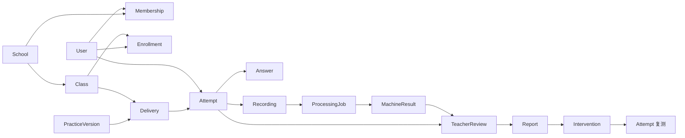

# 03｜业务架构、对象模型与状态机

## 当前事实基线

当前源码已经存在 School、User、Membership、Class、Enrollment、Course、CourseVersion、LearningActivity、Assignment、Submission、Recording、SpeechJob、PracticeDefinition、PracticeVersion、PracticeSection、PracticeItemRef、Delivery、AssessmentSession、AssessmentItem、WrittenAnswer、AssessmentReport 等对象，也已有学生课程、作业、录音、语音任务、反馈和评测相关接口。

这说明后续应优先统一现有对象语义和完成跨角色流转，而不是另起一套“比赛专用”模型。对象存在仅代表 `SOURCE_PRESENT`，不代表状态规则、权限和运行闭环已经验证。

## 业务分层

```text
组织与身份层：School / User / Membership / Class / Enrollment
内容与版本层：Course / CourseVersion / PracticeDefinition / PracticeVersion / Item
教学投递层：Assignment 或 Delivery
学习证据层：Attempt/Submission / Answer / Recording
处理与判断层：ProcessingJob/SpeechJob / MachineResult / TeacherReview
反馈与干预层：Report / Intervention / Retest Attempt
治理与审计层：Consent / AuditEvent / ProviderUsage / DataRetention
```

现有 `Assignment/Submission` 与 `Delivery/AssessmentSession` 两组概念存在并行风险。实施前必须做一次语义对齐：明确它们是不同业务层、兼容层还是需要收敛，禁止前端根据页面随意混用。

## 对象模型

| 对象 | 一句话定义 | 关键约束 |
| --- | --- | --- |
| School | 数据和授权的基础租户边界 | 所有用户和学习数据必须可追溯到学校上下文 |
| User | 登录主体 | 身份与角色分离，用户本身不等于某一角色 |
| Membership | 用户在学校中的角色关系 | 可停用、可审计，不能由前端声明 |
| Class | 教学组织 | 归属单一学校；历史关系应保留时间范围 |
| Enrollment | 学生/教师与班级的关系 | 权限判断依赖有效期和状态 |
| CourseVersion | 课程内容不可变快照 | 发布后不可直接覆盖历史版本 |
| PracticeVersion | 练习结构和评分规则快照 | Attempt 创建时绑定具体版本 |
| Delivery | 教师把某版本投递给目标群体的行为 | 包含目标班级、时间窗和规则 |
| Attempt | 学生对一次投递的独立尝试 | 重做创建新 Attempt，不覆盖旧记录 |
| Answer | 某 Attempt 下某 Item 的回答 | 幂等保存，保留 revision |
| Recording | 音频文件的业务登记与上传状态 | 文件和元数据分离，访问受控 |
| ProcessingJob | 对证据执行异步处理的任务 | 可重试、可观测、供应商结果原样留存 |
| MachineResult | 自动处理输出 | 不是最终教师结论，不可覆盖原始输出 |
| TeacherReview | 教师对证据的专业判断 | 保存触发原因、修改理由、reviewer、revision |
| Report | 对学生发布的反馈版本 | 来源可追溯，发布后以 revision 管理 |
| Intervention | 根据证据生成的后续巩固任务 | 必须关联来源 Report/Attempt |
| Consent | 数据处理授权事实 | 记录范围、版本、主体、时间和撤回状态 |
| AuditEvent | 高风险操作审计 | 追加写，不能作为普通业务记录随意修改 |

推荐的最小关系：



## 状态机

### Delivery

```text
DRAFT → OPEN → CLOSED → ARCHIVED
   └──── CANCELLED
```

- `DRAFT`：仅创建教师和有权限协作者可见；
- `OPEN`：目标学生可见并可创建 Attempt；
- `CLOSED`：默认不允许新 Attempt，是否允许已有 Attempt 迟交由规则决定；
- `CANCELLED`：发布错误等情况下停止继续使用，历史操作保留；
- `ARCHIVED`：只读归档，不等同删除。

### Attempt

```text
CREATED → IN_PROGRESS → SUBMITTING → SUBMITTED → PROCESSING
                                         ├→ NEEDS_REVIEW → REVIEWED → REPORTED
                                         ├→ PROCESSING_FAILED → NEEDS_REVIEW
                                         └→ REPORTED
NEEDS_REVIEW/REVIEWED → REDO_REQUIRED → 新 Attempt
CREATED/IN_PROGRESS → ABANDONED
```

规则：

- `SUBMITTED` 后答案和录音业务内容只读；修正以新 revision 或新 Attempt 表达；
- 处理失败不是 Attempt 丢失，必须保留证据并进入人工路径；
- 重做永远生成新 Attempt 并记录 `supersedes_attempt_id` 或等价关系；
- 只有服务端能推进提交、处理和报告相关状态。

### Recording

```text
PENDING_UPLOAD → UPLOADING → UPLOADED → VERIFIED → AVAILABLE
       ├──────────────→ UPLOAD_FAILED
UPLOADED/VERIFIED ────→ REJECTED
AVAILABLE ────────────→ RETENTION_EXPIRED/DELETED
```

- 对象存储上传成功不等于业务可用，服务端需校验文件存在、大小、类型和归属；
- 重试使用相同业务幂等键；孤儿文件应由回收任务处理；
- 删除受授权撤回、法定/约定保留期和审计策略约束。

### ProcessingJob / SpeechJob

```text
QUEUED → RUNNING → SUCCEEDED
             ├→ RETRY_WAIT → RUNNING
             └→ FAILED → MANUAL_REVIEW
CANCELLED
```

- 每次供应商调用记录 adapter、model/version、request id、耗时和费用口径；
- 超时和 4xx/5xx 分开处理；不可无限重试；
- `FAILED` 不得被转换成伪造的 `SUCCEEDED`；
- 手工修复后可创建新 job，旧 job 保留。

### TeacherReview

```text
PENDING → CLAIMED → CONFIRMED
                   ├→ ADJUSTED
                   └→ REDO_REQUIRED
CLAIMED → PENDING      （锁超时/释放）
任一可编辑状态 + 旧 revision → CONFLICT（不落库）
```

- `CONFIRMED` 表示接受机器/规则结果；
- `ADJUSTED` 必须保存原值、新值和修改理由；
- `REDO_REQUIRED` 必须保存学生可理解的说明；
- 多人协作必须有锁或乐观并发控制。

### Report

```text
DRAFT → READY → PUBLISHED → SUPERSEDED
   └──── FAILED → DRAFT/READY
```

- `PUBLISHED` 后不能原地覆盖；更新生成新 revision；
- `SUPERSEDED` 仍可供审计，不向学生作为当前报告展示；
- 报告必须能解释来源是自动处理、教师确认还是教师调整。

### Intervention

```text
DRAFT → ASSIGNED → STARTED → COMPLETED
                 ├→ EXPIRED
                 └→ CANCELLED
```

- 关联一个来源报告或复核结论；
- 完成时关联新的复测 Attempt；
- 自动建议只生成草稿，首校阶段由教师确认投递。

## 权限矩阵

服务端授权至少包含四个维度：`tenant/school`、`role`、`resource relation`、`object state`。

| 操作 | 学生 | 所属班教师 | 学校管理员 | 内容管理员 |
| --- | --- | --- | --- | --- |
| 读取自己的 Attempt | 是 | 所属班可读 | 原则上只读必要元数据 | 否 |
| 读取学生录音 | 自己可回放 | 所属班且为教学目的 | 默认否，特殊授权审计 | 否 |
| 发布 Delivery | 否 | 所属班 | 可配置但非默认 | 否 |
| 修改已提交 Answer | 否 | 否 | 否 | 否 |
| 提交 Review | 否 | 所属班且有复核权限 | 否 | 否 |
| 管理用户和班级 | 否 | 否或最小协助 | 本校可操作 | 否 |
| 发布内容版本 | 否 | 取决于教研角色 | 否 | 有审核权限时可 |

## 幂等、并发和追溯

- 创建 Attempt：同一用户、Delivery 和客户端发起键只返回同一未结束 Attempt；
- 保存 Answer：使用 `attempt_id + item_id + client_revision`；
- 完成上传：使用 `recording_id + object_checksum`；
- 提交 Attempt：同一幂等键重复调用返回相同结果；
- 提交 Review：必须携带当前 revision；
- 生成 Report：同一 Attempt/Review revision 只产生一个有效报告版本；
- 所有关键对象至少包含 `id`、`school_id`、`created_by`、`created_at`、`updated_at`、`revision`；
- 供应商原始输出、机器解释和教师结论分别保存，不相互覆盖。

## 失败与补偿原则

| 失败点 | 用户可见状态 | 系统补偿 | 禁止行为 |
| --- | --- | --- | --- |
| 音频上传失败 | 上传失败，可重试 | 续传/重传、回收孤儿对象 | 显示已提交 |
| 异步处理超时 | 处理中或转人工 | 有限重试、告警、人工队列 | 填充默认分数 |
| 报告生成失败 | 结果整理中 | 基于已确认数据重试 | 让教师重新复核 |
| 教师并发冲突 | 记录已更新 | 刷新并重新确认 | 最后写入静默覆盖 |
| 供应商不可用 | 能力暂不可用/待复核 | 切换受控适配器或人工流程 | 浏览器直连密钥、静默伪结果 |
| 越权访问 | 无权限 | 审计高风险事件 | 仅靠前端隐藏 |

## 当前模型收敛任务

在继续扩展数据库前，安排一个共享契约任务完成以下产物：

1. `Assignment/Submission` 与 `Delivery/AssessmentSession` 的语义对照表；
2. P0 选择的规范对象和兼容路径；
3. 状态枚举与现有数据库字段差异；
4. 所需 migration、OpenAPI 和前端生成类型变更；
5. 老数据迁移/兼容和回滚方案；
6. 一条真实对象链的 API、数据库和浏览器证据。

这属于共享模型和契约变更，必须由单一 owner 串行合入，不能让多个 Agent 同时各自改 Prisma 与 OpenAPI。

