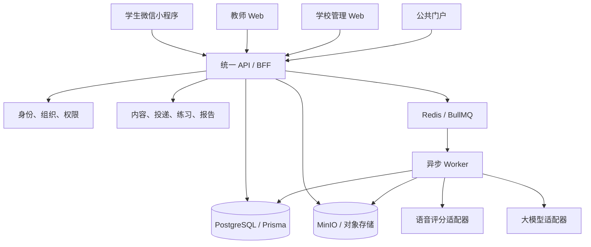

# 04｜技术架构、复用边界与端形态决策

## 架构结论

当前阶段采用“模块化单体 API + 独立异步 Worker + 供应商适配器 + 多端共享契约”。不要为了显得平台很大而过早拆微服务，也不要复制一套小程序专用后端。



## 当前工程可复用资产

| 现有资产 | 处置 | 复用条件 |
| --- | --- | --- |
| `frontend/` 学生、教师和管理页面 | 保留并逐页接真实契约 | 删除演示身份/固定 ID/固定结果；完成响应式与真机验收 |
| `backend/api` | 作为统一业务 API 主体 | 统一身份、租户和资源关系授权；补齐幂等和冲突 |
| `backend/worker` | 作为异步处理主体 | 任务状态可观测、有限重试、死信/人工处理 |
| `backend/speech-scoring` | 保留为语音评分适配器或本地能力 | 当前运行未验证；不得把不可用状态包装成成功 |
| Prisma 数据模型 | 保留并收敛语义 | 先解决并行对象语义，再做共享 migration |
| Redis/BullMQ | 复用 | 任务唯一性、重试和清理策略明确 |
| MinIO | 本地/演示复用 | 生产替换为符合部署要求的受控对象存储；短时授权访问 |
| Flowise | 可作为受控编排实验资产 | 当前仅证明入口可达；不承载核心业务真相和权限 |
| OpenAPI 与生成类型 | 强制作为端到端契约 | 后端、契约和调用方同一变更闭合 |

## 不采用的架构

- 不为比赛临时复制一套假后端或 JSON fixture；
- 不让小程序、教师 Web 各自定义业务状态；
- 不把浏览器 LocalStorage 当身份、授权或业务真相；
- 不由前端直接调用带密钥的 AI/语音供应商；
- 不在 P0 阶段拆分用户、课程、报告等多个独立微服务；
- 不用“HTTP 200”代替业务、数据和浏览器验收；
- 不把网页套壳视为小程序完成。

## 学生小程序实施方式

首版小程序只实现 S01—S08 的核心任务流，共用服务端业务对象与 OpenAPI 契约。建议先做原生小程序或团队已成熟掌握的跨端框架；选择标准不是“写得最快”，而是录音、上传、登录、包体和真机调试风险是否可控。

### 必须独立处理的差异

- 微信登录凭证只在服务端换取和绑定内部 User；
- 麦克风授权拒绝、重新授权和系统设置跳转；
- 录音分段、时长、格式、临时文件生命周期和回放；
- 上传合法域名、失败重试、弱网和前后台切换；
- 隐私保护指引、数据用途、用户授权与撤回；
- 小程序分包、审核、体验版、正式版和版本回滚；
- 真机 iOS/Android 兼容，不以开发者工具通过作为上线证据。

腾讯云的小程序实践文档也明确提示，收集或上传个人信息时应遵循隐私保护要求，并且业务域名、合法域名和开发工具临时绕过不能替代生产配置：[隐私保护实践](https://cloud.tencent.cn/document/product/1301/97930)、[业务域名配置](https://cloud.tencent.com/document/practice/1301/100434)、[开发工具与合法域名说明](https://cloud.tencent.cn/document/product/460/84410)。上线前仍需以微信公众平台当期规则和审核结果为准。

## 登录、租户和权限

### 当前必须整改

现有登录前端存在硬编码演示身份、假 token 和 API 失败后进入演示模式的路径。该行为会掩盖后端故障并污染后续业务证据，必须在任何投资/首校演示前移除。

### 目标规则

- 用户通过真实登录或受控演示身份服务获得短期 token；
- token 只表达主体身份，学校、角色和资源权限由服务端关系校验；
- 多角色用户显式切换上下文，切换留审计记录；
- 演示数据使用专门的 demo tenant 和可重置 seed，但仍经过真实 API；
- API 不可用时登录失败并显示可操作错误，不生成本地成功态；
- 任何端不得保存第三方供应商长期密钥。

## 文件与录音链路

推荐流程：

```text
客户端请求创建 Recording
→ API 校验 Attempt 和权限
→ API 返回短时上传信息
→ 客户端上传对象存储
→ 客户端/API 完成登记
→ API 校验对象、大小、类型和 checksum
→ Recording:VERIFIED
→ 创建 SpeechJob
```

演示环境可沿用当前 MinIO，但必须验证浏览器/小程序真实上传、跨域、签名地址和下载权限。生产环境选择对象存储时再评估地域、未成年人数据、费用和生命周期管理。

## 语音评测策略

语音评测是独立的大能力，不应和通用大模型混为一谈。P0 采用“可替换适配器 + 人工复核兜底”：

1. 保存原始录音和输入版本；
2. 调用当前开源/供应商实现；
3. 保存原始输出、模型/版本、置信度和耗时；
4. 用教研规则决定是否进入教师复核；
5. 不确定、失败或超时时显示 `NEEDS_REVIEW`；
6. 用一组经教师标注的最小评测集比较可用性，不能只展示单个成功样例。

当前 `backend/speech-scoring` 的端口在本次核验中未运行，因此只能标记为 `SOURCE_PRESENT`，不能声明语音闭环可用。

## DeepSeek 与大模型接入策略

用户已经在聊天中暴露过一个看起来有效的 API 密钥。该密钥不得使用、复制或写入仓库，应立即在供应商控制台撤销并新建一个限额、可轮换的密钥。新密钥只配置在本地忽略目录或部署平台密钥管理中，例如受仓库规则保护的 `runtime-local/secrets/ai-provider.env`，绝不能进入前端包。

截至 2026-07-26，DeepSeek 官方文档显示当前模型名称已调整，旧 `deepseek-chat` 和 `deepseek-reasoner` 已在 2026-07-24 的 API 更新中退出，接入时必须以[官方更新记录](https://api-docs.deepseek.com/updates/)和[当前定价/模型页](https://api-docs.deepseek.com/quick_start/pricing)为准，不要把旧模型名硬编码在产品逻辑里。

### 可进入 P1 的用途

- 基于冻结模板生成教案草稿；
- 对内容运营人员提供双语翻译草稿；
- 对教师反馈做结构化润色建议；
- 把非结构化输入转换为受 schema 约束的草稿。

### 不允许的用途

- 直接充当语音评分引擎；
- 无人复核地生成学生最终成绩或高风险标签；
- 把学生真实姓名、完整音频或非必要个人数据发送给模型；
- 浏览器直连或在日志中记录密钥；
- 模型失败时返回固定内容假装成功。

### Provider Adapter 约定

```text
AiProvider.generateStructured(input, schema, policyContext)
  → ProviderResult {
      provider, model, requestId, status,
      rawText, parsedPayload, validationErrors,
      tokenUsage, latencyMs, createdAt
    }
```

- 模型名称、base URL、超时、预算和启用状态来自服务端配置；
- 输出先按 JSON Schema 校验，再进入业务草稿；
- DeepSeek 官方说明 JSON Output 仍可能出现空内容，因此必须检测空响应、做有限重试并保留失败状态：[JSON Output 指南](https://api-docs.deepseek.com/guides/json_mode)；
- 对超时、限流、余额不足、无效参数和服务错误分别映射，参考[限速说明](https://api-docs.deepseek.com/quick_start/rate_limit)与[错误码](https://api-docs.deepseek.com/quick_start/error_codes/)；
- 记录费用和 token 使用但不记录敏感正文；
- 适配器失败时进入“草稿不可用/等待人工”，不阻断核心学习闭环。

## 运行与部署基线

当前唯一入口仍是 `scripts/local-runtime/start-main.ps1`，但本次检查发现端口已占用时脚本会在部分依赖初始化后失败。下一任务应把启动脚本改为幂等运行控制面：

- 启动前识别 4175、4000、8100 等端口对应的进程和工作树；
- 对同一基线的健康实例执行复用或显式重启；
- 对未知进程停止并报告，不得自动杀死；
- 启动失败时清理本次创建的子进程，不影响预先存在的实例；
- 输出服务、PID、端口、版本 SHA、日志路径和 readiness；
- 提供成对的 status/stop 命令；
- 对 API、对象存储、队列、Worker、语音适配器分别做健康检查。

## 可观测与成本

最小可观测性不需要先建设大平台，但要能回答：谁在何时做了什么、哪个对象失败、供应商调用多少次、花费多少、能否恢复。

- 请求日志：request id、actor、school、route、status、latency；
- 业务事件：Delivery、Attempt、Recording、Review、Report 状态转换；
- 异步任务：队列等待、执行、重试、失败和人工接管；
- 供应商：provider/model、调用次数、成功率、P95、token/时长、费用；
- 告警：提交不可用、上传失败激增、队列积压、报告长时间未生成；
- 隐私：默认脱敏，不在普通日志保存录音 URL、token 和完整学生内容。

## 架构完成门禁

- 同一业务规则在小程序与 Web 不出现两套定义；
- 身份、学校和资源授权全部由服务端验证；
- 共享对象、状态、OpenAPI、生成类型和数据库一致；
- 所有外部能力通过可替换 adapter，失败可见且可人工接管；
- 一键启动可重复，服务版本和所有权可辨认；
- 密钥不在源码、前端、截图、任务文档和普通日志中；
- 真实业务闭环能够用浏览器/API/数据库三类证据互相印证。
