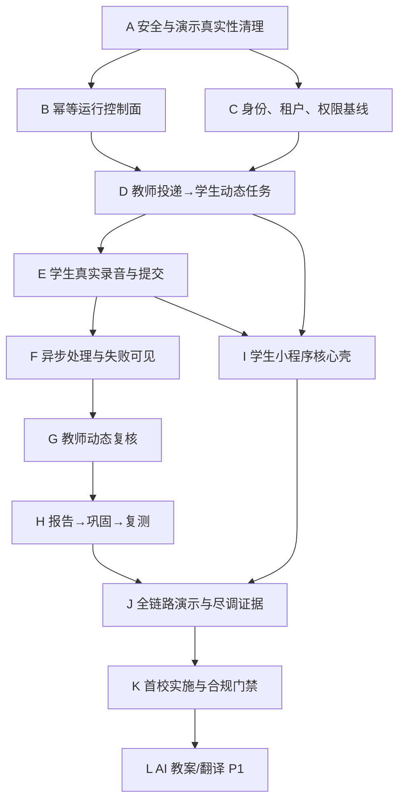

# 05｜开发路线、任务图与验收门禁

## 总体策略

快速开发不是同时开启更多 Agent，而是缩短“一个小闭环从定义到真实证据”的周期。每一波只做满足前置依赖的任务；共享契约由单一 owner 串行修改；其他成员围绕页面、测试、内容和证据并行。

推荐节奏：每天最多合入一批共享契约变化，每 1—2 天形成一个可演示检查点，每周做一次跨角色黄金闭环回归和一次产品事实复核。

## 依赖图



## 开发波次

### 波次 0｜48 小时：止血与可信基线

目标：停止产生伪成功，为后续所有证据建立可信环境。

| 顺序 | 任务包 | 主要产出 | 验收重点 |
| --- | --- | --- | --- |
| 0.1 | `P0-SEC-AUTH-DEMO-FALLBACK-REMOVAL` | 删除前端假 token、API 失败登录成功、硬编码演示身份；演示租户走真实 API | 断开 API 后必须登录失败；无密钥/密码进入前端包 |
| 0.2 | `P0-DYNAMIC-ID-ROUTING-CLEANUP` | 清除 `submission-1` 等固定业务 ID 和固定指标 | 全局扫描；任意新提交都能打开正确详情 |
| 0.3 | `P0-RUNTIME-IDEMPOTENT-STARTUP` | status/start/stop、端口所有权、失败清理、服务版本输出 | 连续启动两次行为可预测；未知端口占用不被误杀 |
| 0.4 | `P0-MOBILE-VISUAL-BLOCKERS` | 修复 390px 登录首屏文字重叠及核心页面溢出 | 390px/430px 截图、无控制台错误、键盘与触控可用 |

波次 0 未完成前，不录制“已上线”宣传视频，不把当前环境交给评审自由操作。

### 波次 1｜第 3—7 天：跨角色最短闭环

目标：教师创建 OPEN 投递，学生新登录后收到动态任务并提交，教师用动态 ID 看到真实提交。

| 顺序 | 任务包 | 主要产出 | 验收重点 |
| --- | --- | --- | --- |
| 1.1 | `P0-AUTH-TENANT-ROLE-CLOSURE` | 学校、角色、班级关系和资源授权统一 | 正向角色 + 跨校/跨班负向测试 |
| 1.2 | `P0-ASSIGNMENT-DELIVERY-MODEL-ALIGNMENT` | Assignment/Delivery 与 Submission/Attempt 语义对齐 | 决策记录、migration、OpenAPI、生成类型同批一致 |
| 1.3 | `P0-TEACHER-STUDENT-ASSIGNMENT-CLOSURE-001` | 教师发布 → 学生 fresh context 可见 → 学生完成 → 教师查看 | 浏览器、API、DB 四段证据；无固定 ID |
| 1.4 | `P0-PRACTICE-RUNTIME-REVALIDATION` | 对已集成练习和课程提交重新做运行验收 | 不引用旧截图；当前 SHA、当前运行环境、动态对象 |

这是当前仓库已接受计划中明确的下一主任务。不得跳过 1.3 直接扩展 AI、社区或更多页面。

### 波次 2｜第 8—14 天：完整比赛闭环

目标：把真实提交接到处理、复核、报告和复测，形成可重复比赛演示。

| 顺序 | 任务包 | 主要产出 | 验收重点 |
| --- | --- | --- | --- |
| 2.1 | `P0-RECORDING-UPLOAD-CLOSURE` | 录音权限、上传、校验、重试和受控回放 | 中断重试不重复；越权不可访问 |
| 2.2 | `P0-SPEECH-JOB-FAILURE-VISIBILITY` | 语音 Job 状态、有限重试、失败转人工 | 8100 不可用时显示真实状态，不伪造分数 |
| 2.3 | `P0-TEACHER-REVIEW-CLOSURE` | 队列、领取、动态证据、确认/修改/重做、并发控制 | 原机器值保留；修改原因；409 冲突 |
| 2.4 | `P0-REPORT-INTERVENTION-RETEST` | 报告 revision、巩固投递、新 Attempt 和前后关系 | 重做不覆盖原数据；报告来源可解释 |
| 2.5 | `P0-DEMO-REHEARSAL-EVIDENCE` | 一键重置演示租户、三轮流程、现场降级、证据包 | 三轮成功；每轮动态 ID；失败路径可解释 |

如果距离比赛不足 14 天，先把学生端做成手机浏览器可用的可信闭环，再并行构建小程序壳；不要牺牲真实业务换取“有二维码”。二维码可先指向受控 H5，答辩时必须如实称为移动端演示版。

### 波次 3｜第 15—30 天：学生小程序与产品化基础

目标：学生核心流进入小程序体验版，教师继续使用 Web，共用同一 API。

- `P0-MINIAPP-AUTH-BOOTSTRAP`：微信身份与内部 User 绑定、体验版环境；
- `P0-MINIAPP-TODAY-DETAIL`：S02—S03；
- `P0-MINIAPP-RECORDING-EXECUTOR`：S04—S06；
- `P0-MINIAPP-REPORT-RETEST`：S07—S08；
- `P0-MINIAPP-PRIVACY-DOMAIN-DEVICE`：隐私、合法域名、iOS/Android 真机矩阵；
- `P0-ADMIN-MINIMUM-GOVERNANCE`：班级、账号、授权与审计最小后台；
- `P0-OBSERVABILITY-AND-COST`：业务事件、异步任务、供应商调用和错误告警。

### 波次 4｜第 31—45 天：首校可用 MVP

目标：不依赖研发现场看守，一个真实班级能连续使用。

- 冻结首校、年级、班级、课表、设备、内容和联系人；
- 完成账号导入/激活、教师培训、学生引导和问题反馈；
- 完成数据授权、保留、删除、备份、恢复和事故处理；
- 建立内容版本审核与发布流程；
- 演练供应商不可用、上传失败、队列积压和账号误配；
- 建立日/周使用与异常报告，指标全部有口径和数据来源；
- 通过首校 Go/No-Go 评审后才开始真实学生试点。

### 波次 5｜第 46—90 天：验证商业与扩展能力

目标：以首校数据决定是否扩展，而不是按最初蓝图自动开发。

- 验证教师复核时间、学生有效提交率、重做完成率和实施成本；
- 访谈教师、学校管理者和潜在采购/资助方；
- 建立可复用实施包和单位经济初稿；
- 只有教研与合规边界清楚后，才上线 AI 教案和翻译草稿工作流；
- 是否扩到第二课、第二班、第二校，由门禁数据决定；
- App、社区、志愿者和区域平台继续保持 P2，除非出现经过验证的新需求。

## 并行开发规则

### 可以并行

- 已冻结契约下的学生页面、教师页面和自动化测试；
- 内容样例制作、演示脚本和合规材料；
- 不同页面的视觉整改；
- 只读审计、测试和证据整理。

### 必须串行或单一 owner

- Prisma schema 与 migration；
- OpenAPI 与生成类型；
- 身份、租户和权限中间件；
- 核心状态枚举；
- 共享运行脚本；
- 同一页面/模块的重叠修改。

### Agent 使用原则

Agent 不是负责人替代品。每个 Agent 只领取一个有明确边界的任务包，不允许多个 Agent 根据宏观 PRD自行发明对象和接口。产品负责人关闭业务决策，契约 owner 维护共享模型，集成负责人只接收通过门禁的提交。

## 标准任务包

每个开发任务都必须包含：

```yaml
id: P0-...
user_outcome: 用户完成什么可观察结果
current_facts: 当前源码/运行真实状态
scope: 本任务要改什么
non_goals: 明确不改什么
depends_on: 完整 SHA 或已接受任务
allowed_paths: 可修改路径
shared_owner_changes: Prisma/OpenAPI/权限/运行脚本等共享面
business_rules: 对象、状态、权限、幂等、异常
acceptance:
  - source_and_contract
  - automated_tests
  - live_api
  - browser_flow
  - database_or_log_evidence
  - negative_paths
rollback: 如何回退且不破坏数据
handoff: 证据路径、已知限制、下一依赖
```

任务不得只写“完成教师端”或“优化体验”。它必须小到 1—3 天能形成独立证据，大到能产生一个用户可观察结果。

## 完成定义

### 单任务 DoD

- 从已接受的完整 SHA 开始，工作树范围明确；
- 变更只落在允许路径，未覆盖他人脏改动；
- 业务规则和异常分支在代码与文档一致；
- 类型检查、构建、相关测试通过；
- 对真实 API、动态 ID 和真实登录态完成浏览器验证；
- 至少验证一个越权/失败/并发路径；
- 证据写清“验证了什么”和“没有验证什么”；
- 集成后在新基线重新运行最小回归。

### 波次 DoD

- 本波所有前置任务已合入同一集成基线；
- 完成跨任务回归而非拼接各自截图；
- 没有 `fixture/demo/fixed-id` 被当成生产路径；
- 没有未知的跳过测试影响本波关键链路；
- 业务、产品、技术和测试验收人明确签字或记录结论；
- 下一波只从已暴露的真实缺口发起。

## 证据包模板

每个检查点保存：

1. Git：分支、完整 base SHA、结果 SHA、工作树状态；
2. 环境：Node/pnpm/数据库/服务版本和启动方式；
3. 自动化：命令、通过/失败/跳过数量；
4. API：关键请求、响应状态、动态对象 ID；
5. 浏览器：角色、入口、操作步骤、页面截图、控制台和网络错误；
6. 数据：关键对象状态链或审计事件；
7. 负向：越权、重复提交、供应商失败或弱网中的至少一项；
8. 限制：尚未验证的端、设备、供应商、数据和合规事实。

## 每周复核

每周只回答以下问题：

- 唯一 P0 是否更接近 `FLOW_VERIFIED`；
- 本周关闭了哪几个业务决策，证据是什么；
- 哪些“已完成”在集成后失效或需要重验；
- 哪条假设被真实用户、运行或数据推翻；
- 下周最大的单点风险是什么；
- 有哪些功能应删除、冻结或降级，而不是继续维护。

## 立即执行清单

从当前基线开始，不需要再开新一轮宏观讨论，按以下顺序执行：

1. 指定四位责任角色，哪怕同一人兼任，也必须明确其在每个决策中的身份；
2. 关闭比赛日期、首个内容单元和演示设备三个问题；
3. 派发波次 0 的三个工程阻断任务；
4. 按当前看板启动 `P0-TEACHER-STUDENT-ASSIGNMENT-CLOSURE-001`；
5. 每完成一项就在同一集成环境重验，不接受仅任务分支截图；
6. 黄金闭环三轮成功后，再决定小程序是否能在比赛前完整交付；
7. 同步准备内容、讲解、尽调和首校材料，但不让其改动核心契约。
