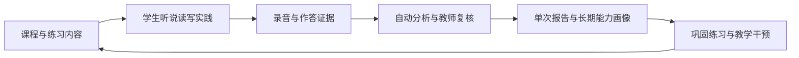

# 语赞心声产品总章程 v3.0

> 生效日期：2026-07-19  
> 当前阶段：核心产品收敛  
> 适用范围：学生端、教师端、志愿者端、管理端、API、worker 和数据模型

## 1. 产品定位

语赞心声是：

> 面向西藏地区学生的国家通用语言文字学习、练习、评测和教学干预一体化平台。

它不是普通网课平台、一次性考试系统、AI 工具集合或数据大屏。产品价值来自同一条持续循环：



所有新功能都必须回答：它增强了这个循环的哪一环？

## 2. 核心用户与核心任务

### 学生

学生需要：

- 清楚知道今天学什么、练什么；
- 能在弱网或断网时继续完成必要步骤；
- 获得示范、练习、反馈和下一步建议；
- 看懂自己的进步，而不是只看到一个分数；
- 知道录音和学习数据如何被使用。

学生端一级入口固定为：

```text
今日学习
课程学习
练习与测评
成长档案
```

### 教师

教师需要：

- 看到班级和学生当前最值得处理的问题；
- 快速准备教学内容和练习；
- 把一份练习便捷地布置给班级或个别学生；
- 只复核低置信度、主观题和异常证据；
- 将反馈直接转成下一项练习或教学干预。

教师端一级工作空间固定为：

```text
今日工作台
班级洞察
备课与资源
练习与作业
复核与干预
```

### 志愿者

志愿者只承担有边界的辅助角色：

- 培训与认证；
- 查看被授权学生的最小必要信息；
- 准备一次帮扶；
- 记录帮扶过程；
- 发现风险时转交教师或学校。

志愿者不得看到完整班级数据、未授权录音、隐私请求或教师内部评价。

### 学校管理者

管理端负责治理，不抢占产品中心：

- 学校、班级、成员和角色；
- 课程、练习、评分标准和发布治理；
- 教学质量趋势；
- 供应商、额度和处理状态；
- 数据授权、保留、导出、删除和审计；
- 志愿者范围与风险事件。

## 3. 三层产品壁垒

### 第一层：国通语内容体系

每个教学内容必须落到可执行练习。完整单元至少包含：

```text
内容导入
→ 示范听辨
→ 跟读模仿
→ 独立表达
→ 书面理解
→ 结果反馈
→ 巩固建议
```

内容壁垒不是页面数量，而是经过教研确认的：

- 学习目标；
- 适用年级；
- 国通语能力标签；
- 题型与难度；
- 示范音频与文本；
- 评分量表；
- 常见问题；
- 补救练习；
- 版权与来源证据。

### 第二层：统一练习与测评引擎

自主练习、课程练习、作业和阶段测评共用同一套内容、执行、证据和报告能力。它们的差异只由交付策略控制。

| 模式 | 典型用途 | 允许重录 | 答案/提示 | 截止与计时 | 结果用途 |
|---|---|---:|---|---|---|
| `SELF_PRACTICE` | 学生自主练习 | 多次 | 可即时反馈 | 无强制截止 | 自我巩固 |
| `COURSE_PRACTICE` | 课程内练习 | 可配置 | 完成后反馈 | 受课程顺序约束 | 更新课程进度 |
| `ASSIGNMENT` | 教师作业 | 可配置 | 提交后反馈 | 有开始和截止 | 教师复核 |
| `STAGE_ASSESSMENT` | 阶段测评 | 严格限制 | 完成前不可见 | 统一时间和自动提交 | 能力报告 |

“正式考试”涉及更严格的防作弊、设备、监考和合规要求，不进入当前 P0。

### 第三层：能力画像与教学干预

单次报告必须回答：

- 本次完成了什么；
- 哪些证据支持结论；
- 哪些结果由机器生成；
- 哪些结果经过教师复核；
- 当前最主要的两个问题；
- 下一步最小可行练习是什么。

长期能力画像按稳定维度汇总，例如：

```text
听辨
声母
韵母
声调
语音清晰度
朗读完整度
流利度
停顿与节奏
听后复述
内容完整度
词汇
句式
阅读理解
书面表达
```

维度、口径和版本必须可追溯。任何 AI 建议都不能脱离原始证据独立成为“最终判断”。

## 4. 统一领域模型

### 4.1 内容层

当前继续复用：

- `Course`、`CourseVersion`：课程及不可变发布版本；
- `Unit`、`Lesson`、`LearningActivity`：课程结构；
- `Question`：已有题目内容；
- `Resource`、`ActivityResource`：文本、音频、图片和其他授权资源。

### 4.2 练习定义层

补充最小领域对象：

#### PracticeDefinition

练习的稳定身份，例如“古诗文朗读与理解训练”。

关键字段：

- 标题、简介、适用年级、难度和预计时长；
- 内容来源与版权状态；
- 能力标签；
- 是否允许自主练习；
- 创建者和所属学校；
- 当前发布版本。

#### PracticeVersion

一次不可变发布版本。草稿可以编辑，发布版本不可原地修改。

关键字段：

- `definitionId`；
- `version`；
- `status`；
- `contentRevision`；
- `rubricVersionId`；
- 发布者和发布时间；
- 变更说明。

#### PracticeSection

定义执行顺序和环节规则，例如：

```text
听辨
跟读
看文朗读
听后复述
书面理解
```

关键字段：

- 标题、说明、顺序；
- section 类型；
- 权重；
- 是否允许跳过；
- 是否要求设备检查；
- 时间和播放规则。

#### PracticeItemRef

引用已有 `Question` 或内容资源，不重复复制题目事实。

关键字段：

- `questionId` 或资源引用；
- item 类型；
- 顺序；
- 目标文本；
- 是否显示文本；
- 示范音频；
- 播放次数；
- 准备、作答、录音时间；
- 重试次数；
- 能力标签；
- 评分量表条目。

#### ScoringRubricVersion

评分标准必须版本化。至少包含：

- 适用题型；
- 维度与权重；
- 总分和通过阈值；
- 人工复核阈值；
- 机器评分器版本；
- 音频最低质量；
- 发布状态和变更说明。

### 4.3 交付层

#### PracticeDelivery

把一个已发布练习交付给学生。

关键字段：

- `practiceVersionId`；
- 模式；
- 目标班级或学生；
- 开始、截止和可见时间；
- 重录、答案、计时和自动提交策略；
- 创建者；
- 与课程、作业或测评的关联。

现有 `Assignment` 可以继续承担教师作业外壳，但必须关联练习版本，不能只关联课程版本。

### 4.4 执行层

短期继续以 `AssessmentSession` 作为统一执行记录的底层实现，并补充：

- `practiceVersionId`；
- `deliveryId`；
- `mode`；
- `policySnapshot`；
- `rubricSnapshot`；
- `contentSnapshotHash`。

现有 `AssessmentItem` 作为一次执行中的 item 快照。它必须保存当时的 prompt、规则和评分引用，避免发布内容后改动导致历史记录失真。

现有 `ActivityAttempt` 继续服务课程活动进度。黄金闭环完成后，再评估是否合并到统一 attempt 模型。

### 4.5 证据与处理层

- `Recording`：录音生命周期、对象存储和上传状态；
- `RecordingChunk`：分片与校验信息；
- `SpeechJob`：评分任务、供应商、模型、结果和错误；
- `WrittenAnswer`：书面草稿与最终答案；
- 教师复核字段：最终分数、评语、复核人和复核时间。

### 4.6 报告与干预层

- `AssessmentReport`：单次执行报告；
- `LearningPlan`：教师确认后的干预计划；
- 后续新增能力快照或证据聚合表，但不得把未经复核的 AI 推断直接固化为学生标签。

## 5. 第一条黄金闭环

练习名称：古诗文朗读与理解训练 v1。

### 内容结构

1. 练习详情与能力目标；
2. 麦克风、扬声器、网络和浏览器检查；
3. 示范听辨；
4. 听后跟读；
5. 看文朗读；
6. 听后复述；
7. 三道书面理解题；
8. 提交前检查；
9. 自动处理与明确等待状态；
10. 教师复核；
11. 学生报告；
12. 一项巩固练习建议。

### 最小评分量表

| 环节 | 维度 | 权重 |
|---|---|---:|
| 跟读/朗读 | 发音准确度 | 20% |
| 跟读/朗读 | 完整度 | 10% |
| 跟读/朗读 | 流利度 | 10% |
| 跟读/朗读 | 停顿与节奏 | 10% |
| 听后复述 | 信息点覆盖 | 15% |
| 听后复述 | 表达连贯度 | 10% |
| 书面理解 | 客观题正确率 | 15% |
| 书面理解 | 简答内容 | 10% |

这只是 v1 示例，正式权重必须由教研确认并版本化。

### 成功标准

- 教师选择真实练习版本并发布；
- 学生不依赖固定 ID 进入执行；
- 每个 section 和 item 来自后端；
- 录音真实上传，失败时保留本地并明确未同步；
- worker 可处理，供应商未配置时明确展示；
- 低置信度结果进入教师复核；
- 报告按评分量表计算并展示证据；
- 学生不能访问其他学生的 session、录音或报告；
- 教师只能访问授权班级；
- 1440、1024、390 三个视口可用；
- 正常、加载、空、错误、离线、权限不足状态完整。

## 6. 页面与交互原则

每个页面只回答一个核心问题：

| 页面 | 核心问题 |
|---|---|
| 今日学习 | 我今天应该做什么？ |
| 课程页 | 我正在学习什么，下一步是什么？ |
| 练习中心 | 我现在可以练什么？ |
| 练习详情 | 这项练习训练什么、怎么完成？ |
| 执行器 | 我现在应该听、说还是作答？ |
| 报告页 | 哪些证据说明我做得如何，下一步练什么？ |
| 教师工作台 | 今天最需要我处理什么？ |
| 班级洞察 | 班级当前最突出的问题是什么？ |
| 练习布置 | 给谁布置哪一个已发布版本？ |
| 复核页 | 哪些机器结果需要我判断？ |

禁止继续采用：

- 同等权重的通用卡片墙；
- 为一个业务步骤再开多个无必要页面；
- 静态统计数字冒充真实数据；
- API 失败后无提示地继续展示演示内容；
- 用固定学生、课程、session 或题目 ID 完成流程；
- 用 AI 建议替代教师确认。

## 7. P0、P1、P2 边界

### P0：产品内核

- 练习定义、版本、section、item 和 rubric；
- 练习库和练习详情；
- 教师选择、发布和查看；
- 学生通用执行器；
- 录音、书面答案、提交、SpeechJob；
- 教师复核；
- 报告和一次巩固建议；
- 课程入口接入；
- 权限、异常和测试。

### P1：数据与智能化

- 长期能力画像；
- 班级共性问题；
- 推荐练习；
- 教师备课助手；
- 可编辑的练习生成；
- 个性化干预计划；
- 更完整的离线 outbox 和冲突处理。

### P2：扩展业务

- 志愿者完整培训和帮扶助手；
- 管理端扩展驾驶舱；
- 社区、合作、套餐和大规模运营能力；
- 正式考试级监考；
- 复杂推荐或知识图谱。

## 8. 北极星指标

当前不以页面数、接口数或 AI 功能数衡量进展。

产品北极星指标是：

> 每周完成至少一项“有真实证据、有有效反馈、有下一步行动”的国通语练习的活跃学生比例。

配套指标：

- 练习开始到有效提交的完成率；
- 录音上传成功率；
- 处理成功率和平均等待时间；
- 需要人工复核比例；
- 教师复核完成时长；
- 学生收到反馈后的再次练习率；
- 同一能力维度的连续改善情况；
- 离线完成后成功恢复同步比例。

## 9. 数据与 AI 底线

- 录音前必须有明确授权提示；
- 只采集完成练习所需的数据；
- 明确保留期限、撤回、导出和删除机制；
- 学校、班级、学生和资源范围全部由服务端校验；
- 供应商只能获得最小必要数据；
- AI 结果带版本、置信度、输入摘要和处理状态；
- 教师修改机器结果时保留前后值和理由；
- 不把单次低分固化为长期负面标签；
- 不使用真实学生数据做本地演示、截图或模型测试。

## 10. 章程的完成判断

只有满足以下事实，才能说产品内核已经形成：

1. 同一份练习可以以自主练习和教师作业两种模式交付；
2. 同一执行器能根据配置运行口语和书面题；
3. 录音、答案、评分、复核和报告可追溯；
4. 报告能给出具体、可行动的下一步；
5. 教师能从报告直接追加巩固练习；
6. 课程结束能进入练习，练习结果能回到课程和成长档案；
7. 权限、离线和失败状态不伪造成功；
8. 关键链路有自动化测试和三视口截图证据。

