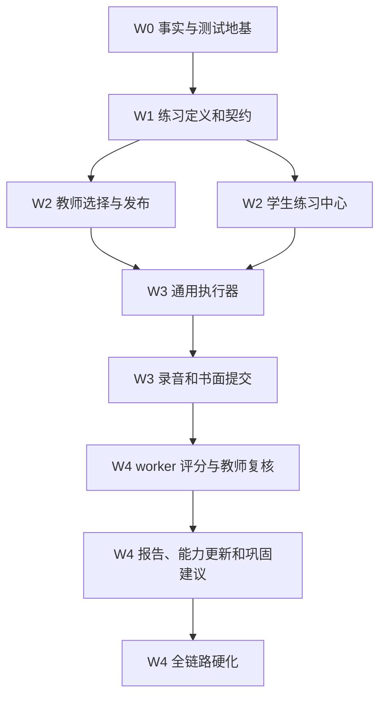

# 前后端一体化详细开发进程

> 周期：20 个工作日  
> 目标：不是完成全平台，而是交付第一条真实、可复用、可扩展的黄金闭环。  
> 前端：`web-runtime`  
> 后端：`apps/api`  
> 异步处理：`apps/worker`

## 1. 最终交付物

20 个工作日后，系统必须能完成：

```text
教师创建或选择“古诗文朗读与理解训练 v1”
→ 配置班级、截止时间和执行规则
→ 发布给真实测试学生
→ 学生在练习中心看到任务
→ 查看练习详情
→ 设备检查
→ 完成听辨、跟读、朗读、复述和书面题
→ 录音与答案真实写入
→ worker 处理语音或明确供应商不可用
→ 低置信度结果进入教师复核
→ 生成按 rubric 计算的报告
→ 学生看到证据和下一步建议
→ 教师一键追加巩固练习
```

同一份练习还必须能以 `SELF_PRACTICE` 模式开放，证明这不是一次性测评。

## 2. 总体依赖



任何后续阶段不得绕过前置阶段，用静态数据伪造已完成页面。

## 3. 每日固定节奏

赶工不等于无门槛。每天采用：

1. 上午确定当天唯一纵向目标；
2. 先冻结请求/响应和状态；
3. 后端、worker、前端并行实现不同层；
4. 下午用同一测试数据联调；
5. 下班前跑局部测试并更新验收表；
6. 未完成项保留真实状态，不用假数据补页面。

每天只回答：

- 今天新增了哪个真实用户动作？
- 它的数据从哪里来？
- 失败时怎样表现？
- 哪个自动化验证证明它可用？

## 4. 第 1 阶段：事实与地基收敛（第 1—2 天）

### Day 1：接口和模型盘点

#### 后端

- 导出当前 Controller 路由；
- 对照 `packages/contracts/openapi/openapi.yaml`；
- 对照 `web-runtime/assets/api-client.js`；
- 标出已实现、缺失、路径冲突和 DTO 冲突；
- 明确 `AssessmentSession` 暂作 attempt 的决定；
- 明确 `Question.kind` 到练习 item 类型的映射。

#### 前端

- 列出黄金闭环会触发的全部页面和 API；
- 删除计划中对固定 demo session 的依赖；
- 标出默认硬编码数据、静默 catch 和假回退；
- 记录当前状态矩阵。

#### worker

- 确认 BullMQ queue 名称、消息 payload、内部 API 和供应商状态；
- 明确 `PROVIDER_NOT_CONFIGURED`、超时、坏音频和最终失败的状态。

#### 当日验收

- 一份端点矩阵；
- 一份领域映射；
- 一份已知断点清单；
- 不修改业务功能。

### Day 2：测试地基

#### 必修问题

- Classes 测试补 `PrismaService` 和 `AssessmentService` 测试 provider；
- Assignments 测试补 Prisma provider；
- Submissions 测试补新增依赖；
- Learning 和 Reporting 测试补新增 repository/provider；
- 数据库集成测试改为明确的 test database gate；
- 新建 Assessment、Recording、SpeechJob、worker 测试目录。

#### 验收命令

```text
pnpm --filter @yuzan/api typecheck
pnpm --filter @yuzan/worker typecheck
pnpm --filter @yuzan/api test
pnpm --filter @yuzan/worker test
```

#### 退出条件

- 使用 Node 24；
- API 非数据库单元测试全绿；
- 数据库套件有库时运行、无库时明确跳过；
- worker 至少有一个正常和一个失败测试，不再是 0 测试；
- 记录基线数字。

## 5. 第 2 阶段：统一练习定义（第 3—5 天）

### Day 3：契约设计

冻结以下对象：

- `PracticeDefinition`；
- `PracticeVersion`；
- `PracticeSection`；
- `PracticeItemRef`；
- `ScoringRubricVersion`；
- `PracticeDelivery`；
- attempt policy snapshot。

建议第一批端点：

```text
GET    /api/v1/schools/:schoolId/practices
POST   /api/v1/schools/:schoolId/practices
GET    /api/v1/schools/:schoolId/practices/:practiceId
POST   /api/v1/schools/:schoolId/practices/:practiceId/versions
GET    /api/v1/schools/:schoolId/practice-versions/:versionId
POST   /api/v1/schools/:schoolId/practice-versions/:versionId/submit-review
POST   /api/v1/schools/:schoolId/practice-versions/:versionId/publish
POST   /api/v1/schools/:schoolId/practice-deliveries
GET    /api/v1/schools/:schoolId/practice-deliveries
```

如果选择不同命名，必须保持对象边界，不得继续把所有能力塞进 `/assessments`。

### Day 4：数据库与 repository

#### 最小增量

- 添加练习定义、版本、section、item 引用和 rubric 版本；
- 添加 delivery；
- 给 `AssessmentSession` 添加 `practiceVersionId`、`deliveryId`、`mode` 和快照；
- 索引学校、状态、可见时间和目标；
- 所有关系包含学校范围校验；
- 发布版本不可变。

#### 测试

- 发布后不能原地修改；
- 跨学校引用 Question 被拒绝；
- 跨学校引用 rubric 被拒绝；
- delivery 只能引用已发布版本；
- 不同学校不能读取同一 practice；
- 迁移可回滚。

### Day 5：第一份真实内容

准备“古诗文朗读与理解训练 v1”：

- 使用内部自有或已登记授权文本与音频；
- 2 个以上口语 section；
- 1 个书面 section；
- 真实能力标签；
- 明确准备、播放、录音和重录规则；
- rubric v1；
- 内容来源和版权状态；
- 开发 fixture 与正式内容分开。

#### 退出条件

后端能返回完整、动态、可执行的练习版本；不存在任何固定 `spring-2` 或 demo item ID。

## 6. 第 3 阶段：教师发布与学生发现（第 6—8 天）

### Day 6：教师练习库和编辑入口

#### 前端

- 在教师端提供练习库；
- 支持按年级、能力、题型、状态筛选；
- 显示版本和发布状态；
- 选择已有练习，不要求先实现完整可视化编辑器；
- 没有内容时显示空状态。

#### 后端

- 列表、详情和权限；
- 教师只能管理当前学校内容；
- 平台内容与学校内容的可见范围明确。

### Day 7：发布流程

教师发布只保留：

```text
选择练习版本
→ 选择班级或学生
→ 选择模式
→ 设置开始/截止和重录规则
→ 预览
→ 发布
```

必须修复当前问题：

- `enrollmentIds` 的 DTO 与 service 规则一致；
- `questionIds` 不再由前端临时传空，而由已发布练习版本决定；
- 禁止创建 0 个 item 的 session；
- 批量创建要有事务或可恢复策略；
- 通知失败不能回滚已成功的核心交付，也不能伪装全部成功。

### Day 8：学生练习与测评中心

学生端合并为四类：

- 推荐练习；
- 自主练习；
- 教师布置；
- 阶段测评。

练习卡只显示真实数据：

- 标题、能力目标、预计时间；
- 模式和截止；
- 当前状态；
- 是否允许继续；
- 最近一次结果。

点击后进入动态详情：

```text
/practice/:practiceVersionId
```

开始后进入：

```text
/attempts/:attemptId/prepare
```

旧 `/assessment/sessions/:sessionId` 可在兼容期映射到同一执行器。

#### 退出条件

教师发布的同一练习能出现在目标学生列表中；其他学校、其他班级和未目标学生不可见。

## 7. 第 4 阶段：通用执行器与证据提交（第 9—12 天）

### Day 9：执行状态机

前后端共同冻结：

```text
CREATED
→ DEVICE_CHECK
→ IN_PROGRESS
→ READY_TO_SUBMIT
→ SUBMITTED
→ PROCESSING
→ NEEDS_REVIEW | COMPLETED | FAILED
```

每个 item：

```text
PENDING
→ PRESENTED
→ ANSWERING
→ SAVED_LOCAL
→ SYNCED
→ FINALIZED
→ AUTO_RESULT | NEEDS_REVIEW | REVIEWED
```

非法跳转必须由服务端拒绝。

### Day 10：动态 section/item

执行器从后端决定：

- 是否先播放音频；
- 是否显示文本；
- 播放次数；
- 准备倒计时；
- 录音时长；
- 是否允许暂停和重录；
- 下一题；
- 是否进入书面题；
- section 完成条件。

前端不得按固定 page 名称猜流程。

### Day 11：录音

流程：

```text
获取麦克风授权
→ 本地录制
→ IndexedDB 临时保存
→ 初始化 Recording
→ 获取短时上传地址
→ 上传并校验
→ complete
→ 创建 SpeechJob
→ 显示服务端状态
```

必须修复当前学习播放器中的类型问题：

- assignment ID 不能作为 submission ID；
- enrollment ID 不应从 demo state 猜；
- idempotency key 不能只用当前时间；
- 页面跳转前必须确认上传成功或明确保留本地；
- 上传失败不能继续提示“已安全同步”。

### Day 12：书面题和提交检查

- 书面答案自动保存；
- 本地草稿与服务端 revision 对齐；
- 最终答案不可被普通自动保存覆盖；
- 提交页显示未完成、未同步、待处理和可提交状态；
- 正式提交幂等；
- 缺失必要证据时拒绝提交；
- 离线时只允许“保留本机”，不提示已提交。

#### 退出条件

学生能完成整套动态练习，录音和书面答案均有真实记录；断网或失败时状态真实。

## 8. 第 5 阶段：评分、复核与报告（第 13—16 天）

### Day 13：worker 处理

- queue payload 包含 practice/rubric/scorer 版本；
- 对象存储下载失败可分类；
- 供应商未配置返回稳定状态；
- 供应商超时按规则重试；
- 坏音频不重复评分；
- 重复消费不重复写结果；
- 内部回写校验关联和学校范围；
- 日志包含 job ID，不包含敏感下载 URL。

### Day 14：评分量表

报告计算不能再直接平均所有 `scoredScore`。

正确顺序：

```text
原始指标
→ item rubric 维度分
→ 按 maxScore 归一化
→ section 权重
→ 总分
→ 置信度与数据完整度
→ 是否需要复核
```

每个分数能追溯到：

- item；
- rubric version；
- scorer version；
- 原始证据；
- 机器或人工来源。

### Day 15：教师复核

复核队列只显示：

- 低置信度；
- 音频质量异常；
- 机器/文本冲突；
- 主观书面题；
- 学生申诉或教师标记。

教师可以：

- 播放证据；
- 查看机器维度与置信度；
- 修改分数；
- 写理由；
- 发布反馈；
- 追加一项巩固练习。

机器结果、教师修改前值和修改后值全部保留。

### Day 16：报告

学生报告至少包含：

- 完成概况；
- 总分和 section 分；
- 证据片段；
- 两项优势；
- 两项改进点；
- 教师反馈；（教师那边完成后再同步，不影响整份报告）
- 数据完整度；
- scorer/rubric 版本；
- 下一项巩固练习；
- 复测入口。

没有足够数据时显示“数据不足”，不生成强结论。

#### 退出条件

一份真实 attempt 可从录音进入 worker、进入教师复核（可以先出报告，教师复核后续补）并生成可解释报告。

## 9. 第 6 阶段：课程回接和全链路硬化（第 17—20 天）

### Day 17：课程接入

- 课程活动可以绑定已发布练习版本；
- 学生完成课程内容后进入练习；
- 练习完成后更新课程进度；
- 报告建议可链接下一课程或练习；
- 不复制练习内容到课程页面。

### Day 18：自主练习复用

将同一份“古诗文朗读与理解训练 v1”以 `SELF_PRACTICE` 开放：

- 学生可主动发现；
- 可配置更多重录和即时反馈；
- 数据仍进入历史；
- 与阶段测评报告明确区分；
- 证明“一套引擎，多种模式”成立。

### Day 19：安全、离线和视觉

#### 安全

- 学生访问他人 attempt、录音、报告被拒绝；
- 教师访问非任课班级被拒绝；
- 伪造 schoolId 被拒绝；
- 过期上传 URL 不可用；
- worker 错 key 被拒绝；
- 导出和复核有审计。

#### 离线

- 录音保存本地；
- 书面答案保存本地；
- 重连后 outbox 可重试；
- 冲突不自动覆盖；
- 用户可看到哪些内容未同步。

#### 视觉

- 1440；
- 1024；
- 390；
- 键盘和焦点；
- reduced motion；
- 无控制台致命错误。

### Day 20：最终 E2E 和交付

至少运行：

1. 教师创建/选择练习并发布；
2. 学生发现并完成；
3. 录音上传和书面提交；
4. worker 正常或供应商未配置分支；
5. 教师复核；
6. 学生报告；
7. 追加巩固练习；
8. 自主练习复用；
9. 跨租户负向链路；
10. 断网恢复链路。

最终交付包含：

- 修改摘要；
- 契约影响；
- 数据迁移和回滚；
- 实际测试命令与结果；
- 三视口截图；
- 已知限制；
- 未配置供应商状态；
- 下一周期建议。

## 10. 并行开发分工

不讨论 Git 同步时，也必须避免多人同时修改同一事实。

### 轨道 A：领域与契约

- 练习模型；
- rubric；
- OpenAPI；
- 状态机；
- 错误码。

### 轨道 B：后端用例

- 练习库；
- delivery；
- attempt；
- 复核和报告；
- 权限。

### 轨道 C：worker 和媒体

- Recording；
- 对象存储；
- queue；
- 评分供应商；
- 重试和回写。

### 轨道 D：学生前端

- 练习中心；
- 详情；
- 执行器；
- 提交；
- 报告。

### 轨道 E：教师前端

- 练习库；
- 发布；
- 复核；
- 追加巩固练习。

### 轨道 F：验证

- 契约测试；
- 安全负向；
- E2E；
- 截图；
- 状态矩阵。

共享事实由轨道 A 先确定，其他轨道不得各自发明字段。

## 11. 每阶段停止条件

遇到以下情况停止当前实现，先修事实：

- 前端需要的字段在 OpenAPI 不存在；
- Prisma 无法表达练习版本或学校范围；
- 同一 ID 被当成两种资源；
- 需要创建 0 item 的 attempt 才能继续；
- 供应商未配置却要求展示分数；
- 评分标准没有版本；
- 需要读取其他学生数据才能渲染页面；
- 测试失败原因无法区分环境和代码；
- 内容或音频版权不明确。

## 12. 赶工完成标准

以下任一情况都不能称为“黄金闭环完成”：

- 页面能点，但请求没有写入；
- session 创建了，但没有 item；
- 录音只存在本地却显示已同步；
- worker 没运行却显示评分完成；
- 报告使用静态分数；
- 教师复核只是本地按钮；
- 同一练习不能被第二种模式复用；
- 跨学校访问没有自动化负向测试；
- 只有桌面截图；
- 测试命令退出 0 但没有测试文件。

