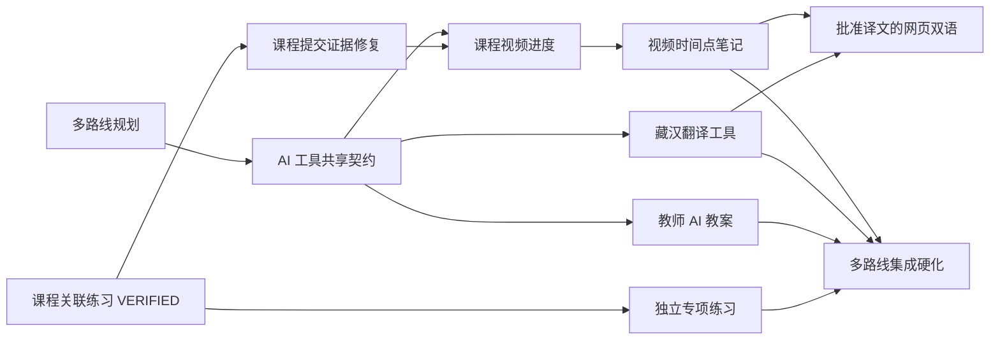

# P0 多路线最小闭环总规划

> 事实快照：2026-07-24
> 当前可信产品基线：`ca14c57f0534e4e8ddf3e273128668b6c12e685e`
> 机器任务图：`project-ops/multitrack-tasks.json`

## 1. 总结判断

项目现在不缺页面，也不缺模块骨架；真正缺的是把已有能力逐条变成可重复验证的用户
闭环。原项目全景报告的核心判断“框架已立、闭环未成”仍然有价值，但其中的目录、
完成度百分比、录音/测评“完全未实现”等结论已经被后续源码和真实证据部分推翻。

当前更准确的判断是：

- 仓库治理和自动续作框架已经可用；
- 学生课程关联练习已完成第一条可信闭环；
- 普通课程提交已有实现，但证据不足，必须先修复而不是直接合并；
- 视频有模型、资源服务和播放器，但没有真实 URL、服务端进度与恢复证据；
- 笔记后端 CRUD 已可复用，用户级闭环仍未证明；
- 教师教案是“接近可闭合的半成品”，不是从零重做；
- 翻译是“安全骨架 + 损坏视觉稿”，生产路径仍不可用；
- 网页双语应当是批准译文的 consumer，而不是页面现场调用模型。

## 2. 证据等级

统一使用以下等级，避免“页面存在”和“功能完成”混用：

| 等级 | 含义 |
|---|---|
| `NOT_STARTED` | 当前源码没有可复用实现 |
| `BROKEN` | 路径存在但无法正常执行 |
| `PARTIAL` | 有可复用代码或测试，但用户闭环未成立 |
| `EVIDENCE_REPAIR` | 实现可能成立，但交付证据不足或彼此矛盾 |
| `READY_FOR_REVIEW` | 任务分支完成自身门禁，尚未集成复验 |
| `VERIFIED` | 实时浏览器/API/DB/必要 provider 证据成立且分支可解析 |
| `INTEGRATED` | 已进入唯一 integration 线并通过该轮回归 |

HTTP 200、mock 单测、静态截图、固定 seed ID、build 通过或任务 JSON 自称通过，都不
足以单独升级为 `VERIFIED`。

## 3. 当前完成度

### 3.1 学生课程与练习

| 子能力 | 状态 | 当前事实 |
|---|---|---|
| 课程关联古诗文练习 | `VERIFIED` | 动态课程和 Submission/Attempt、两段真实非空录音、两项书面作答、提交、课程 25%、新上下文仍完成 |
| 普通课程提交 | `EVIDENCE_REPAIR` | 本地分支有实现提交，但录音走 API link、只有一个尺寸、证据脚本未提交、handoff 与远端 HEAD 不一致 |
| 课程视频 | `PARTIAL` | Activity/Resource 支持 VIDEO，已有签名播放 URL API 和播放器；课程 DTO 未提供可播 URL，前端进度只在内存 |
| 时间点笔记 | `PARTIAL` | Prisma、CRUD、revision、前端控制器存在；缺真实视频上的浏览器/API/DB 与越权证据 |
| 独立专项练习 | `PLANNED` | 可复用 PracticeDefinition、AssessmentSession 和同一执行器，不应新建第二套系统 |

学生线的正确顺序是：

```text
修复课程提交证据
→ 视频真实播放和服务端进度
→ 视频时间点笔记
```

独立专项练习可以在不写课程核心文件和共享契约的前提下走另一条学生子泳道。

### 3.2 教师 AI 教案

可复用轮子：

- 教师/校管理员的 Job、Draft、Revision、Approve API；
- idempotency key 和 `QUEUED/RUNNING/SUCCEEDED/...` 状态；
- BullMQ consumer、Flowise Agentflow V2 调用、超时和 AJV Schema 校验；
- 结构化教案 schema、版本化 flow、prompt 和 bootstrap/health 脚本；
- 教师草稿列表、编辑、revision 冲突提示、审批后只读 UI。

真实阻断：

1. 后端返回 `lessonPlanDraftId`，前端读取 `draftId`，成功后无法进入草稿；
2. 编辑器字段与真实 schema 不一致，对象数组会变成 `[object Object]`，保存会丢
   `schemaVersion/context` 等结构；
3. Flowise 两个模型节点没有真实 credential/base path 注入；
4. bootstrap 写本地 flow ID，API 数据库的 `externalFlowId` 没有同步来源；
5. URL 已配置和 Queue 对象存在被误当成 Flowise/worker 在线；
6. worker 回写失败只记日志，BullMQ 可能完成而数据库永久卡住；
7. 课程上下文查询没有严格 school scope，资料库/RAG 目前不能宣称完成；
8. 当前 API、worker、前端测试都 mock 了关键依赖，不能证明 live closure。

第一闭环只做：

```text
教师选择真实已发布课程
→ 输入教学目标
→ 创建幂等 Job
→ BullMQ/Flowise/真实 provider
→ schema-valid Draft(NEEDS_REVIEW)
→ 教师结构化修改，revision + 1
→ 教师确认 APPROVED
→ 刷新和新浏览器上下文仍存在
```

不做自动发布、自动评分、泛化 Agent 编排或“大量资料库/RAG 已完成”的宣传。

### 3.3 藏汉翻译

可复用轮子：

- BO/ZH、Job 状态、DTO、controller/service/port；
- 响应不泄露源文密文和 provider 内部信息；
- unavailable repository 的 fail-closed 503；
- 公共 API client 已导出通用 `request`，页面可以使用目录内 gateway，避免修改高
  冲突公共 client。

真实阻断：

1. 生产模块固定绑定 `UnavailableTranslationRepository`，所有接口都会失败；
2. Job 没有 `createdByUserId`，`listMyJobs` 实际列全校任务；
3. 学生查看权限只校验 school，不能保证“只看自己的”；
4. 限流是 no-op；
5. 所谓加密只是 Base64；
6. 没有持久化、provider consumer、人工修订或审批模型；
7. OpenAPI 没有翻译路径；
8. `frontend/teacher/translation/script.js` 损坏，页面状态全部写死；
9. 页面同时宣称“仅当前会话”和“保存历史”，且 2000/5000 字符限制不一致；
10. “服务正常”“离线可用”没有运行证据。

第一闭环只做独立翻译工具：

```text
教师真实登录
→ BO↔ZH 创建持久化 Job
→ 真实 provider 返回非空机器结果
→ NEEDS_REVIEW
→ 教师修订，revision + 1
→ APPROVED
→ 刷新和新上下文仍存在
```

网页双语是第二任务，只读取已批准译文；provider 不可用不能阻断原文课程学习。

## 4. 复用轮子与架构边界

本轮采用“薄业务核心 + 成熟通用轮子 + 可替换适配器”，不进行平台级换血：

| 能力 | 本轮决定 | 原因 |
|---|---|---|
| 课程、作业、练习 | 复用现有 Course/Submission/AssessmentSession 和同一练习执行器 | 已有真实课程练习证据，重建第二套执行器会制造双事实源 |
| 视频与文件 | 复用现有 Resource、对象存储和短期签名 URL；需要时只补课程适配层 | 当前缺口是课程消费与进度，不是另造上传/存储平台 |
| 教师 AI | 保留 NestJS 模块化单体、BullMQ 和 Flowise Agentflow V2 | Job、草稿、revision 和 worker 骨架已存在，当前要修契约与真实运行 |
| 藏汉翻译 | 复用 controller/service/port 和 fail-closed 行为，新增可替换 provider/repository adapter | 保留 provider 退出能力，未配置时明确 unavailable |
| 身份、学校与权限 | 复用现有 JWT、活动学校和服务端 school/user scope | 不在每个工具里建立第二套账号或租户模型 |
| H5P / QTI | 本轮不引入；练习闭环稳定后再做导入导出 adapter discovery | 不能让标准接入阻塞真实作答、录音和提交证据 |
| OneRoster | 本轮不引入；真实学校对接前单独做 roster mapping 任务 | 当前没有外部 SIS 对接出口 |
| Uppy / tusd | 本轮不引入；出现大文件断点续传的真实需求后再评估 | 当前已有对象存储和资源签名 URL，先闭合消费链 |
| Langfuse / OpenTelemetry | 本轮不扩根依赖；先用现有 Job/provider 元数据形成最小可追踪证据 | 观测平台不能代替用户闭环，后续以 adapter 接入 |
| Moodle / Open edX / Canvas | 不整体迁移或把它们当新业务内核 | 会丢失本项目的藏汉双语、弱网和语音证据差异化 |

引入新轮子前必须单独通过四项判断：许可证与商用边界、安全和数据出境、与当前
契约的 adapter/退出方案、能否缩短已定义闭环的交付时间。未经任务级决策，不修改
根依赖、部署拓扑或核心数据模型。对标产品用于验证能力边界，不作为照搬页面或
重写架构的理由。

## 5. 并行任务图



同一波次内只有稳定 `shared_locks` 不相交的任务可以并行；`shared_writes` 仍用于
reviewer 核对实际路径白名单。机器校验命令：

```powershell
& .\project-ops\scripts\validate-multitrack-plan.ps1
```

registry 的 `dispatch_status` 只回答“现在能否派发”；任务 JSON 的 status 回答开发
门禁；`evidence_status` 回答证据强度；`integration_status` 回答是否进入集成线。
依赖只由 `project-ops/accepted-baselines.json` 中的完整 commit 解除。多个依赖的
任务必须从同时包含全部依赖的 integration checkpoint 开分支，不能任选一个父分支。
所有调度机器事实只读取 `origin/integration/p0-multitrack-001` 控制面；规划 task
branch 只负责 bootstrap。控制面持续接受任务、按 rank 合并和登记 checkpoint，
不是等所有开发结束后才启动。

## 6. 任务定义

### 6.1 `P0-STUDENT-COURSE-SUBMIT-001`

恢复现有 worktree 和分支，不创建重复分支。先把 task status 从错误的
`READY_FOR_REVIEW` 恢复为 `IN_PROGRESS`，提交可复跑的 E2E/DB 脚本，使用真实
浏览器 MediaRecorder 或受控 fake-media-device 产生非空音频，补齐
1440/1024/390，并让 handoff、local HEAD、remote HEAD 和证据一致。

如果真实验收暴露业务代码缺陷，用新提交修复；不得通过改写 JSON 或手工拼证据使
门禁变绿。

### 6.2 `P0-AI-TOOL-CONTRACTS-001`

这是共享 OpenAPI 的唯一 writer。它必须冻结：

- 教案 Job/Draft/Revision/Approve/Workflow status；
- 翻译 Job 归属、状态、机器结果、人工修订、审批和 provider unavailable；
- provider/consumer 使用同一字段名和状态；
- 负向响应、revision 冲突和敏感字段不可见；
- 为后续实现建立 CCR 和 provider/consumer 契约测试。

它不实现 provider、数据库或页面。

### 6.3 `P0-STUDENT-INDEPENDENT-PRACTICE-001`

学生从练习中心动态发现可见练习，创建或恢复一个没有课程上下文的 attempt，使用
现有执行器完成真实口语与书面题，提交后在历史中可见，再次进入不会污染课程进度。
不得创建第二套执行器，不得写 OpenAPI；发现契约缺失时阻塞给 contract owner。

### 6.4 `P0-TEACHER-AI-LESSON-PLAN-001`

复用现有 Job/Draft/Revision/BullMQ/Flowise。修复字段与 schema 对齐、真实健康状态、
flow ID 单一来源、回写失败重试和 school scope。完成证据必须含真实 provider 的
`QUEUED → RUNNING → SUCCEEDED`、数据库三次修订、旧 revision 409、跨教师/学校
拒绝、三尺寸和新浏览器上下文。

### 6.5 `P0-TIBETAN-TRANSLATION-TOOL-001`

实现唯一翻译 Prisma 迁移、真实 repository/provider consumer、用户归属、受控加密、
限流、人工修订和审批，并接通现有教师页面。真实 provider 缺失时任务保持
`BLOCKED`；mock 只能证明契约和失败路径，不能证明翻译完成。

### 6.6 `P0-STUDENT-COURSE-VIDEO-PROGRESS-001`

使用课程绑定的真实 Resource 获取短期签名 URL，真实播放到中途后刷新恢复位置，
自然播放完成后服务端 ActivityProgress 和课程百分比增加。禁止直接把
`currentTime` 设为 duration 冒充完成。

### 6.7 `P0-STUDENT-COURSE-VIDEO-NOTE-001`

在真实视频时间点创建笔记，刷新、新上下文、点击跳转、编辑、删除均成立；两个页面
用旧 revision 更新必须 409 并重新读取；另一学生或学校不可读写。

### 6.8 `P1-TIBETAN-BILINGUAL-COURSE-001`

只选一种真实课程内容，服务端返回原文和 `APPROVED` 译文，页面支持原文/双语切换；
没有批准译文时显示“译文待复核”，不得现场生成或阻断原文学习。该任务排在视频
时间点笔记之后，接管相同课程核心文件，不能与视频/笔记并发。

## 7. 预计问题与处理

| 问题 | 信号 | 处理 |
|---|---|---|
| 旧半成品没有独立分支 | 文件最早出现在综合提交 | 保留历史，从规划基线新建 closure 分支，不重写历史 |
| 共享 OpenAPI 冲突 | 两个任务都想改同一 YAML | 只让 contract owner 写；consumer 等依赖 |
| Prisma 冲突 | 翻译和其他任务同时迁移 | 翻译任务是该波次唯一 schema owner |
| provider 密钥缺失 | live happy-path 无法启动 | 保持 `BLOCKED`，证据不得保存密钥或伪造结果 |
| Flowise 配置存在但不可达 | status 显示正常、请求失败 | 使用真实 ping/consumer heartbeat，不以环境变量存在代替健康 |
| AI/翻译结构化输出漂移 | schema 校验或编辑保存失败 | provider 输出先校验；页面按 schema 编辑并保留未知字段 |
| 课程 seed 没有视频 | 找不到真实 VIDEO Activity | 使用 development/test-only 可重复 bootstrap，ID 仍由 API 动态发现 |
| 音频/视频测试走捷径 | API link、直接 seek、空 Blob | 正式 E2E 明确禁止并校验 bytes/duration/事件序列 |
| 任务自称完成但证据不可复跑 | 脚本未提交、只有 JSON 摘要 | 降级为 `EVIDENCE_REPAIR`，补提交脚本后重新验收 |
| 分支本地远端不一致 | handoff commit 不等于 `ls-remote` | finish 后推送并比较完整 40 位 HEAD |
| 合并后跨泳道回归 | 局部测试绿、集成页面失败 | 每 2–3 个任务进入硬化窗口，跑契约、类型、构建和跨泳道浏览器 smoke |

## 8. 每条闭环共同完成定义

- 所有业务 ID 来自当前登录和 API；
- 正向路径有真实浏览器、API 和数据库交叉证据；
- provider 路径使用真实 provider，mock 不冒充 live；
- school/resource/user scope 有正向与越权负向测试；
- loading、empty、error、offline、permission、processing、unavailable 真实；
- 页面在 1440、1024、390 验收，console/page/request/HTTP 错误已审计；
- evidence 不保存 token、密钥、真实学生资料或敏感原文；
- minimal tests 每项都有实际命令、数量、PASS/FAIL/限制；
- handoff 可让陌生 reviewer 重现；
- review、commit、finish、push、远端 HEAD 比对和干净 Git 状态全部完成；
- 未经 Integration Lead 复验不得写 `INTEGRATED` 或合并 main。
