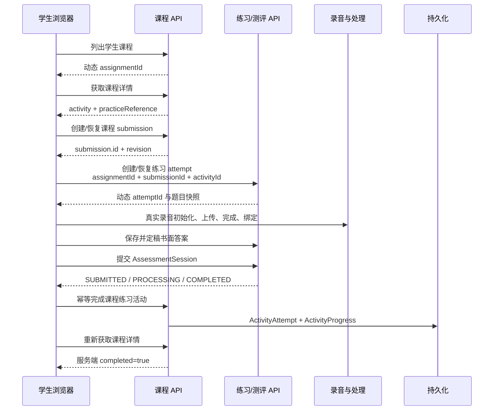

# 学生端最小闭环开发路线图

> 事实快照：2026-07-23
> 适用仓库：`D:/program/test_program/yuzanxinsheng/three/yuzan-next`
> 当前首要结果：学生从真实课程进入关联练习，完成真实作答与录音并提交，回到原课程后刷新仍能看到持久化完成状态。

## 0. 先做什么

下一步只做这一条闭环：

```text
学生登录
→ API 返回当前学生可见课程和动态 assignmentId
→ 打开课程详情
→ 创建或恢复真实课程 submission
→ 从课程活动取得 practiceDefinitionId
→ 携带 assignmentId + submissionId + activityId 创建或恢复练习 attempt
→ 使用现有通用练习执行器完成听、说、读、写题
→ 真实录音上传并绑定，书面答案保存并定稿
→ 提交 AssessmentSession
→ 幂等回写课程练习活动
→ 返回原课程
→ 重新请求课程详情，完成状态仍然存在
```

第一阶段不同时开发教师教案 Agent、管理驾驶舱、藏中翻译器、社区、内容商城、
QTI/H5P、离线大改造或新的通用执行器。它们有价值，但都不应挡在第一个学生真实
闭环前面。

## 1. 对现有两份分析的评价

### 1.1 值得保留的判断

`docs/10-project-review/01-项目全景分析报告.md` 的核心判断“框架已立，闭环未成”
仍然成立。它正确指出：

- 项目的价值不在页面数量，而在“测评—学习—复测”的证据闭环；
- 藏中双语、弱网、本地化口语反馈是差异化方向；
- unavailable、持久化和真实业务闭环不能被路由可达或静态页面替代；
- 翻译必须融入教学，而不是成为一个与课程脱节的孤立工具；
- 教师必须能复核 AI 结果，不能把模型输出当最终教育结论。

`对标产品与复用轮子与ai对话.md` 中值得保留的是架构思想：

- 教师创作模型与学生发布后运行快照分离；
- 练习执行器与题型采用可扩展边界，不把逻辑散落到每个页面；
- 学习证据、异步处理、教师复核、报告和后续干预形成可追踪链路；
- 上传、身份、观测和 AI 编排优先通过适配器复用成熟能力。

### 1.2 不能直接作为开发排程的部分

两份材料是方向和技术备忘，不是当前可直接执行的任务清单：

| 问题 | 当前判断 | 应对方式 |
|---|---|---|
| 完成度百分比 | 55%、40% 等数字会随代码快速失效，也不能说明哪个用户动作可完成 | 改用逐条用户旅程和可验证出口 |
| “测评完全未实现” | 已经过时；当前已有 practice、AssessmentSession、录音、书面作答和提交代码 | 先核对现有实现，再补接缝 |
| “课程聚合接口缺失” | 已经过时；当前已有学生课程列表、详情、提交和活动进度 API | 修复前端与真实响应的契约漂移 |
| 十二周横向建设 | 同时引入上传、身份、QTI、离线、观测、AI 等会再次扩大未闭环面积 | 先完成一个纵向学生闭环 |
| 历史 evidence | 旧截图和旧 JSON 只能证明当时结果，当前 seed 已变化 | 每次从当前 API 动态发现 ID 并重跑 |
| 竞品能力清单 | 可用于决策，不代表都应自研或立即接入 | 只有首个闭环遇到真实阻塞才引入轮子 |

因此，分析方向是好的，但下一阶段必须从“宏观架构建议”切换为“一个用户动作、
一个真实状态链、一组反证测试、一个干净任务分支”。

## 2. 当前源码事实

### 2.1 已经存在、应该复用的能力

| 能力 | 当前事实 | 本轮策略 |
|---|---|---|
| 学生课程列表 | `listStudentCourses` 和真实课程目录已经存在 | 复用，ID 从响应取得 |
| 学生课程详情 | 后端返回 assignment、courseVersion、units、progress、attempt、practiceReference | 以前端适配真实响应 |
| 课程 Submission | 后端可创建或恢复，返回 `{ submission, resumed }` | 不再假设顶层 `submissionId` |
| 通用练习目录 | `/schools/:schoolId/practices` 已有真实筛选和学生可见性 | 独立练习继续复用 |
| 通用练习 Attempt | `createOrResume` 支持自主练习和课程练习 | 课程入口必须传完整上下文 |
| 练习执行器 | 同一执行器支持听读、口语和书面题 | 不再建第二个课程练习执行器 |
| 真实录音 | 已有录音初始化、上传、完成、题目绑定链路 | 用真实浏览器麦克风/音频验证 |
| 书面作答 | 已有保存、定稿、提交检查 | 修复契约后复用 |
| 课程练习完成 | `completePractice` 校验学校、学生、submission、activity 和 definition | 用 attempt 回写课程进度 |
| 开发 seed | development/test 可创建四门课程和六套练习 | 可做本地基线，但运行时不得硬编码其 UUID |
| 失败状态 | processing、failed、NEEDS_REVIEW、provider unavailable 已有部分表达 | 保持真实，不伪造分数 |

### 2.2 已确认的首要断点

#### 断点 A：课程详情响应契约漂移

后端 `StudentCoursesService.detail` 返回：

```text
assignment
course
courseVersion
units[].lessons[].activities[]
studentProgress
existingSubmission
practiceReferences
```

前端 `course-api-adapter.js` 仍读取顶层：

```text
raw.assignmentId
raw.title
raw.description
raw.progress
raw.submissionId
```

活动也只保留旧字段，没有完整保留当前的：

```text
instruction
content
resources
progress
attempt
practiceReference
```

结果不是“后端没有数据”，而是现有数据在适配层被丢掉。

#### 断点 B：创建课程 Submission 的响应读取错误

后端返回：

```json
{
  "submission": {
    "id": "...",
    "revision": 0,
    "status": "IN_PROGRESS"
  },
  "resumed": false
}
```

前端却读取 `resp.submissionId` 或 `resp.id`。这会让后续课程活动和课程练习缺少
真实 `submissionId`。

#### 断点 C：保存活动的 DTO 不一致

后端 `SaveActivityAttemptDto` 需要：

```json
{
  "kind": "CHOICE",
  "value": {},
  "completed": true,
  "expectedProgressRevision": 0
}
```

现有选择题和填空题前端发送：

```json
{
  "attemptType": "CHOICE",
  "answer": 0,
  "isCorrect": true
}
```

这是已确认的下一闭环债务。首个课程关联练习任务只保留 submission revision，
不顺手修全部普通活动；`P0-STUDENT-COURSE-SUBMIT-001` 再用聚焦测试修复该 DTO。

#### 断点 D：课程练习路由写错

课程详情当前跳转到：

```text
/student/practice/
```

服务器实际只注册：

```text
/student/practices/
/student/practices/attempts/:attemptId/...
```

单数路由会落入错误页面，不能作为练习入口。

#### 断点 E：课程练习上下文没有传递

后端明确要求课程练习上下文必须同时包含：

```text
assignmentId
submissionId
activityId
```

并验证练习定义确实被该课程活动引用。现有课程入口既没有取得
`practiceDefinitionId`，也没有传这三个字段，所以无法生成带
`courseSubmissionId/courseActivityId` 的真实 attempt。

#### 断点 F：提交后的回写依赖从未建立的 localStorage

`api-client.js` 已尝试读取：

```text
yuzan-course-practice-context:<attemptId>
```

但课程入口没有写入这个上下文。即使学生完成练习，提交后也不知道要回到哪一门
课程、哪一个活动。

此外，提交成功与课程回写之间可能发生刷新、断网或页面关闭。实现必须支持：

- AssessmentSession 已提交，但课程活动尚未回写；
- 回写接口重试；
- 重复回写幂等；
- 回到课程后重新读取服务端状态，而不是只改本地 DOM。

#### 断点 G：课程提交 revision 被硬编码

后端提交课程要求客户端发送当前 `Submission.revision`，而前端适配器固定发送
`1`。新建 submission 的 revision 是 `0`，恢复的 revision 也未必是 `1`。
必须把 revision 纳入课程状态并在冲突时刷新，不能靠猜。

#### 断点 H：错误被转换成类似成功的对象

课程适配器捕获异常后返回 `{ error: true }` 一类对象，状态机可能继续执行并展示
空课程或空活动。失败必须抛回上层，进入明确的 auth、permission、not-found、
offline 或 backend unavailable 状态。

### 2.3 当前不是首要闭环的能力

- 藏中翻译后端默认绑定 `UnavailableTranslationRepository`；
- 当前只发现教师翻译页面，没有可验收的学生翻译旅程；
- 翻译前端绑定文档仍把相关接口标为 `NOT_CONFIGURED`；
- 教师教案生成与 Agent 编排已有方向材料，但不是学生闭环依赖；
- 管理端应先消费真实闭环数据，不应先建设静态驾驶舱。

这些功能不能删除，但应排在学生端基础证据链之后。

## 3. 产品功能如何拆成小闭环

### 3.1 学生端顺序

| 顺序 | 学生闭环 | 用户出口 |
|---|---|---|
| 1 | 课程内关联练习 | 从课程进入练习，提交后回到课程并持久化完成 |
| 2 | 普通课程/作业 | 完成文本、音频、选择、填空、口语活动并提交整门课程 |
| 3 | 独立专项练习 | 从练习中心选择专项，完成后进入历史和报告 |
| 4 | 广东听说式模拟训练 | 在同一执行器中组合听、复述、朗读、口头表达等题型和时序 |
| 5 | 报告—再练—成长 | 看到可信反馈，按薄弱项启动下一次练习并形成趋势 |
| 6 | 一对一帮扶 | 教师针对一名学生下发干预，学生完成后回流同一证据链 |
| 7 | 藏中翻译辅助 | 在真实 provider、权限、语料和纠错闭环具备后嵌入课程 |
| 8 | 弱网/离线 | 在在线闭环稳定后，把相同命令和状态做同步队列化 |

“课程、测评、作业、练习”不应先做成四套技术栈。第一阶段把它们理解为：

- 课程：发布后的学习内容与活动序列；
- 作业：教师分配的 Assignment 和学生 Submission；
- 练习：可复用的 PracticeDefinition/Version 和 AssessmentSession；
- 测评：使用同一执行器，但规则、时限、评分和报告更严格的练习模式。

### 3.2 教师端顺序

学生端形成真实数据后，再按下面顺序推进：

1. 单学生/单任务证据工作台；
2. 班级完成率、问题分布和需要人工处理的队列；
3. 对录音、答案和 AI 建议进行教师复核；
4. 一对一干预任务；
5. 基于已审核资料库生成教案草稿；
6. 教师接受、修改、拒绝、发布和审计；
7. Agent 自动编排重复流程，但最终教育决策保留人工控制。

### 3.3 管理端顺序

管理端只管理真实系统对象和真实指标：

1. 学校、身份、班级、学年和权限；
2. 内容发布、版本和资源；
3. provider/队列健康；
4. 数据质量、审计和隐私；
5. 聚合后的运行与教学指标。

不先制作没有数据来源的仪表盘。

## 4. 首个闭环的目标状态



### 4.1 入口条件

- 在独立 sibling worktree；
- 当前分支有唯一 active task JSON；
- `base_commit` 是准确的已接受基线；
- task metadata 已先提交，worktree 可运行 preflight；
- 本地环境只使用 development/test 数据；
- 没有把主工作区的脏文件带进任务；
- Node 24 与仓库声明的 pnpm 版本可用；
- 必需环境变量、数据库和对象存储已验证，而不是猜测。

### 4.2 退出条件

- 动态发现的学生可以列出至少一门关联练习的课程；
- 课程页显示真实标题、活动、进度和 submission；
- 课程入口创建的 AssessmentSession 保存正确的课程关联；
- 录音和书面答案均进入真实 API/持久化；
- 提交后课程活动真实完成；
- 刷新页面或新浏览器上下文仍显示完成；
- 重复提交/重复回写不会制造第二份错误进度；
- 处理未完成或 provider 不可用时显示真实状态，不显示虚假分数；
- 聚焦测试、API/DB 证据和浏览器证据齐全；
- handoff、review、finish、push 均完成，`git status --porcelain` 为空。

## 5. 第一任务定义

建议任务 ID：

```text
P0-STUDENT-COURSE-PRACTICE-001
```

建议任务分支：

```text
task/p0-student-course-practice-001
```

唯一用户结果：

> 一名真实登录学生能从被分配的课程进入该课程关联的古诗文练习，完成真实录音和
> 书面作答后提交，返回原课程并在刷新后看到该活动已完成。

明确非目标：

- 不实现教师端完整复核；
- 不承诺最终自动评分已经可用；
- 不在本任务提交整门课程，也不修复所有普通课程活动；
- 不创建新的课程/练习执行器；
- 不接入新的身份、上传、AI 或翻译产品；
- 不改变生产数据；
- 不用 `?demo=1`、固定 UUID、静态报告或旧截图验收；
- 不顺手重做整套 UI。

## 6. 一步步实施

### S0：恢复、隔离和事实基线

目标：证明正在正确仓库、正确分支、正确基线和正确环境中工作。

动作：

1. 在仓库根运行 `task-context.ps1 -Mode auto`；
2. 确认 Git root、分支、HEAD、task JSON 和 `allowed_paths`；
3. 检查 canonical 工作区已有脏文件但不修改、不清理；
4. 检查 active worktree 是否只有本任务写入；
5. 检查 Node/pnpm 版本；
6. 检查相关服务、端口、数据库和环境变量；
7. 运行当前相关测试，记录“改动前”结果；
8. 通过 API 而不是数据库常量发现当前学生、学校、课程和练习。

最小证明：

- `task-gate.ps1 -Mode preflight` 通过；
- 当前相关前端/API 测试基线有真实输出；
- 动态 API 响应中存在可执行课程和 `practiceReference`。

停止条件：

- 基线不是预期提交；
- 分支已有来源不明改动；
- 缺少数据库/对象存储/登录能力且无法在任务范围内安全补齐；
- 只有固定 demo ID 才能继续。

### S1：先写契约刻画测试

目标：在改实现前，把当前 provider 响应和 consumer 需求变成可失败的测试。

应覆盖：

1. 课程详情的真实嵌套结构；
2. 活动中的 `instruction/content/progress/attempt/practiceReference`；
3. 创建/恢复课程 submission 的嵌套返回；
4. submission ID、status 和 revision 能被适配器保留；
5. 课程练习上下文三个 ID 必须同时存在；
6. definition 未被 activity 引用时拒绝；
7. 其他学校、其他学生、其他 submission 被拒绝；
8. 已提交 attempt 可幂等完成课程活动；
9. 错误不能被适配器转换为成功状态。

`SaveActivityAttemptDto` 与普通课程提交 revision 的已知漂移记录到
`P0-STUDENT-COURSE-SUBMIT-001`；除非它直接阻断课程练习启动，本任务不顺手扩张。

如果学生课程路径仍未进入 OpenAPI：

- 先建立 CCR；
- 以当前 controller/service/DTO 为 provider 事实；
- 补齐 OpenAPI 并验证 provider/consumer；
- 不在前端另造一套未声明字段。

最小证明：

- 新测试在修复前确实失败于目标断点；
- 后端正向和跨学校/跨学生负向用例；
- OpenAPI/DTO/client 的字段一致性检查。

### S2：修复课程详情适配

目标：课程页面只消费当前真实 DTO，不猜字段。

动作：

- `assignmentId` 来自 `raw.assignment.id`；
- 课程标题、描述、封面和预计时长来自 `courseVersion`；
- submission 来自 `existingSubmission` 或创建接口的 `submission`；
- 保留 submission 的 `id/status/revision/attemptNo`；
- progress 来自 `studentProgress/courseCompletion`；
- 活动保留 `id/type/title/instruction/content/resources/progress/attempt/practiceReference`；
- `isCompleted` 来自服务端 progress；
- 错误继续抛出，让页面状态机进入真实错误状态；
- 不用空字符串把必需 ID 缺失掩盖掉。

最小证明：

- 纯适配器测试：输入一份按当前 service 结构构造的响应；
- 断言课程标题、动态 assignmentId、submission、activity 和
  practiceDefinitionId 全部保留；
- error、empty、permission 和 offline 不显示成成功空课程。

### S3：修复课程状态机与错误传播

目标：课程练习启动前的 load/create/resume 状态真实、稳定、可恢复。

动作：

- loadCourse 失败时抛回页面状态机；
- create/resume 从嵌套 `submission` 读取 ID、status 和 revision；
- 已有 submission 时不重复创建；
- 必需 ID 缺失时明确失败，不继续导航；
- auth、permission、not-found、offline 和 backend unavailable 使用不同状态；
- 页面刷新后重新读取服务端详情，不把本地 state 当事实；
- 普通选择/填空活动保存和整门课程提交留给闭环 2。

最小证明：

- load/create/resume 的正向适配测试；
- 失败不进入练习导航；
- 恢复已有 submission 使用同一 ID。

### S4：建立课程到练习的启动桥

目标：从具体课程活动直接启动它所引用的练习。

动作：

1. 读取 `activity.practiceReference.practiceDefinitionId`；
2. 确保课程 submission 已创建或恢复；
3. 调用：

   ```javascript
   createOrResumePractice(practiceDefinitionId, {
     assignmentId,
     submissionId,
     activityId
   })
   ```

4. 从响应取得动态 `attemptId`；
5. 保存最小返回上下文：

   ```text
   assignmentId
   submissionId
   activityId
   attemptId
   returnTo
   ```

6. `returnTo` 只允许同源、相对的课程详情路径；
7. 跳到真实复数路由：

   ```text
   /student/practices/attempts/<attemptId>/prepare/
   ```

8. 重复点击复用 open attempt，不生成重复会话。

最小证明：

- 路由单测或 server route smoke；
- create/resume 请求包含三个课程 ID；
- 数据库中 attempt 的 `courseSubmissionId/courseActivityId` 正确；
- 其他学生的 submission 或不匹配 definition 返回拒绝。

### S5：复用通用执行器完成真实证据

目标：不新增执行器，用现有页面完成至少一个口语题和一个书面题。

口语链：

```text
浏览器授权麦克风
→ MediaRecorder 产生非空 Blob
→ init recording
→ 上传到真实 upload URL
→ complete recording
→ bind recording to AssessmentItem
→ 重新获取 item 可见 recordingId
```

书面链：

```text
选择/输入答案
→ 保存到 API
→ 刷新后仍存在
→ finalize
→ 提交检查显示已完成
```

必须验证：

- 麦克风拒绝时明确提示，不伪造录音；
- 空音频、上传失败和绑定失败不标记完成；
- 页面刷新后从 API 恢复，不只依赖 localStorage；
- `demo=1` 只保留明确演示标识，不能进入正式验收；
- 题目 ID、录音 ID 和 attempt ID 全部来自动 API 响应。

### S6：提交、回写和中断恢复

目标：AssessmentSession 提交与课程完成回写形成可恢复的两步状态。

推荐行为：

1. `submitAssessmentSession` 只确认真实提交结果；
2. 如果存在课程上下文，再调用 `completeCoursePractice`；
3. 只有课程回写成功后才把本地上下文标记完成；
4. 跳回课程时携带 `practiceAttemptId`；
5. 课程页重新请求详情并以服务端 progress 为准；
6. 如果提交成功但回写失败：
   - 不重新创建 attempt；
   - 不重新提交答案；
   - 显示“练习已提交，课程进度待同步”；
   - 提供幂等重试；
7. 如果浏览器在两步之间关闭，恢复时检测已提交 attempt 和待回写上下文；
8. 重复调用完成接口仍返回同一活动完成状态。

后端当前允许 `SUBMITTED`、`PROCESSING`、`COMPLETED` attempt 完成课程活动。因此：

- 课程完成不必等待最终语音分数；
- processing、NEEDS_REVIEW 或 provider unavailable 仍应如实显示；
- 不能为了让课程显示完成而生成静态分数或假报告。

最小证明：

- 正常提交并回写；
- 提交成功、第一次回写失败、第二次重试成功；
- 重复回写不重复计数；
- 刷新/新浏览器上下文后课程完成仍存在。

### S7：真实运行验收

必须从同一次运行中采集一条动态 ID 链：

| ID | 获取方式 | 禁止方式 |
|---|---|---|
| schoolId | 登录/当前学校上下文 | 粘贴 seed UUID |
| assignmentId | 学生课程列表响应 | 写死到脚本 |
| submissionId | 创建/恢复课程 submission 响应 | 自造 UUID |
| activityId | 课程详情响应 | 从旧截图抄 |
| practiceDefinitionId | activity.practiceReference | 按标题猜 |
| attemptId | create/resume practice 响应 | 使用旧 evidence |
| itemId | attempt items 响应 | 静态数组 |
| recordingId | 录音初始化响应 | fixture |

浏览器验收：

- 1440、1024、390 三种宽度；
- 课程列表、课程详情、练习准备、口语题、书面题、提交、课程返回；
- 关键页面截图；
- console error、page error、failed request 清单；
- 正常、loading、error、offline/permission、processing 状态；
- 使用一个新浏览器上下文验证持久化。

API/DB 核对：

- AssessmentSession 属于当前 school/enrollment；
- `courseSubmissionId` 与 `courseActivityId` 正确；
- Recording 非空且属于当前学生/attempt；
- 书面答案已保存和定稿；
- session 状态是实际状态；
- ActivityAttempt 指向 practiceAttemptId；
- ActivityProgress.completed 为 true；
- 课程详情刷新结果与 DB 一致。

### S8：自审、交接、提交和推送

自审问题：

1. 是否只修改 task `allowed_paths`？
2. 是否触碰 OpenAPI/Prisma/全局路由等共享事实？owner 和 CCR 是否齐全？
3. 是否出现固定 ID、`demo=1`、静态业务结果或假成功？
4. 是否直接测试了 adapter、上下文校验、幂等回写和权限边界？
5. 是否真的跑过浏览器和 API/DB 核对？
6. provider 不可用时是否如实呈现？
7. 是否泄露 token、真实学生数据、原始录音内容或密钥？
8. handoff 能否让陌生 reviewer 重现？

结束顺序：

```powershell
& .\scripts\repo\task-gate.ps1 -Mode review -TaskFile <task-json>
git add -- <allowed-paths>
git commit -m "feat(student): close course-linked practice loop"
& .\scripts\repo\task-gate.ps1 -Mode finish -TaskFile <task-json>
git push -u origin task/p0-student-course-practice-001
git status --porcelain
```

最后一条必须无输出。推送 task branch 不代表已经合并；Integration Lead 仍需按当前
集成基线复验。

## 7. 最小测试矩阵

下面覆盖连续几个学生闭环；标为“闭环 2”的两项不进入首个课程关联练习任务。

| 风险 | 最快反证测试 | 必须看到的结果 |
|---|---|---|
| 详情适配错误 | adapter 单测输入真实嵌套 DTO | ID、内容、progress、practiceReference 不丢失 |
| submission 响应错误 | create/resume consumer 测试 | 使用 `submission.id/revision` |
| 闭环 2：保存 DTO 错误 | controller/service DTO 测试 | kind/value/completed 被接受 |
| 错误路由 | server route smoke | 只进入 `/student/practices/...` |
| 上下文缺字段 | practice service 负向测试 | 400，且不创建 attempt |
| 越权上下文 | 跨学校/跨学生测试 | 403/404，且无数据泄露 |
| 练习未关联 | definition/activity 不匹配测试 | 拒绝创建 |
| 重复启动 | create/resume 测试 | 返回同一 open attempt |
| 录音是假数据 | 浏览器录音 + API/DB | 非空 Recording 且 item 绑定 |
| 答案只在本地 | 保存后刷新 | API 恢复答案 |
| 提交后断网 | 故障注入回写失败 | 已提交、待同步、可重试 |
| 重复回写 | 两次 complete | 只有一个 ActivityAttempt/Progress |
| 闭环 2：revision 猜测 | 旧 revision 提交 | 409 并刷新，不覆盖 |
| provider 不可用 | provider failure smoke | unavailable/failed，不显示假分 |
| UI 假完成 | 新浏览器上下文重开课程 | 服务端仍返回 completed |

HTTP 200、构建通过或一张截图都不能单独证明闭环完成。

## 8. 预计问题与处理

| 可能问题 | 识别信号 | 处理原则 |
|---|---|---|
| 框架分支尚未集成 | canonical 找不到 `project-ops` 新入口 | 从已验证控制分支解析精确 commit，不能猜 base |
| canonical 有脏文件 | `git status` 有用户改动 | 保留原样，只在 sibling worktree 工作 |
| 环境变量缺失 | API/Prisma 启动失败 | 只补本地未跟踪配置，不提交密钥 |
| 数据库未 seed | 课程或练习列表为空 | development/test 执行可重复 seed，并从 API 发现 ID |
| 旧 evidence 与 seed 不同 | 数量、标题或 ID 不一致 | 旧 evidence 标为历史，不用于当前通过 |
| OpenAPI 缺课程路径 | controller 有端点但契约检索不到 | 建 CCR，先补共享契约 |
| 前端结构仍按旧 DTO | 页面空白但 API 有数据 | 用 characterization test 修 adapter |
| submissionId 为空 | 活动保存/练习创建 4xx | 读取嵌套 `submission.id` |
| 课程 activity content 多形态 | TEXT/AUDIO/SPEECH/CHOICE 渲染差异 | 按 `type + content` 建显式映射 |
| 浏览器麦克风不可用 | permission denied/无设备 | 显式阻塞；测试可使用真实测试音频输入但不能空 Blob |
| 上传 URL/CORS 失败 | init 成功、PUT 失败 | 核对对象存储和 URL，不绕过上传 |
| worker/provider 未配置 | session 停在 processing/failed | 如实显示；课程活动可按已提交状态完成 |
| localStorage 丢失 | attempt 已提交但无法返回课程 | 服务端课程关联是事实，本地只作导航提示；提供恢复路径 |
| 多标签并发 | progress revision 冲突 | 发送 expected revision，409 后刷新 |
| 重复点击/网络重试 | 多个 attempt 或重复进度 | create/resume + 幂等 complete |
| Node/PowerShell 差异 | 本机一套命令通过、另一套失败 | Node 24；脚本显式 UTF-8，并跑 PowerShell 7/5.1 |
| Playwright 包不可用 | Node 导入失败 | 使用仓库现有 harness；必要时使用已验证的 Python Playwright |
| 共享文件冲突 | 另一任务也改 OpenAPI/路由 | 单写者或先合并共享前置，不并行覆盖 |
| 任务越做越大 | 开始触及教师/管理/翻译 | 写入后续队列，当前不实现 |

## 9. 第一个闭环之后怎么走

### 闭环 2：普通课程与作业

复用第一闭环建立的课程 adapter、Submission 和 ActivityProgress：

- TEXT 阅读完成；
- AUDIO 播放和进度；
- CHOICE/FILL_BLANK 保存；
- SPEECH 录音绑定；
- 必修活动 100%；
- 使用当前 revision 提交课程；
- 教师以后可消费同一 Submission。

完成定义：整门课程刷新后仍保持进度和提交状态。

### 闭环 3：独立专项练习

复用同一 PracticeDefinition/AssessmentSession/执行器：

- 练习目录筛选；
- 详情；
- create/resume；
- 完成；
- 历史；
- 收藏和再次练习。

完成定义：独立练习没有课程上下文，也不会污染课程进度。

### 闭环 4：广东听说式模拟训练

先把它定义为执行器上的一种 `MOCK`/专项组合，而不是新系统：

- 固定环节与计时；
- 听力材料播放规则；
- 复述、朗读和口头表达；
- 书面或选择理解题；
- 提交前完整性检查；
- 真实 processing/复核/报告；
- 设备、断网和中断恢复规则。

具体考试规则必须单独核对当期官方要求后再冻结，不能凭产品印象硬编码。

### 闭环 5：报告、成长和再练

- 学生只看到允许发布的可信结果；
- 自动结果标注置信度和复核状态；
- NEEDS_REVIEW 明确；
- 报告能启动下一次针对性练习；
- 同一能力维度形成时间序列，而不是静态分数卡。

### 闭环 6：一对一帮扶

- 教师从真实证据选择一名学生；
- 下发一项可完成的干预练习；
- 学生完成；
- 教师看到前后变化；
- 所有动作可审计。

### 闭环 7：藏中翻译辅助

只有满足以下入口条件才开始：

- 有真实 TranslationRepository/provider；
- provider unavailable 语义明确；
- 学校/用户权限和数据保留规则确定；
- 术语表、翻译记忆和纠错审核有持久化；
- 学生端有一个具体课程内使用场景；
- 结果是辅助理解，不冒充权威译文。

第一版可以是“课程选中文本→请求翻译→显示来源与状态→学生/教师纠错→审核入库”，
而不是一次建设完整语料平台。

## 10. 教师、Agent 与资料库何时开始

当学生端至少产生一条真实、可恢复的证据链后，教师端才有可靠输入。顺序应是：

```text
学生真实 evidence
→ 教师查看单条 evidence
→ 教师复核/批注
→ 班级聚合
→ 一对一干预
→ 资料库检索
→ 教案草稿生成
→ 教师修改/发布
→ Agent 自动编排重复步骤
```

资料库需区分：

- 已发布课程与教学资料；
- 教师私有草稿；
- 学校共享资料；
- 已审核术语/翻译记忆；
- 学生证据和隐私数据；
- AI 生成但未审核内容。

Agent 的第一职责是减少检索、整理和重复录入，不是替老师自动决定成绩或直接发布
教案。

## 11. 全局自动续作规则

任务开始或继续时统一运行：

```powershell
& .\scripts\repo\task-context.ps1 -Mode auto
```

它会：

1. 从当前 Git branch 匹配唯一 active task JSON；
2. PLANNED 且干净时执行 preflight；
3. 其他活动状态执行 resume 门禁；
4. 自动读取稳定开发短契约；
5. 自动读取任务 JSON；
6. 只读取 `context.required` 的 2–6 个文件；
7. resume 时若已有 handoff，则一并读取；
8. 输出当前 status、最近提交和相对 base 的 changed paths；
9. 不写临时文件，不改变 Git 状态；
10. 限制单文件与总上下文字节数，拒绝目录、仓库外路径和二进制文件。

限制：

- 仓库无法强迫一个完全不读取 repository instructions 的外部 AI 自动执行；
- 因此目标模式提示词必须把这条命令写成第一条动作；
- 没有 task JSON 时，AI 先建立任务元数据和隔离 worktree，再运行自动入口；
- 不能把 `.env`、密钥或大目录加入 `context.required`。

## 12. 完成定义

首个学生闭环只有同时满足以下条件才可写“完成”：

- [ ] 课程与练习使用同一真实登录学生；
- [ ] 所有 ID 从当前 API 动态发现；
- [ ] 课程详情字段与当前后端响应一致；
- [ ] Submission ID 和 revision 正确；
- [ ] 课程练习 attempt 保存完整课程关联；
- [ ] 至少一条真实录音成功上传并绑定；
- [ ] 至少一个书面答案保存、刷新恢复并定稿；
- [ ] AssessmentSession 真正提交；
- [ ] 课程活动幂等回写；
- [ ] 刷新或新浏览器上下文仍显示完成；
- [ ] processing/failed/NEEDS_REVIEW/unavailable 如实显示；
- [ ] 正向、越权、冲突、重试路径有测试；
- [ ] 浏览器 console/page/network 错误已审计；
- [ ] 没有 `demo=1`、固定 ID、静态分数或假成功；
- [ ] handoff 包含命令、结果、风险和回滚；
- [ ] review 与 finish 门禁通过；
- [ ] task branch 已按授权推送；
- [ ] `git status --porcelain` 无输出。

## 13. 陌生执行者应能直接回答的问题

如果文档足够完整，一个没有当前聊天上下文的执行者应该能回答：

1. 当前只做哪一个学生闭环？
2. 为什么不先做教师 Agent、管理端或翻译？
3. 后端已经有哪些能力，哪些不应重写？
4. 课程详情前端和后端的字段具体哪里不一致？
5. 为什么课程练习需要三个上下文 ID？
6. 动态 ID 分别从哪里取得？
7. 练习提交成功但课程回写失败时怎么办？
8. provider 不可用是否阻止课程活动完成？
9. 哪些测试可以最快证明不是假闭环？
10. 哪些状态和证据齐全后才能说完成？
11. AI 每次续作时如何自动恢复最小上下文？
12. 完成后如何保证分支已提交、推送且 Git 状态干净？

任一问题无法从本文得到明确答案时，应先补文档或任务 JSON，不要靠聊天记忆推进。
